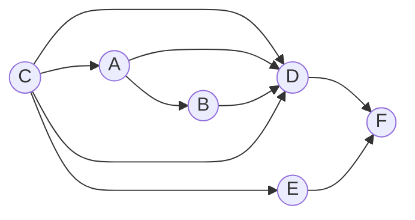

```mermaid
    graph LR
        A(("A"))
        B(("B"))
        C(("C"))
        D(("D"))
        E(("E"))
        F(("F"))
        C --> A
        C --> D
        C --> E
        A --> B
        A --> D
        B --> D
        C --> D
        D --> F
        E --> F

```