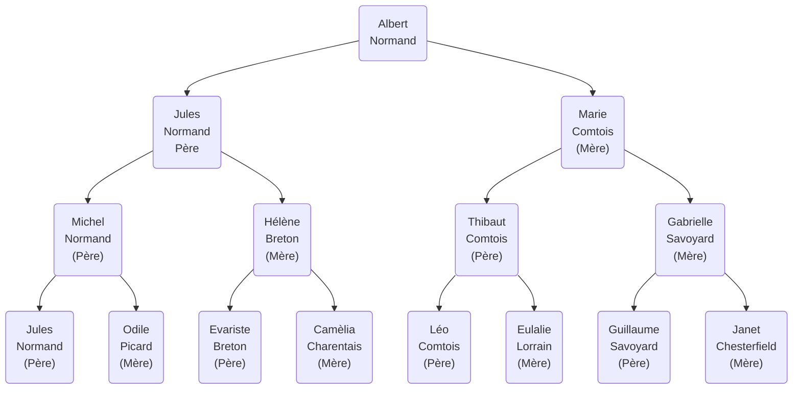







{{ titre_chapitre(num,titre,theme,niveau)}}

{{ initexo(0) }}

## Amérique du Sud 2022 J2 

!!! exo

Dans un arbre binaire, chaque noeud admet au plus deux enfants, appelés sous-arbre gauche et sous-arbre droit. On considère dans cet exercice des arbres binaires étiquetés avec des nombres entiers.  
On définit un chemin racine-feuille dans un tel arbre comme une liste ordonnée de noeuds telle que :  

- le premier noeud est la racine  
- chaque noeud suivant est enfant du précédent;  
- le dernier noeud est une feuille.  

On appellera somme d'un chemin racine-feuille la somme des étiquettes des noeuds du chemin.  
Enfin, la plus graande somme racine-feuille d'un arbre est la plus grande somme qu'il est possible d'obtenir en considérant tous les chemins racine-feuille de l'arbre.  


!!! fabquestion "Question 1"
    === "Enoncé"
        Déterminer la plus grande somme racine-feuille de l'arbre représenté ci-dessous

        ```mermaid
        graph TD  
            A("2") --> B("7") 
            B --> D("4")
            B --> E("1")
            A --> C("5")
            C --> C1("3")
            C --> C2("8")
            D --> D1("2")
            D --> D2("3")
            E --> F(" ")
            E --> E1("5")
            linkStyle 8 stroke-width:0px;
            style F opacity:0;
            C1 --> C3(" ")
            C1 --> C4("1")
            C2 --> C5(" ")
            C2 --> C6(" ")
            linkStyle 10 stroke-width:0px;
            style C3 opacity:0;
            linkStyle 12 stroke-width:0px;
            style C5 opacity:0;
            linkStyle 13 stroke-width:0px;
            style C6 opacity:0;
        ```

!!! fabquestion "Question 
    La class `Noeud` ci-dessous implémente le type abstrait d'arbre binaire.

    ```python
    class Noeud:
        def __init__(self,v):
            self.etiquette = v
            self.sag = None
            self.sad = None
        
        def niveau(self):
            if self.sag != None ans self.sad != None:
                hg = self.sag.niveau()
                hd = self.sad.niveau()
                return 1 + max(hg,hd)
            if self.sag != None:
                return self.sag.niveau() + 1
            if self.sad != None:
                return self.sad.niveau() + 1
            return 0
        
        def modifier_sag(self,nsag):
            self.sag = nsag
        
        def modifier_sad(self,nsad):
            self.sad = nsad
    ```

    a. Ecrire une suite d'instructions utilisant la class `Noeud` permettant de représenter l'arbre ci-dessous : 

    ```mermaid
    graph TD  
        A("2") --> B("7") 
        B --> D("4")
        B --> E("1")
        A --> C("5")
        C --> C1(" ")
        C --> C2("8")
        D --> D2(" ")
        linkStyle 6 stroke-width:0px;
        style D2 opacity:0;
        linkStyle 4 stroke-width:0px;
        style C1 opacity:0;
    ```

    b. Que renvoie l'appel de la méthode `niveau` sur l'arbre ci-dessus ?

!!! fabquestion "Question 3"
    S'inspirer du code de la méthode `niveau` pour écrire une méthode récursive `gde_somme` qui renvoie la plus grande somme racine-feuille d'un arbre.

!!! fabquestion "Question 4"
    On appelle arbre magique un arbre binaire dont toutes les sommes des chemins racine-feuille sont égales.  

    a. Recopier et compléter l'arbre ci-dessous pour qu'il soit magique.
    ```mermaid
    graph TD  
        A("2") --> B("...") 
        B --> D("4")
        B --> E("...")
        A --> C("5")
        C --> C1("3")
        C --> C2("...")
        D --> D1("2")
        D --> D2("...")
        E --> F("...")
        E --> E1("5")
        linkStyle 8 stroke-width:0px;
        style F opacity:0;
        C1 --> C3("...")
        C1 --> C4("1")
        C2 --> C5("...")
        C2 --> C6("...")
        linkStyle 10 stroke-width:0px;
        style C3 opacity:0;
        linkStyle 12 stroke-width:0px;
        style C5 opacity:0;
        linkStyle 13 stroke-width:0px;
        style C6 opacity:0;
    ```
    b. Un arbre est magique si ses sous-arbres sont magiques et qu'ils ont de plus la même plus grande somme racine-feuille. Ecrire une méthode récursive `est_magique` quie renvoie `True` si l'arbre est magique et `False` sinon.


## 2022 Mayotte J1

!!! exo

On s’intéresse dans cet exercice à l’étude d’un arbre généalogique.  
Voici un extrait de l’arbre généalogique fictif d’une personne nommée Albert Normand.  

L’arbre généalogique est présenté avec les parents vers le bas et les enfants vers le haut.  

Albert Normand est considéré comme la génération 0. On considère ses parents comme la génération 
1, ses grands-parents comme la génération 2 et ainsi de suite pour les générations précédentes. 



**MODELISATION DE L’ARBRE**  
L’arbre généalogique d’un individu est modélisé par un arbre :  

- chaque nœud de l’arbre représente un individu ;  
- le premier nœud du sous-arbre gauche d’un individu est associé à son père ;  
- le premier nœud du sous-arbre droit est associé à sa mère. 

**IMPLEMENTATION DE L’ARBRE**  
Pour implémenter l’arbre, on utilise des notions de programmation orientée objet. Chaque nœud de l’arbre est représenté par un objet qui est l’instance d’une classe Noeud  ayant trois attributs. Ainsi l’objet N de type Noeud aura les attributs suivants :  

- `N.identite` de type tuple : `(prenom,nom)` de l’individu référencé par l’objet N ;  
- `N.gauche` de type arbre binaire : le sous-arbre gauche de l’objet N ;  
- `N.droit` de type arbre binaire : le sous-arbre droit de l’objet N.

Pour un individu, référencé par l’objet N de type Noeud, dont on ne connait pas les parents, on considèrera que `N.gauche` et `N.droit` ont la valeur `None`. 

!!! fabquestion "Question 1"
    a. Expliquer en quoi cet arbre généalogique est un arbre binaire.  
    b. Pourquoi un arbre généalogique n'est pas un arbre binaire de recherche (ABR) ? 
    
    

!!! fabquestion "Question 2"
    On souhaite obtenir la liste de tous les ascendants (ancêtres) d'Albert Normand. Pour cela, on utilise un parcours en profondeur de l’arbre.  
    a. Ecrire les sept premières personnes (nom et prénom) rencontrées si on utilise le parcours en profondeur préfixe.  
    b. Ecrire les sept premières personnes (nom et prénom) rencontrées si on utilise le parcours en profondeur infixe.  
    On donne ci-dessous le code incomplet de la fonction d’un parcours en profondeur de l’arbre, dans lequel il manque la ligne correspondant à l’instruction d’affichage du prénom et du nom de l'individu :  
    ```python
    def parcours(racine_de_l_arbre) : 
        if racine_de_l_arbre != None : 
            noeud_actuel = racine_de_l_arbre 
            parcours(noeud_actuel.gauche)   
            parcours(noeud_actuel.droite)
    ```
    c. Recopier et compléter l’algorithme ci-dessus en y insérant au bon endroit la ligne contenant l’instruction d’affichage pour que cet algorithme corresponde à un parcours en profondeur **préfixe**.  
    d. Recopier et compléter l’algorithme ci-dessus en y insérant au bon endroit la ligne contenant l’instruction d’affichage pour que cet algorithme corresponde à un parcours en profondeur **infixe**. 
 
 
!!! fabquestion "Question 3"
    On souhaite maintenant préciser la génération d’un individu dans l'implémentation de l'arbre généalogique. Lors de la création de l'instance, on donnera la valeur 0 par défaut.  
    a. Recopier et compléter la définition de la classe `Noeud` pour ajouter un attribut generation qui indique la génération d’un individu.
    ```python
    class Noeud(): 
        def __init__(prenom, nom) : 
            self.identite = (prenom, nom) 
            self.gauche = None 
            self.droite = None
    ```
    b. Ecrire la fonction récursive `numerotation` qui parcourt l’arbre et modifie l’attribut generation de tous les ancêtres d’Albert Normand, de sorte que les parents d’Albert Normand soient la génération 1 etc...  
    Cette fonction prend en paramètres `racine_de_l_arbre`  de type `Noeud`  et `num_gen` de type entier.  
    ```python
    def numerotation(racine_de_l_arbre, num_gen=0) :
        ...
    ```
    

!!! fabquestion "Question 4"
    On donne la fonction suivante qui prend en paramètres l’objet N de type `Noeud` et la variable affiche de type booléen :  
    ```python
    def mystere(N,affiche) : 
        if N != None : 
            if affiche : 
                print( N.identite[0])
            mystere(N.gauche,False) 
            mystere(N.droite,True)
    ```
    Ecrire, dans l’ordre d’affichage, le résultat de l’exécution de `mystere(racine_de_l_arbre,False)` où `racine_de_l_arbre` est le `nœud` qui référence Albert Normand

## 2021 France J2

!!! exo  

Une agence immobilière développe un programme pour gérer les biens immobiliers qu’elle propose à la vente.  
Dans ce programme, pour modéliser les données de biens immobiliers, on définit une classe Bim avec les attributs suivants :  

- `nt` de type `str` représente la nature du bien (appartement, maison, bureau, commerces,... );  
- `sf` de type `float` est la surface du bien ;  
- `pm` de type `float` est le prix moyen par m² du bien qui dépend de son emplacement.  

La classe `Bim` possède une méthode `estim_prix` qui renvoie une estimation du prix du bien. Le code (incomplet) de la classe `Bim` est donné ci-dessous :  

```python
class Bim:    
    def __init__(self, nature, surface, prix_moy):
        ...
        
    def estim_prix(self): 
        return self.sf * self.pm 
```

!!! fabquestion "Question 1"
    Recopier et compléter le code du constructeur de la classe `Bim`. 
    
!!! fabquestion "Question 2"
    On exécute l'instruction suivante : 
    ```python
    b1 = Bim('maison', 70.0, 2000.0)
    ```
    Que renvoie l'instruction `b1.estim_prix()` ?  
    Préciser le type de la valeur renvoyée. 
    
!!! fabquestion "Question 3"
    On souhaite affiner l’estimation du prix d’un bien en prenant en compte sa nature :  
    
    - pour un bien dont l’attribut `nt` est  'maison' la nouvelle estimation du prix est le produit de sa surface par le prix moyen par m² multiplié par 1,1 ;  
    - pour un bien dont l’attribut `nt` est  'bureau' la nouvelle estimation du prix est le produit de sa surface par le prix moyen par m² multiplié par 0,8 ;  
    - pour les biens d’autres natures, l’estimation du prix ne change pas.  
    
    Modifier le code de la méthode `estim_prix`  afin de prendre en compte ce changement de calcul.
    
!!! fabquestion "Question 4"
    Écrire le code Python d'une fonction `nb_maison(lst)` qui prend en argument une liste Python de biens immobiliers de type `Bim` et qui renvoie le nombre d’objets de nature 'maison' contenus dans la liste `lst`. 
    
!!! fabquestion "Question 5"
    Pour une recherche efficace des biens immobiliers selon le critère de leur surface, on stocke les objets de type `Bim` dans un arbre binaire de recherche, nommé `abr`. Pour tout nœud de cet arbre :  
    
    - tous les objets de son sous-arbre gauche ont une surface inférieure ou égale à la surface de l’objet contenue dans ce nœud ;  
    - tous les objets de son sous-arbre droit ont une surface strictement supérieure à la surface de l’objet contenue dans ce nœud.  
    
    L’objet abr dispose des méthodes suivantes :  
    
    - `abr.est_vide()` : renvoie True si abr est vide et False sinon. 
    - `abr.get_v()` : renvoie l’élément (de type `Bim`) situé à la racine de `abr` si `abr` n’est pas vide et `None` sinon.  
    -  `abr.get_g()` : renvoie le sous-arbre gauche de `abr` si `abr` n’est pas vide et `None` sinon.  
    - `abr.get_d()` : renvoie le sous-arbre droit de abr si `abr` n’est pas vide et `None` sinon.
    
    a. Dans cette question, on suppose que l'arbre binaire abr a la forme ci-dessous : 
    
    Donner la liste les biens b1, b2, b3, b4, b5, b6 triée dans l'ordre croissant de leur surface.  
    b. Recopier et compléter le code de la fonction récursive contient donnée ci-dessous, qui prend en arguments un nombre surface de type float et un arbre binaire de recherche abr contenant des éléments de type Bim ordonnés selon leur attribut de surface sf. La fonction `contient(surface, abr)` renvoie `True` s'il existe un bien dans abr d'une surface supérieure ou égale à surface et `False` sinon.  
    ```python
    def contient(surface, abr):
        if abr.est_vide():  
            return False  
        elif abr.get_v().sf >= ...:  
            return True  
        else:  
            return contient( surface,... )
    ```
