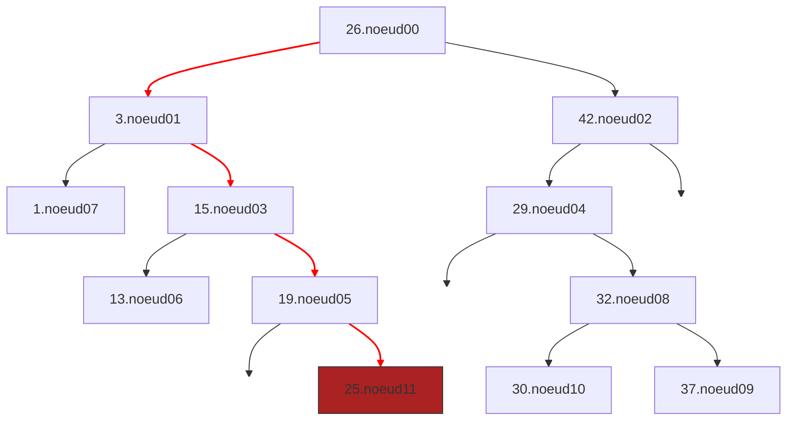

hide: - navigation  in docs.md



{{ corrige_sujetbac(repere_sujet) }}


{{ corrige_exobac(repere_sujet,1) }}


{{ corrige_exobac(repere_sujet,2) }}

1.  a.
   ```python
   {'type': 'classique', 'etat': 1, 'station': 'Coliseum'}
   ```
    b. 0 

    c. renvoie une erreur, car la clé 99 n’existe pas dans le dictionnaire flotte 
    
2.  a. le paramètre choix peut être égal à  “electrique" ou "classique” 
   
   b. Dans le cas où le paramètre choix est égal à “electrique”,  la fonction proposition renvoie “Prefecture” ou “Jacobins” selon la version de Python utilisée ! Dans le cas où le paramètre choix est égal à “classique”,  la fonction proposition renvoie “Baraban” ou “Coliseum” selon la version de Python utilisée !
   
3.  a.
    ```python
    def affiche(): 
        tab = [] 
        for v in flotte: 
            if flotte[v]["station"] == "Citadelle" and flotte[v]["etat"] == 1 : 
                tab.append(v) 
        print(tab)
    ```
    
    b.
    ```python
    def affiche(): 
        tab = [] 
        for v in flotte: 
            if flotte[v]["etat"] !=-1 and flotte[v]["type"] == "electrique": 
                tab.append((v,flotte[v]["station"])) 
        print(tab)
    ```

4.
    ```python
    def station(coord): 
    d = {} 
    for num,info in flotte.items() : 
        nom_station = info['station'] 
        distance_station = distance(stations[nom_station],coord) 
        if info['etat'] == 1 and distance_station < 800: 
            if nom_station not in d : 
                d[nom_station] = [distance_station, [num]] 
            else : 
                d[nom_station][1].append(num) 
    return d
    ```

{{ corrige_exobac(repere_sujet,3) }}



1. Etapes de l'insertion du noeud 11 de valeur 25 :

    * A gauche du noeud00 car il a pour valeur 26 et $25<26$

    * A droite du noeud01 car il a pour valeur 3 et $25>3$

    * A droite du noeud03 car il a pour valeur 15  et $25>15$

    * A droite du noeud05 car il a pour valeur 19  et $25>19$

2. A gauche du noeud04, on peut stocker les valeurs strictement inférieures à 29 et supérieures ou égales à 26. C'est à dire : 26,27, et 28.

    !!! note
        Le sujet précise dans son introduction que : 

        > les valeurs du sous-arbre droit sont **supérieures ou égales** à valeur du noeud.

        Avec cette définition, la valeur 26 est donc possible même si elle est déjà présente dans l'arbre. Si on considère que les valeurs sont uniques seules 27 et 28 sont possibles.

3.  &nbsp;

    a. 26, 3, 1, 15, 13, 19, 25, 42, 29, 32, 30, 37

    b.  C'est un parcours préfixé car la valeur du noeud est listé *avant* celle des valeurs présentes dans le sous arbre gauche et le sous arbre droit. La valeur du noeud serait listé *entre* ces valeurs pour un parcours infixe et *après* pour un parcours suffixé.

4.  Afin d'afficher les valeurs par ordre croissant, on doit effectuer un parcours infixe. C'est à dire afficher la valeur du noeud *entre* les valeurs du sous arbre gauche et du sous arbre droit.
```
Parcours2(A): 
    Parcours(A.fils_gauche)
    Afficher(A.valeur)
    Parcours(A.fils_droit)
``` 


{{ corrige_exobac(repere_sujet,4) }}


2.  a. On utilise 4 octets dans une adresse IP V4

    2.b, 2.c et 2.d
    

3. Adresses IP possibles : 192.168.20.30 et 192.168.20.230,
   
Partie B  

```python
def IP_bin(adr): 
    conv=[] 
    for o in adr: 
        conv.append(dec_bin(o)) 
    return conv 
```

{{ corrige_exobac(repere_sujet,5) }}


1.    

2.    

3.
```python 
def maximum(P): 
    m=depiler(P) 
    while not est_vide(P): 
        v = depiler(P) 
        if v > m: 
            m = v 
    return m
```
    
4.  a. Il suffit de mettre place une boucle qui s'arrêtera quand la pile P sera vide. À chaque tour de boucle, on dépile P, on empile les valeurs précédemment dépilées dans une pile auxiliaire Q et on incrémente un compteur  de 1. Une fois la boucle terminée, on crée une nouvelle boucle où  on dépile Q et on empile P avec les valeurs dépilées (l’idée est de retrouver l’état originel de pile. Il suffit ensuite de renvoyer la valeur du compteur. 
   
    b. 
    ```python
    def taille(P): 
        cmp = 0 
        Q = creer_pile() 
        while not est_vide(P): 
            v = depiler(P) empiler(Q,v) 
            cmp = cmp + 1 
        while not est_vide(Q): 
            v = depiler(Q) 
            empiler(P,v) 
        return cmp
    ```