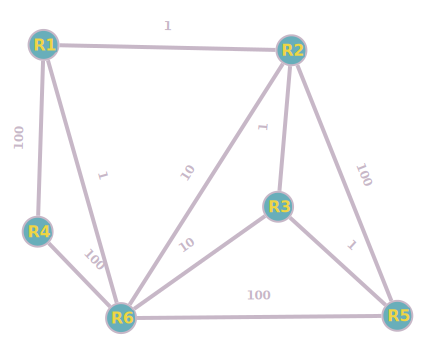

hide: - navigation  in docs.md



{{ corrige_sujetbac(repere_sujet) }}


{{ corrige_exobac(repere_sujet,1) }}

1.a  
La “commande” f(5) affiche :  
5  
4  
3  
2  
1  
Partez!  

1.b  
Parce que la fonction s’appelle elle-même.  

2.a  
```python
def ajouter(s, liste):
    res = [] 
    for m in liste:
        res.append(s+m)
    return res
```

2.b  
`['ba','bb','bc']` 

2.c 
`['a']`  

3.a 
`['']` il ne s’agit pas d’une liste vide, mais d’une liste contenant une chaine de caractère vide.  

3.b  
`['a','b']`  

2.c  
`['aa','ab','ba','bb']`


{{ corrige_exobac(repere_sujet,2) }}

1.a. La valeur associée à la clé “D” est “C”. Pour l’obtenir en Python, on écrit `alpha["D"]`  

1.b. DBEBEF  

2.  
```python
def chiffrer(mot, alpha): 
    mc = "" 
    for l in mot: 
        mc = mc + alpha[l] 
    return mc
```  

3.a. `alpha_d ={"B":"A", "D":"B", "A":"C", "C":"D", "F":"E", "G":"F", "E":"G"}`

3.b.  
```python
def dico_dechiffrement(dico): 
    nouveau = {} 
    for lettre in dico : 
        code = dico[lettre] 
        nouveau[code] = lettre 
    return nouveau
```

3.c.  
```python
def dechiffre(mot, dico): 
    dico_d = dico_dechiffrement(dico) 
    md = chiffrer(mot, dico_d) 
    return md
```  

4.  
```python
def dico_chiffrement(alphabet): 
    n = len(alphabet) 
    alphabet_m = random.sample(alphabet, n) 
    d = {} 
    for i in range(n): 
        d[alphabet[i]] = alphabet_m[i] 
    return d
```

{{ corrige_exobac(repere_sujet,3) }}

1.a. La clé primaire doit être unique, le seul attribut que peut être unique pour chaque entrée, est l’attribut Code_evaluation. Par conséquence, le seul attribut qui peut jouer le rôle de clé primaire est Code_evaluation.  

1.b.  
```sql
INSERT INTO Evaluations 
VALUES ('EXKVLX886', 'Term7', 'Peltier', '13/10/2021', 1453) 
```

2.a.  
11  

2.b.  
Term7,  13/10/2021   
Term5, 07/10/2021   

2.c.  
```sql
SELECT Nom_evaluation 
FROM Evaluations 
WHERE Code_competences = 452
```  

3.a. Il faut que le couple (Code_evaluation, Num_eleve) soit unique. Un élève donné ne peut donc pas faire plusieurs fois la même évaluation. 

3.b  
```sql
SELECT Num_eleve
FROM resultats JOIN Evaluations ON resultats.Code_evaluation = Evaluations.Code_evaluation 
WHERE Code_competences = 532
```

4.a.  
|attribut| type|
|:---:|:---:|
| Num_eleve| INT |
| Nom | CHAR |
| prenom | CHAR |
| classe | CHAR |  

4.b Num_eleve peut jouer le rôle de clé primaire


{{ corrige_exobac(repere_sujet,4) }}

1.a.  
```python
class Carte: 
    def __init__(self, val, coul): 
        self.valeur = val 
        self.couleur = coul 
```

1.b.  
```python
c7 = Carte(7, "coeur")
```

2.  
```python
def initialiser() : 
    jeu = [] 
    for c in ["coeur", "carreau", "trefle", "pique"] : 
        for v in range(2,15) : 
            carte_cree = Carte(v,c)
            jeu.append(carte_cree) 
    return jeu
```

3. La structure des données la plus adaptée est la file, puisque l’on a affaire à une structure de type FIFO (First IN First OUT). Le classement des cartes doit suivre la “règle FIFO”, car la carte remportée (la dernière arrivée) doit être placée en dessous du tas.  

4.  
```python
def comparer(carte1, carte2): 
    if carte1.valeur > carte2.valeur : 
        return 1 
    elif carte1.valeur < carte2.valeur :
        return-1 
    else : 
        return 0
```

{{ corrige_exobac(repere_sujet,5) }}

1.a. O4 = 00011111  

1.b.  
11111111.11111111.11111111.00000000  
255.255.255.0  

1.c. Il est possible d’adresser 254 machines :  
$2^8-1= 256 - 2 = 254$ (2 adresses ne sont pas disponibles : adresse du réseau et adresse de broadcast)  

2.a. L’adresse IP 70.37.150.6 (renseignée dans la table de routage de R4) correspond au routeur R6, le routeur R4 envoie donc le paquet de données vers le routeur R6.  

2.b  R4 → R6 → R5 

3.a. R4 → R1 → R2 → R5  

3.b. Il faut modifier la ligne du routeur R4   

|||||
|:---:|:---:|:---:|:---:|
|R4 |192.168.10.0 |144.50.65.1 | 144.50.65.4  |

4.a. 
{:.centre}

R4 → R1 → R2 → R3 → R5 (coût = 100 + 1 + 1 + 1 = 103)  

4.b. lignes tables de routage modifiées :   

|||||
|:---:|:---:|:---:|:---:|
|R2|192.168.10.0|85.40.65.3|85.40.65.2|
|R4|192.168.10.0|144.50.65.1|144.50.65.4|
| R6|192.168.10.0|32.18.145.3|32.18.145.6|