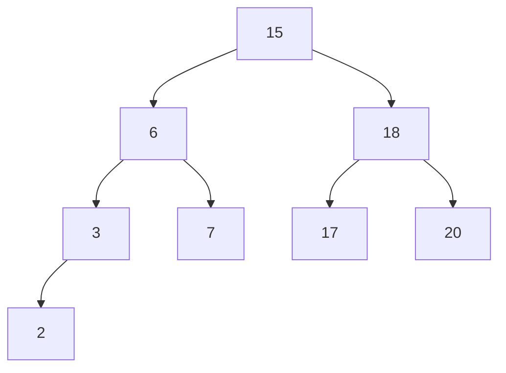
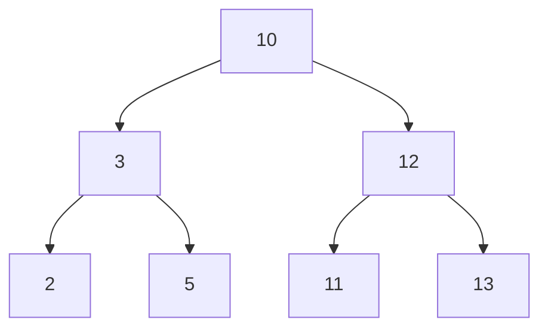

hide: - navigation  in docs.md



{{ corrige_sujetbac(repere_sujet) }}


{{ corrige_exobac(repere_sujet,1) }}

1.  a. Les commandes permettant de se positionner dans `timbres` depuis `fiches` sont : commande **1** et commande **5**

    b. Pour accéder au répertoire `timbres` depuis la racine, on peut écrire : `cd /home/document/collections/timbres`

2.  a. On applique la formule $C = \dfrac{10^8}{d}$ avec $d = 100$Mbit/s c'est à dire le coût d'une liaison FastEthernet :
$C = \dfrac{10^8}{100\times 10^6} = 1$. Donc le coût d'une liaison FastEthernet est 1. 

    b. On a reproduit ci-dessous le schéma du réseau, en faisant figurer le coût des liaisons (le coût d'une liaison FFTH est $\dfrac{10^8}{10 \times 10^9}=0,01$) :
    {.imgcentre width=600px}
    Selon le protocole OSPF (minimisation des coûts), le chemin suivi sera donc : {{route(["A","B","C","E","F","G"])}} pour un coût total de **1,04**.

3. Les descripteurs de ce fichier sont :  
    * `nom_timbre` avec pour valeurs `Gustave Eiffel`, `Marianne` et `Alan Turing`,
    * `annee_fabrication` avec pour valeurs `1950`, `1989` et `2021`,
    * `nom_collectionneur` avec pour valeurs `Dupont`, `Durand` et ̀`Dupont`.

4.  a. La clé primaire d'une relation est un attribut (ou ensemble d'attributs) permettant d'identifier de façon unique chaque enregistrement.

    b. L'attribut  `nom` ne peut pas servir de clé primaire car il n'est pas unique pour chaque enregistrement. Dans l'exemple proposé plusieurs timbres ont pour nom `Gustave Eiffel`.

    c. Pour la même raison, l'attribut `annee_fabrication` ne peut pas servir de clé primaire non plus. Dans l'exemple proposé plusieurs timbres ont pour année de fabrication 1989.

    d. On peut ajouter un attribut `id_timbre` qui est différent pour chaque enregistrement (par exemple en l'incrémentant de 1 à chaque ajout d'un timbre)

5.  a. Cette requête modifie l'attribut `ref_licence` en `Ythpswz` pour les enregistrements dont l'attribut `nom` est `Dupond`. Après cette requête la relation devient (en italique, les valeurs modifiées):

    |ref_licence|nom       |prenom         |annee_naissance|nbre_timbres|
    |-----------|----------|---------------|---------------|------------|
    |Hqdfapo|Dupuis|Daniel|1953|53|
    |*Ythpswz*|Dupond|Jean-Pierre|1961|157|
    |Qdfqnay|Zaouï|Jamel|1973|200|
    |Aerazri|Pierre|Jean|1967|130|
    |*Ythpswz*|Dupond|Alexandra|1960|61|

    b. L'attribut `ref_licence` ne peut plus être une clé primaire puisqu'il est n'est plus unique (la valeur `Ythpswz`  apparaît pour deux enregistrement)

6. 
```sql
SELECT nom, prenom, nbre_timbres 
FROM collectionneurs
WHERE annee_naissance >= 1963;
```

{{ corrige_exobac(repere_sujet,2) }}

1.  a. Une fonction récursive qui est une fonction qui s'appelle elle-même.

    b. La fonction `compte_rebours` ne fait rien si l'argument `n` passé en paramètre est négatif. Après l'affichage de `0`, `compte_rebours` est appelé avec la valeur `-1` et donc le programme s'arrête.

2.  
```python
def fact(n):
    """ Renvoie le produit des nombres entiers strictement positifs inférieurs à n """
    if n == 0:
        return 1
    else:
        return n * fact(n-1)
```

3.  a. Dans la console l'affichage produit sera :
```pycon
3
2
1
```
En effet, `somme_entiers_rec(3)` va afficher 3 et appeler `somme_entiers(2)` qui va afficher 2 et appeler `somme_entiers(1)` qui va afficher 1.

    b. La valeur 6 sera affecté à la variable `res` ($3 + 2 + 1$)

4.
```python
def somme_entiers(n):
    somme = 0
    for k in range(1,n+1):
        somme = somme + k
    return somme
```


{{ corrige_exobac(repere_sujet,3) }}

1.  a. Un exemple d'attribut de la classe `ArbreBinaire` est `valeur`. Un exemple de méthode est `insert_gauche`.

    b. `a` aura le valeur 15 et `c` la valeur 6.

2.  


3. La valeur `13` figure dans le sous arbre gauche du noeud `12` qui ne doit contenir que des valeurs *plus petites* que 12 si l'arbre était binaire. On obtient un arbre binaire de recherche en inversant les positions du `13` et du `11`.



4.
La liste renvoyée sera : `[1,6,10,15,16,18,25]`. On rappelle que dans un parcours infixe, on parcourt d'abord le sous arbre gauche, puis la racine puis le sous arbre droit. Et que dans le cas d'un arbre binaire de recherche ce parcours permet d'obtenir les valeurs dans l'ordre croissant.