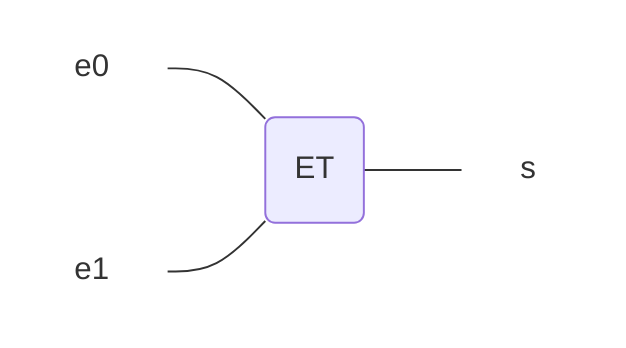
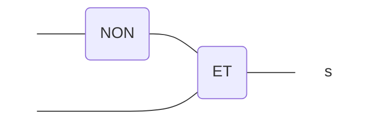







{{ titre_chapitre(num,titre,theme,niveau)}}


## 2021, France sujet 1

!!! exo

**Partie A**

Cette partie est un questionnaire à choix multiples (QCM).
Pour chacune des questions, une seule des quatre réponses est exacte. Le candidat indiquera sur sa copie le numéro de la question et la lettre correspondant à la réponse exacte.
Aucune justification n’est demandée. Une réponse fausse ou une absence de réponse n’enlève aucun point.

!!! question "Question 1"
    Parmi les commandes ci-dessous, laquelle permet d’afficher les processus en cours d’exécution ?

        a. dir  
        b. ps  
        c. man  
        d. ls  

!!! question "Question 2"
    Quelle abréviation désigne l’identifiant d’un processus dans un système d’exploitation de type UNIX ? 

        a. PIX  
        b. SIG  
        c. PID  
        d. SID  

!!! question "Question 3"
    Comment s’appelle la gestion du partage du processeur entre différents processus ?

        a. L’interblocage  
        b. L’ordonnancement  
        c. La planification  
        d. La priorisation  

!!! question "Question 4"
    Quelle commande permet d’interrompre un processus dans un système d’exploitation de type UNIX ?

        a. stop  
        b. interrupt  
        c. end  
        d. kill  

??? tip "Correction"
    1.b  
    2.c  
    3.b  
    4.d  


**Partie B**

!!! question "Question 1"
    Un processeur choisit à chaque cycle d’exécution le processus qui doit être exécuté. Le tableau ci-dessous donne pour trois processus P1, P2, P3 :

    - la durée d’exécution (en nombre de cycles),

    - l’instant d’arrivée sur le processeur (exprimé en nombre de cycles à partir de 0),

    - le numéro de priorité.

    Le numéro de priorité est d’autant plus petit que la priorité est grande. On suppose qu’à chaque instant, c’est le processus qui a le plus petit numéro de priorité qui est exécuté, ce qui peut provoquer la suspension d’un autre processus, lequel reprendra lorsqu’il sera le plus prioritaire.

    

    Reproduire le tableau ci-dessous sur la copie et indiquer dans chacune des cases le processus exécuté à chaque cycle.

    

??? tip "Correction"
    

!!! question "Question 1"
    On suppose maintenant que les trois processus précédents s’exécutent et utilisent une ou plusieurs ressources parmi R1, R2 et R3.
    Parmi les scénarios suivants, lequel provoque un interblocage ? Justifier.

    

??? tip "Correction"
    Il s’agit du scénario 2 car nous nous retrouvons dans la situation où P1 possède R1 et attend R2 avant de pouvoir continuer et P3 possède R2 et attend R1 avant de pouvoir continuer.

**Partie C**  

Dans cette partie, pour une meilleure lisibilité, des espaces sont placées dans les écritures
binaires des nombres. Il ne faut pas les prendre en compte dans les calculs.  
Pour chiffrer un message, une méthode, dite du masque jetable, consiste à le combiner avec une
chaîne de caractères de longueur comparable.  
Une implémentation possible utilise l’opérateur XOR (ou exclusif) dont voici la table de vérité :

|a|b|a XOR b|
|:---:|:---:|:---:|
|0|0|0|
|0|1|1|
|1|0|1|
|1|1|0|

Dans la suite, les nombres écrits en binaire seront précédés du préfixe 0b.

!!! question "Question 1"
    Pour chiffrer un message, on convertit chacun de ses caractères en binaire (à l’aide du format Unicode), et on réalise l’opération XOR bit à bit avec la clé.  
    Après conversion en binaire, et avant que l’opération XOR bit à bit avec la clé n’ait été effectuée, Alice obtient le message suivant :  

    `m = 0b 0110 0011 0100 0110`

    **a.** Le message m correspond à deux caractères codés chacun sur 8 bits : déterminer quels sont ces caractères. On fournit pour cela la table ci-dessous qui associe à l’écriture hexadécimale d’un octet le caractère correspondant (figure 2). Exemple de lecture : le caractère correspondant à l’octet codé 4A en hexadécimal est la lettre J.

    {:.center}


??? tip "Correction"
    0100 0110 => 46 en hexa => caractère F  
    0110 0011 => 63 en hexa => caractère c  

    donc cF

!!! question "Question 1.b"
    Pour chiffrer le message d’Alice, on réalise l’opération XOR bit à bit avec la clé suivante :  
    `k = 0b 1110 1110 1111 0000`  

    Donner l’écriture binaire du message obtenu.

??? tip "Correction"
    `0b 1000 1101 1011 0110`

!!! question "Question 2.a" 
    Dresser la table de vérité de l’expression booléenne suivante : 

    `(a XOR b) XOR b`

??? tip "Correction"
    |a|b|(a XOR b) XOR b|
    |:---:|:---:|:---:|
    |0|0|0|
    |0|1|0|
    |1|0|1|
    |1|1|1|

!!! question "Question 2.b"
    Bob connaît la chaîne de caractères utilisée par Alice pour chiffrer le message. Quelle opération doit-il réaliser pour déchiffrer son message ?

??? tip "Correction"
    On peut remarquer que (a xor b) xor b permet de retrouver a, donc si a correspond au message non chiffré et a xor b correspond au message chiffré, un (a xor b) xor b permet donc de retrouver le message non chiffré. Si on appelle m le message non chiffré, m’ le message chiffré et k la clé de chiffrement, un m’ xor k permettra de retrouver m.


## 2021, France sujet annulé

!!! exo "d'après le sujet du bac NSI 2021"

_Cet exercice porte sur les systèmes d’exploitation : gestion des processus et des ressources._    
_Les parties A et B peuvent être traitées indépendamment_

**Partie A**  

!!! question "Question 1"
    La commande ps suivie éventuellement de diverses options permet de lister les processus actifs ou en attente sur une machine.
    Sur une machine équipée du système d’exploitation GNU/Linux, la commande “ps -aef” permet d’obtenir la sortie suivante (extrait) :

    


    **a)** Quelle est la particularité de l’utilisateur “root” ?

    **b)** Quel est le processus parent du processus ayant pour PID 3383

??? tip "Correction"

Dans un bureau d’architectes, on dispose de certaines ressources qui ne peuvent être utilisées simultanément par plus d’un processus, comme l’imprimante, la table traçante, le modem. Chaque programme, lorsqu’il s’exécute, demande l’allocation des ressources qui lui sont nécessaires. Lorsqu’il a fini de s’exécuter, il libère ses ressources.


!!! question "Question 2"
    On appelle p1, p2 et p3 les processus associés respectivement aux programmes 1, 2 et 3.

    **a)** Justifier qu'une situation d'interblocage peut se produire.

    **b)** Modifier l'ordre des instructions du programme 3 pour qu'une telle situation ne puisse pas se produire.

??? tip "Correction"
    **2.a** Pour passer à l’exécution, le Programme 1 a besoin du modem, mais le modem est déjà utilisé par le Programme 2. Le processus p1 est donc bloqué. Pour passer à l’exécution, le Programme 2 a besoin de l’imprimante, mais l’imprimante est déjà utilisée par le Programme 3. Le processus p2 est donc bloqué. Pour passer à l’exécution, le Programme 3 a besoin de la table traçante, mais la table traçante est déjà utilisée par le Programme 1. Le processus p3 est donc bloqué. Les 3 processus sont bloqués et ne pourront pas libérer les ressources attendues par les autres processus (la libération des ressources se faisant après l’exécution), nous sommes bien en situation d’interblocage.  

    **2.b**  

    |Programme 3|
    |:---:|
    |demander (table traçante)|
    |demander (imprimante)|
    |exécution|
    |libérer (imprimante)|
    |libérer (table traçante)|

!!! question "Question 3"
    Supposons que le processus p1 demande la table traçante alors qu'elle est en cours d'utilisation par le processus p3. Parmi les états suivants, quel sera l'état du processus p1 tant que la table traçante n'est pas disponible :  
    
    a) élu  
    b) bloqué  
    c) prêt  
    d) terminé  

??? tip "Correction"
    bloqué

**Partie B**  

Avec une ligne de commande dans un terminal sous Linux, on obtient l'affichage suivant :


La documentation Linux donne la signification des différents champs :

- UID : identifiant utilisateur effectif ;  
- PID : identifiant de processus ;  
- PPID : PID du processus parent ;  
- C : partie entière du pourcentage d'utilisation du processeur par rapport au temps de vie des  processus ;  
- STIME : l'heure de lancement du processus ;  
- TTY : terminal de contrôle  
- TIME : temps d'exécution  
- CMD : nom de la commande du processus  

!!! question "Question 1"
    Parmi les quatre commandes suivantes, laquelle a permis cet affichage ?  

    a) ls -l  
    b) ps –ef  
    c) cd ..  
    d) chmod 741 processus.txt  

??? tip "Correction"
    ps -ef

!!! question "Question 2"
    Quel est l'identifiant du processus parent à l'origine de tous les processus concernant le navigateur Web (chromium-browser) ?

??? tip "Correction"
    L’identifiant du processus parent à l’origine de tous les processus concernant le navigateur Web est 831

!!! question "Question 3"
    Quel est l'identifiant du processus dont le temps d'exécution est le plus long ?

??? tip "Correction"
    L’identifiant du processus dont le temps d’exécution est le plus long est 6211 (00:01:16)


## 2021, France candidat libre

!!! exo "Extrait sujet BAC 2021"

_Cet exercice porte sur la gestion des processus par un système d’exploitation._

**Partie A : Processus**  

La commande UNIX ps présente un cliché instantané des processus en cours d'exécution.  
Avec l’option −eo pid,ppid,stat,command, cette commande affiche dans l’ordre l’identifiant du processus PID (process identifier), le PPID (parent process identifier), l’état STAT et le nom de la commande à l’origine du processus.  

Les valeurs du champ STAT indique l’état des processus :  

- R : processus en cours d’exécution  
- S : processus endormi  

Sur un ordinateur, on exécute la commande ps −eo pid,ppid,stat,command et on obtient un affichage dont on donne ci-dessous un extrait. 


À l'aide de cet affichage, répondre aux questions ci-dessous.

!!! question "Question 1"
    Quel est le nom de la première commande exécutée par le système d'exploitation lors du démarrage ?

??? tip "Correction"
    La première commande exécutée par le système d’exploitation lors du démarrage est la commande init

!!! question "Question 2"
    Quels sont les identifiants des processus actifs sur cet ordinateur au moment de l’appel de la commande ps ? Justifier la réponse.  

??? tip "Correction"
    Les processus actifs sont les processus ayant pour PID 5440 et 5450 (présence de l’indicateur R dans la colonne STAT pour ces 2 processus).

!!! question "Question 3"
    Depuis quelle application a-t-on exécuté la commande ps ?  
    Donner les autres commandes qui ont été exécutées à partir de cette application.  

??? tip "Correction"
    La commande ps a été exécutée depuis l’application Bash (car le processus ps a pour PPID 1912 qui correspond au PID de Bash).  
    Deux autres processus Bash (PID 2014 et PID 2013) et un processus python programme1.py (PID 5437) ont été lancés depuis le processus Bash de PID 1912.

!!! question "Question 4"
    Expliquer l'ordre dans lequel les deux commandes python programme1.py et python programme2.py ont été exécutées.  

??? tip "Correction"
    Le processus python programme1.py a un PID de 5437 alors que le processus python programme2.py a un PID de 5440. python programme1.py a été exécuté avant python programme2.py.

!!! question "Question 5"
    Peut-on prédire que l'une des deux commandes python programme1.py et python programme2.py finira avant l’autre ?

??? tip "Correction"
    Non, aucune prédiction n’est possible.

## 2023, Polynésie, J1

!!! exo "Ordonnanceur avec liste d'attente"

Un système est composé de 4 périphériques, numérotés de 0 à 3, et d'une mémoire, reliés entre eux par un bus auquel est également connecté un dispositif ordonnanceur. À l'aide d'un signal spécifique envoyé sur le bus, l'ordonnanceur sollicite à tour de rôle les périphériques pour qu'ils indiquent le type d'opération (lecture ou écriture) qu'ils souhaitent effectuer, et l'adresse mémoire concernée.

Un tour a lieu quand les 4 périphériques ont été sollicités. **Au début d'un nouveau tour, on considère que toutes les adresses sont disponibles en lecture et écriture.**

Si un périphérique demande l'écriture à une adresse mémoire **à laquelle on n'a pas encore accédé** pendant le tour, l'ordonnanceur répond `"OK"` et l'écriture a lieu. Si on a déjà demandé la lecture ou l'écriture à cette adresse, l'ordonnanceur répond `"ATT"` et l'opération n'a pas lieu.

Si un périphérique demande la lecture à une adresse à laquelle on n'a pas encore accédé en écriture pendant le tour, l'ordonnanceur répond `"OK"` et la lecture a lieu. Plusieurs lectures peuvent avoir donc lieu pendant le même tour à la même adresse.

Si un périphérique demande la lecture à une adresse à laquelle on a déjà accédé en écriture, l'ordonnanceur répond `"ATT"` et la lecture n'a pas lieu.

Ainsi, pendant un tour, une adresse peut être utilisée soit une seule fois en écriture, soit autant de fois qu'on veut en lecture, soit pas utilisée.

Si un périphérique ne peut pas effectuer une opération à une adresse, il demande la même opération à la même adresse au tour suivant.

**1.** Le tableau donné en annexe 1 indique, sur chaque ligne, le périphérique sélectionné, l'adresse à laquelle il souhaite accéder et l'opération à effectuer sur cette adresse. Compléter dans la dernière colonne de cette annexe, à rendre avec la copie, la réponse donnée par l'ordonnanceur pour chaque opération.


!!! abstract "Annexe 1"

    |N° périphérique | Adresse | Opération | Réponse de l'ordonnanceur |
    |:---|:---|:---|:---|
    | 0 | `10` | écriture | `"OK"` |
    | 1 | `11` | lecture  | `"OK"` |
    | 2 | `10` | lecture  | `"ATT"` |
    | 3 | `10` | écriture | `"ATT"` |
    | 0 | `12` | lecture  |  |
    | 1 | `10` | lecture  |  |
    | 2 | `10` | lecture  |  |
    | 3 | `10` | écriture |  |

??? success "Réponse"

    |N° périphérique | Adresse | Opération | Réponse de l'ordonnanceur |
    |:---|:---|:---|:---|
    | 0 | `10` | écriture | `"OK"` |
    | 1 | `11` | lecture  | `"OK"` |
    | 2 | `10` | lecture  | `"ATT"` |
    | 3 | `10` | écriture | `"ATT"` |
    | 0 | `12` | lecture  | `"OK"` |
    | 1 | `10` | lecture  | `"OK"` |
    | 2 | `10` | lecture  | `"OK"` |
    | 3 | `10` | écriture | `"ATT"` |

    Il s'agit d'un nouveau tour, les lectures sont possibles, la première écriture ne l'est pas, on a déjà accédé en lecture pendant le tour à l'adresse demandée.


On suppose dans toute la suite que :

- le périphérique 0 écrit systématiquement à l'adresse `10` ;
- le périphérique 1 lit systématiquement à l'adresse `10` ;
- le périphérique 2 écrit alternativement aux adresses `11` et `12` ;
- le périphérique 3 lit alternativement aux adresses `11` et `12` ;

Pour les périphériques 2 et 3, le changement d'adresse n'est effectif que lorsque l'opération est réalisée.


**2.** On suppose que les périphériques sont sélectionnés à chaque tour dans l'ordre 0 ; 1 ; 2 ; 3. Expliquer ce qu'il se passe pour le périphérique 1.

??? success "Réponse"

    - À chaque début de tour, le périphérique 0 demande à écrire à l'adresse `10` ; c'est accepté.
    - Juste après, le périphérique 1 demande à lire à l'adresse `10` ; c'est refusé.

    Le périphérique 1 ne pourra jamais lire l'adresse `10`.

Les périphériques sont sollicités de la manière suivante lors de quatre tours successifs :

- au premier tour, ils sont sollicités dans l'ordre 0 ; 1 ; 2 ; 3 ;
- au deuxième tour, dans l'ordre 1 ; 2 ; 3 ; 0 ;
- au troisième tour, 2 ; 3 ; 0 ; 1 ;
- puis 3 ; 0 ; 1 ; 2 au dernier tour.
- Et on recommence...

**3.a.** Préciser pour chacun de ces tours si le périphérique 0 peut écrire et si le périphérique 1 peut lire.

??? success "Réponse"

    - **Tour 1** : 0 ; 1 ; 2 ; 3
        - 0 peut écrire, puis
        - 1 ne peut pas lire
    - **Tour 2** : 1 ; 2 ; 3 ; 0
        - 1 peut lire, puis
        - 0 ne peut pas écrire
    - **Tour 3** : 2 ; 3 ; 0 ; 1
        - 0 peut écrire, puis
        - 1 ne peut pas lire
    - **Tour 4** : 3 ; 0 ; 1 ; 2
        - 0 peut écrire, puis
        - 1 ne peut pas lire

**3.b.** En déduire la proportion des valeurs écrites par le périphérique 0 qui sont effectivement lues par le périphérique 1.

??? success "Réponse"
    - Au tour 1, la valeur écrite par le périphérique 0 sera lue par le périphérique 1 au tour suivant.
    - Au tour 2, rien n'est écrit par le périphérique 0.
    - Au tour 3, la valeur écrite par le périphérique 0 **ne sera jamais** lue par le périphérique 1 ; en effet, une autre écriture intervient avant la prochaine lecture.
    - Au tour 4, la valeur écrite par le périphérique 0 **ne sera jamais** lue par le périphérique 1 ; en effet, une autre écriture intervient avant la prochaine lecture.

    Ainsi, une seule valeur sur trois sera effectivement lue. La proportion est $\frac13$.


On change la méthode d'ordonnancement : on détermine l'ordre des périphériques au cours d'un tour à l'aide de deux listes d'attente `ATT_L` et `ATT_E` établies au tour précédent.


Au cours d'un tour, on place dans la liste `ATT_L` toutes les opérations de lecture mises en attente, et dans la liste d'attente `ATT_E` toutes les opérations d'écriture mises en attente.


Au début du tour suivant, on établit l'ordre d'interrogation des périphériques en procédant ainsi :

- on interroge ceux présents dans la liste `ATT_L`, par ordre croissant d'adresse,
- on interroge ensuite ceux présents dans la liste `ATT_E`, par ordre croissant
d'adresse,
- puis on interroge les périphériques restants, par ordre croissant d'adresse.

**4.** Compléter et rendre avec la copie le tableau fourni en annexe 2, en utilisant l'ordonnancement décrit ci-dessus, sur 3 tours.

!!! abstract "Annexe 2"

    | Tour | N° périphérique | Adresse | Opération | Réponse ordonnanceur | `ATT_L` | `ATT_E` |
    |:---|:---|:---|:---|:---|:---|:---|
    | 1 | 0 | `10` | écriture | `"OK"`  | vide      | vide |
    | 1 | 1 | `10` | lecture  | `"ATT"` | `(1, 10)` | vide |
    | 1 | 2 | `11` | écriture |         |           |      |
    | 1 | 3 | `11` | lecture  |         |           |      |
    | 2 | 1 | `10` | lecture  |         |           | vide |
    | 2 |   |      |          |         |           |      |
    | 2 |   |      |          |         |           |      |
    | 2 |   |      |          |         |           |      |
    | 3 | 0 | `10` | écriture |         | vide      | vide |
    | 3 | 1 | `10` | lecture  |         |           | vide |
    | 3 | 2 | `11` | écriture | `"OK"`  | `(1, 10)` | vide |
    | 3 | 3 | `12` | lecture  |         |           |      |

??? success "Réponse"

    | Tour | N° périphérique | Adresse | Opération | Réponse ordonnanceur | `ATT_L` | `ATT_E` |
    |:---|:---|:---|:---|:---|:---|:---|
    | 1 | 0 | `10` | écriture | `"OK"`  | vide      | vide |
    | 1 | 1 | `10` | lecture  | `"ATT"` | `(1, 10)` | vide |
    | 1 | 2 | `11` | écriture | `"OK"`  | `(1, 10)` | vide |
    | 1 | 3 | `11` | lecture  | `"ATT"` | `(1, 10), (3, 11)` | vide |
    | 2 | 1 | `10` | lecture  | `"OK"`  | `(3, 11)` | vide |
    | 2 | 3 | `11` | lecture  | `"OK"`  | vide      | vide |
    | 2 | 0 | `10` | écriture | `"ATT"` | vide      | `(0, 10)` |
    | 2 | 2 | `12` | écriture | `"OK"`  | vide      | `(0, 10)` |
    | 3 | 0 | `10` | écriture | `"OK"`  | vide      | vide |
    | 3 | 1 | `10` | lecture  | `"ATT"` | `(1, 10)` | vide |
    | 3 | 2 | `11` | écriture | `"OK"`  | `(1, 10)` | vide |
    | 3 | 3 | `12` | lecture  | `"OK"`  | `(1, 10)` | vide |


Les colonnes **e0** et **e1** du tableau suivant recensent les deux chiffres de l'écriture binaire de l'entier **n** de la première colonne.

| nombre n | écriture binaire de n sur deux bits | e1 | e0 |
|:--------:|:-----------------------------------:|:--:|:--:|
|0|00|0|0|
|1|01|0|1|
|2|10|1|0|
|3|11|1|1|

L'ordonnanceur attribue à deux signaux sur le bus de données les valeurs de **e0** et **e1** associées au numéro du circuit qu'il veut sélectionner. On souhaite construire à l'aide des portes ET, OU et NON un circuit pour chaque périphérique.  
Chacun des quatre circuits à construire prend en entrée deux signaux **e0** et **e1**, le signal de sortie **s** valant 1 uniquement lorsque les niveaux de **e0** et **e1** correspondent aux bits de l'écriture en binaire du numéro du périphérique correspondant.


Par exemple, le circuit ci-dessous réalise la sélection du périphérique 3. En effet, le signal **s** vaut 1 si et seulement si **e0** et **e1** valent tous les deux 1.




**5.a.** Recopier sur la copie et indiquer dans le circuit ci-dessous les entrées **e0** et **e1** de façon que ce circuit sélectionne le périphérique 1.



??? success "Réponse"

    ```mermaid
    flowchart LR
        ea(e1)---NON(NON)---ET(ET)
        eb(e0)----ET
        ET---s
        style ea stroke-width:0px,opacity:0
        style eb stroke-width:0px,opacity:0
        style s stroke-width:0px,opacity:0
    ```

**5.b.** Dessiner un circuit constitué d'une porte ET et d'une porte NON, qui sélectionne le périphérique 2.

??? success "Réponse"

    ```mermaid
    flowchart LR
        ea(e1)----ET(ET)
        eb(e0)---NON(NON)---ET
        ET---s
        style ea stroke-width:0px,opacity:0
        style eb stroke-width:0px,opacity:0
        style s stroke-width:0px,opacity:0
    ```


**5.c.** Dessiner un circuit permettant de sélectionner le périphérique 0.

??? success "Réponse"

    ```mermaid
    flowchart LR
        ea(e0)---NON1(NON)---ET(ET)
        eb(e1)---NON2(NON)---ET
        ET---s
        style ea stroke-width:0px,opacity:0
        style eb stroke-width:0px,opacity:0
        style s stroke-width:0px,opacity:0
    ```

## 2022, Amérique du Nord, J2

!!! exo

Cet exercice pourra utiliser des commandes de système d'exploitation de type UNIX telles que `cd, ls, mkdir, rm, rmd, mv, cat`.  

!!! question "Question 1"
    Dans un système d'exploitation de type UNIX, on considère l'arborescence des fichiers suivante dans laquelle les noms de dossiers sont en italique et ceux des fichiers qui sont en gras :

    {:.center width:250px}

    On souhaite, grâce à l'utilisation du terminal de commande, explorer et modifier les répertoires et fichiers présents.  
    On suppose qu'on se trouve actuellement à l'emplacement _/home/morgane_  

    **(a)** Parmi les quatre propositions suivantes, donner celle correspondant à l'affichage obtenu lors se l'utilisation de la commande `ls`.  

    - **Proposition 1 :** lycee francais NSI info.txt image1.jpg perso  
    - **Proposition 2 :** lycee perso  
    - **Proposition 3 :** morgane  
    - **Proposition 4 :** bin etc home tmp  

    **(b)** Ecrire la commande qui permet, à partir de cet emplacement, d'attendre le répertoire **lycee**.  
    On suppose maintenant qu'on se trouve dans le repertoire `/home/morgane/lycee/NSI`  

    **(c)** Ecrire la commande qui permet de créer à cet emplacement un répertoire nommé `algorithmique`.  

    **(d)**  Ecrire la commande qui permet, à partir de cet emplacement, de supprimer le fichier `image1.jpg`.  


!!! question "Quesiton 2"
    On rappelle qu'un processus est une instance d'application. Un processus peut être démarré par l'utilisateur, par un périphérique ou par un autre processus appelé parent.  
    La commande UNIX `pa` présente un cliché instantané des procesus en cours d'exécution.  
    On a exécuté la commande `ps` (avec quelques options qu'il n'est pas nécessaire de connaître pour la réussite de cet exercice). Un extrait du résultat de la commande est présenté ci-dessous :  

    {:.center width:250px}  

    On rappelle que :  

    - l'UID est l'identifiant de l'utilisateur propriétaire du processus;  
    - le PID est l'identifiant du processus parent;  
    - le PPID est l'identifiant du provessus parent;  
    - C indique l'utilisation processeur;  
    - STIME est l'heure de démarrage du processus;  
    - TTy est le nom du terminal de commande auquel le processus est attaché;  
    - TIME est la durée d'utilisation du processus par le processeur;  
    - CMD le nom de commande utilisé pour démarrer le processus.  

    **(a)** Donner le PID du parent du processus démarré par la commande `vi`.  
    **(b)** Donner le PID d'un processus enfant du processus démarré par la commande `xfce4-terminal`.  
    **(c)** Citer le PID de deux processus qui ont le même parent.  
    **(d)** Parmi tous les processus affichés, citer le PID des deux qui ont consommé le plus de temps.  

!!! question "Question 3"
    On considère les trois processus P1, P2, P3, tous soumis à l'instant 0 dans l'ordre 1, 2, 3 :  

    |Nom du processus|Durée d'exécution <br> en unité de temps| Ordre de soumission|    
    |:---:|:---:|:---:|    
    | P1 | 3 | 1 |    
    | P2 | 1 | 2 |    
    | P3 | 4 | 3 |    

    **(a)** Dans cette question, on considère que les processus sont exécutés de manière concurrente selon la politique du tourniquet : le temps est découpé en tranches nommées _quantums de temps_.  
    Les processus prêts à être exécutés sont placés dans une file d'attente selon leur ordre de soumission.  
    Lorsqu'un processus est élu, il s'exécute au plus durant un quantum de temps. Si le processus n'a pas terminé son exécution à l'issue du quantum de temps, il réintègre la file des processus prêts (coté entrée). Un autre processus, désormais en tête de la file (coté sortie) des processus prêts, est alors à son tour élu pour une durée égale à un quantum de temps maximum.  

    

    Reproduire le tableau ci-dessous sur la copie et indiquer dans chacune des cases le processus exécuté à chaque cycle. Le quantum correspond à une unité de temps.  

    

    **(b)** Dans cette question, on considère que les processus sont exécutés en appliquant la politique du plus court d'abord : les processus sont exécutés complétement dans l'ordre croissant de leurs temps d'exécution, le plus court étant exécuté en premier.  
    Reproduire le tableau ci-dessous sur la copie et indiquer dans chacune des cases le processus excécuté à chaque cycle.  

    

!!! question "Question 4"    
    On considère trois ressources R1, R2 et R3 et trois processus P1,P2 et P3 dont les files d'exécution des instructions élèmentaires sont indiquées ci-dessous : 

      

    **(a)** Rappeler les différens états d'un processus et expliquer pourquoi il y a ici risque d'interblocage, en proposant un ordre d'exécution des instructions élèmentaires le provoquant.  
    **(b)** Proposer un ordre d'exécution des instructions élèmentaires sans interblocage.