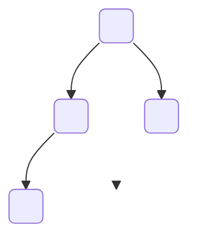
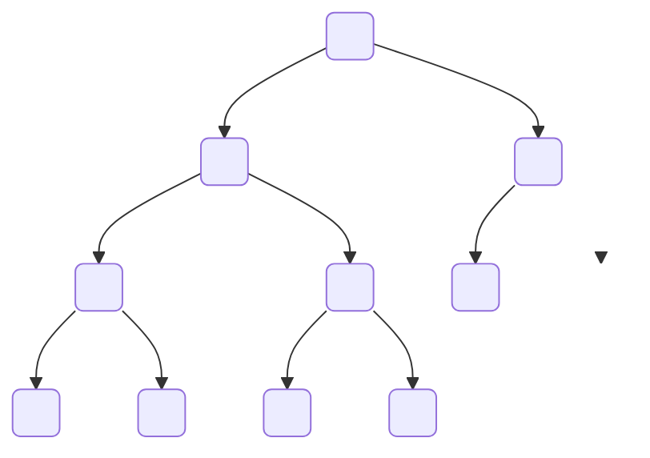
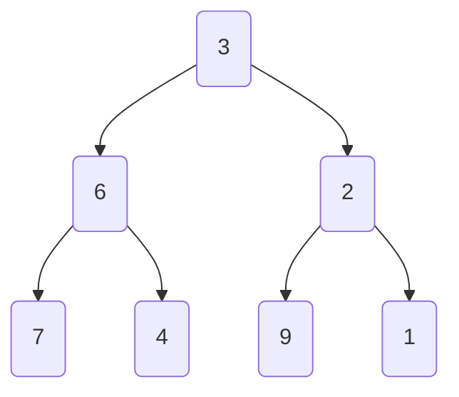
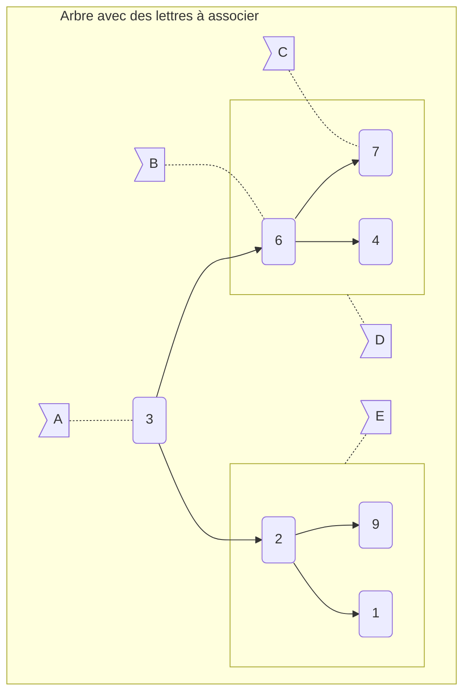
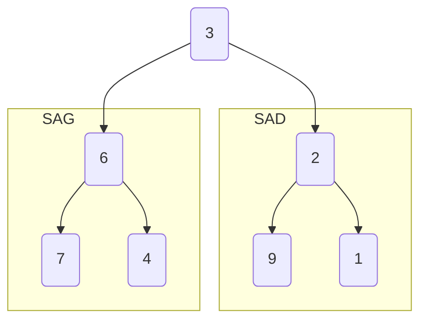







{{ titre_chapitre(num,titre,theme,niveau)}}

{{ initexo(0) }}


## 2022, Polynésie, J1, Ex. 5

!!! exo "BAC : Construction d'arbres binaires"


On manipule ici les arbres binaires avec trois fonctions :

- `est_vide(A)` renvoie `True` si l'arbre binaire `A` est vide, `False` s'il ne l'est pas ;

- Pour un arbre binaire `A` **non vide** :

    - `sous_arbre_gauche(A)` renvoie le sous-arbre à gauche de `A` ;
    - `sous_arbre_droite(A)` renvoie le sous-arbre à droite de `A`.

L'arbre binaire renvoyé par les fonctions `sous_arbre_gauche` et `sous_arbre_droite` peut éventuellement être l'arbre vide.

On définit la hauteur d'un arbre binaire de la façon suivante :

- la hauteur de l'arbre vide est $0$ ;
- sinon, la hauteur est égale à $1 + M$, où $M$ est la plus grande des hauteurs de ses sous-arbres (à gauche et à droite).

**1.a.** Donner la hauteur de l'arbre ci-dessous.




??? success "Réponse" 
    {{ correction(True, 
    "
    Avec cette définition, la hauteur de cet arbre binaire est 3.
    ")}}

**1.b.** Dessiner sur la copie un arbre binaire de hauteur $5$.

??? success "Réponse"
    {{ correction(True, 
    "
    Avec cette définition, voici un arbre binaire de hauteur $5$.

    ```mermaid
    graph TD
        N0( ) --> N1( )
        N0   --> N2( )
        N1  --> N3( )
        N1  --> N4( )
        N2  --> N5( )
        N2  --> N6( )
        N4  --> N7( )
        N4  --> N8( )
        N7  --> N9( )
        N7  --> N10( )
        linkStyle 7 stroke-width:0px;
        style N8 opacity:0;
        linkStyle 4 stroke-width:0px;
        style N5 opacity:0;
    ```
    "
    )}}

La hauteur d'un arbre est calculée par l'algorithme récursif suivant :

```text title="Pseudo Code", linenums="1"
Algorithme hauteur(A) :
    si A vide :
        renvoyer ...
    sinon:
        renvoyer 1 + max(
            hauteur(sous_arbre_gauche(A)),
            ...
        )
```

**2.** Recopier sur la copie les lignes 3 et 7 en complétant les points de suspension.

??? success "Réponse"
    ```text title="Pseudo Code", linenums="1"
    Algorithme hauteur(A) :
        si A vide :
            renvoyer 0
        sinon:
            renvoyer 1 + max(
                hauteur(sous_arbre_gauche(A)),
                hauteur(sous_arbre_droite(A)),
            )
    ```


On considère un arbre binaire `R` dont on note `G` le sous-arbre à gauche et `D` le sous-arbre à droite. On suppose que `R` est de hauteur $5$ et `G` de hauteur $3$.

**3.a.** Justifier le fait que `D` n'est pas l'arbre vide et déterminer sa hauteur.

??? success "Réponse"
    {{ correction(True, 
    "
    Si `D` est égal à l'arbre vide, alors la hauteur de `R` est égale à `1 + hauteur(G)` qui est égal à $1+3=4$, or `R` est de hauteur $5$. Contradiction.

    Ainsi `D` n'est pas l'arbre vide.
    
    Dans ce cas `1 + max(hauteur(G), hauteur(D))` est égal à $4$. D'où

    - `1 + max(3, hauteur(D))` est égal à $5$.
    - `max(3, hauteur(D))` est égal à $4$.
    - `hauteur(D)` est égal à $4$.
    "
    )}}

**3.b.** Illustrer cette situation par un dessin.

??? success "Réponse"
    {{ correction(True, 
    "
    - Cet arbre est de hauteur $5$,
    - son sous arbre à gauche est de hauteur $3$,
    - son sous arbre à droite est de hauteur $4$.

    ```mermaid
    graph TD
        N0( ) --> N1( )
        N0   --> N2( )
        N1  --> N3( )
        N1  --> N4( )
        N2  --> N5( )
        N2  --> N6( )
        N4  --> N7( )
        N4  --> N8( )
        N6  --> N9( )
        N6  --> N10( )
        N9  --> N11( )
        N9  --> N12( )
        linkStyle 7 stroke-width:0px;
        style N8 opacity:0;
        linkStyle 4 stroke-width:0px;
        style N5 opacity:0;
    ```
    "
    )}}

Soit un arbre binaire non vide de hauteur `h`. On note `n` le nombre de nœuds de cet arbre. On admet que $h \leqslant n \leqslant 2^h - 1$.

**4.a.** Vérifier ces inégalités sur l'arbre binaire de la question **1.a.**.

??? success "Réponse"
    {{ correction(True, 
    "
    Dans la question **1.a.**, l'arbre binaire possède $n = 4$ nœuds et a une hauteur $h = 3$.

    On a bien $3 \leqslant 4 \leqslant 2^3 - 1$ qui s'écrit aussi $3 \leqslant 4 \leqslant 7$
    "
    )}}

**4.b.** Expliquer comment construire un arbre binaire de hauteur `h` quelconque ayant `h` nœuds.

??? success "Réponse"
    {{ correction(True, 
    "
    Il **suffit**, par exemple, de construire un arbre binaire où pour chaque nœud, soit le sous arbre à gauche est vide, soit celui à droite.

    - Cela peut être toujours celui à gauche qui est vide, on parle alors d'arbre peigne à droite.
    - Cela peut être toujours celui à droite qui est vide, on parle alors d'arbre peigne à gauche.
    "
    )}}

**4.c.** Expliquer comment construire un arbre binaire de hauteur `h` quelconque ayant $2^h - 1$ nœuds.

> _Indication_ : $2^h - 1 = 1+2+4+...+2^{h-1}$.

??? success "Réponse"
    {{ correction(True, 
    "
    Il **faut**, dans ce cas, construire un arbre binaire complet ; les sous-arbres vides sont tous à la même profondeur.
    "
    )}}

L'objectif de la fin de l'exercice est d'écrire le code d'une fonction `fabrique(h, n)` qui prend comme paramètres deux nombres entiers positifs `h` et `n` tels que $h < n < 2^h - 1$, et qui renvoie un arbre binaire de hauteur `h` à `n` nœuds.

Pour cela, on utilise les deux fonctions suivantes :

- `arbre_vide()`, qui renvoie un arbre vide ;
- `arbre(gauche, droite)` qui renvoie l'arbre fils à `gauche` et le fils à `droite`.

**5.** Recopier sur la copie l'arbre binaire ci-dessous et numéroter ses nœuds de 1 en 1 en commençant à 1, en effectuant un parcours en profondeur préfixe.



??? success "Réponse"
   {{ correction(True, 
    "
    ```mermaid
    graph TD
        N0(1) --> N2(9)
        N0   --> N1(2)
        N1 --> N3(3)
        N1 --> N4(6)
        N2  --> N5(10)
        N2  --> N6( )
        linkStyle 5 stroke-width:0px;
        style N6 opacity:0;
        N3 --> N7(4)
        N3 --> N8(5)
        N4 --> N9(7)
        N4 --> N10(8)
    ```
    "
    )}}

La fonction `fabrique` ci-dessous a pour but de répondre au problème posé. 

```python
def fabrique(h, n):
    if n == 0:
        return ...
    else:
        reste = n - 1                    # 1 pour la racine du sous-arbre
        n_gauche = min(reste, ...)       # le plus possible à gauche
        n_droite = reste - n_gauche      # la suite à droite
        return arbre(
            fabrique(..., n_gauche),
            ...
        )
```

**6.** Recopier sur la copie les lignes 3, 6 et 9 en complétant les points de suspension.

??? success "Réponse"
    ```python linenums="1", hl_lines="9 12 15 16"
    def arbre_vide():
        return []

    def arbre(gauche, droite):
        return [gauche, droite]

    def fabrique(h, n):
        if n == 0:
            return arbre_vide()
        else:
            reste = n - 1                        # 1 pour la racine du sous-arbre
            n_gauche = min(reste, 2**(h-1) - 1)  # le plus possible à gauche
            n_droite = reste - n_gauche          # la suite à droite
            return arbre(
                fabrique(h-1, n_gauche),
                fabrique(h-1, n_droite)
            )

    def taille(arbre):
        if arbre == []:
            return 0
        else:
            gauche, droite = arbre
            return 1 + taille(gauche) + taille(droite)

    def hauteur(arbre):
        if arbre == []:
            return 0
        else:
            gauche, droite = arbre
            return 1 + max(hauteur(gauche), hauteur(droite))
        

    for h in range(4):
        print("Hauteur", h)
        for n in range(h, 2**h):
            n_sav = n
            arbre_hn = fabrique(h, n)
            print(arbre_hn)
            assert (h, n_sav) == (hauteur(arbre_hn), taille(arbre_hn))
        print()
    ```

## 2022, Métropole, J1, Ex. 4

!!! exo "BAC : Somme des valeurs d'un arbre binaire"


Cet exercice traite du calcul de la somme d'un arbre binaire. Cette somme consiste à additionner toutes les valeurs numériques contenues dans les nœuds de l'arbre.

L'arbre utilisé dans les parties A et B est le suivant :



### Partie A : Parcours d'un arbre

**1.** Donner la somme de l'arbre précédent. Justifier la réponse en explicitant le calcul qui a permis de l'obtenir.

??? success "Réponse"
    {{ correction(True, 
    "
    La somme de l'arbre est $3 + 6 + 2 + 7 + 4 + 9 + 1 = 32$
    "
    )}}

**2.** Indiquer la lettre correspondante aux noms « racine », « feuille », « nœud », « SAG » (Sous Arbre à Gauche) et « SAD » (Sous Arbre à Droite). Chaque lettre A, B, C, D et E ne devra être utilisée qu'une seule fois.



??? success "Réponse"
    {{ correction(True, 
    "
    | Lettre | Nom    |
    |:---:|:---------:|
    |  A  | racine    |
    |  B  | nœud      |
    |  C  | feuille   |
    |  D  | SAG       |
    |  E  | SAD       |
    "
    )}}

**3.** Parmi les quatre propositions A, B, C et D ci-dessous, donnant un parcours en largeur de l'arbre, une seule est correcte. Indiquer laquelle.

- **Proposition A** : 7 - 6 - 4 - 3 - 9 - 2 - 1
- **Proposition B** : 3 - 6 - 7 - 4 - 2 - 9 - 1
- **Proposition C** : 3 - 6 - 2 - 7 - 4 - 9 - 1
- **Proposition D** : 7 - 4 - 6 - 9 - 1 - 2 - 3

??? success "Réponse"
    {{ correction(True, 
    "
    On lit chaque niveau, de la gauche vers la droite.

    - 3, puis
    - 6, 2, puis
    - 7, 4, 9, 1.

    La proposition **C** est la bonne.
    "
    )}}


**4.** Écrire en langage Python la fonction `somme` qui prend en paramètre une liste de nombres et qui renvoie la somme de ses éléments.

Exemple : `#!py somme([1, 2, 3, 4])` est égale à 10.

??? success "Réponse"
    Plusieurs réponses possibles

    === "Itération sans indice"

        ```python
        def somme(une_liste):
            resultat = 0
            for un_entier in une_liste:
                resultat += un_entier
            return resultat
        ```

        Recommandée.

    === "Itération avec indice"

        ```python
        def somme(une_liste):
            resultat = 0
            for i in range(len(une_liste)):
                resultat += une_liste[i]
            return resultat
        ```

        Inutile, ici, d'utiliser un indice.


**5.** La fonction `parcourir(arbre)` pourrait se traduire en langage naturel par :

``` text title="📋 Pseudo-code"
parcourir(A):
    L = liste_vide
    F = file_vide
    enfiler A dans F
    Tant que F n'est pas vide
        défiler S de F
        ajouter la valeur de la racine de S dans L
        Pour chaque sous arbre SA non vide de S
            enfiler SA dans F
    renvoyer L
```

Donner le type de parcours obtenu grâce à la fonction `parcourir`.

??? success "Réponse"
    {{ correction(True, 
    "
    Si, à un moment du traitement, la file ne contient que des éléments d'un certain niveau, **puis** (éventuellement) du niveau suivant, alors on enfile pendant le traitement des éléments du niveau suivant, ce qui fait que cette propriété est conservée.

    Au départ, la propriété est de mise avec un seul élément. Elle le restera pendant tout le parcours, ainsi on traite les éléments niveau par niveau.

    Il s'agit d'un **parcours en largeur**.
    "
    )}}

### Partie B : Méthode « diviser pour régner »

**6.** Parmi les quatre propositions A,B, C et D ci-dessous, indiquer la seule proposition correcte. En informatique, le principe diviser pour régner est associé à :

- **Proposition A** : diviser une fonction en deux fonctions de plus petit code.
- **Proposition B** : utiliser plusieurs modules
- **Proposition C** : séparer les informations en fonction de leur type
- **Proposition D** : découper un problème initial en sous-problèmes, à résoudre, puis combiner leurs solutions

??? success "Réponse"
    {{ correction(True, 
    "
    **Proposition D**
    
    En informatique, diviser pour régner (du latin « _Divide ut imperes_ », _divide and conquer_ en anglais) est une technique algorithmique consistant à :

    - Diviser : découper un problème initial en sous-problèmes ;
    - Régner : résoudre les sous-problèmes (récursivement ou directement s'ils sont assez petits) ;
    - Combiner : calculer une solution au problème initial à partir des solutions des sous-problèmes.
    "
    )}}

**7.** L'arbre présenté dans le problème peut être décomposé en racine et sous arbres :



Indiquer dans l'esprit de « diviser pour régner » l'égalité donnant la somme d'un arbre en fonction de la somme des sous arbres et de la valeur numérique de la racine.


??? success "Réponse"
    {{ correction(True, 
    "
    `somme(arbre)` est égal à `valeur_racine(arbre) + somme(SAG(arbre)) + somme(SAD(arbre))`
    "
    )}}

**8.** Écrire en langage Python une fonction récursive `somme(arbre)`. Cette fonction renvoie la somme de l'arbre passé en paramètre.

Les fonctions suivantes sont disponibles :

- `est_vide(arbre)` : détermine si `arbre` est vide et renvoie un booléen `#!py True` ou `#!py False`.
- `valeur_racine(arbre)` : renvoie la valeur numérique de la racine de `arbre` ;
- `arbre_gauche(arbre)` : renvoie le sous arbre à gauche de `arbre` ;
- `arbre_droite(arbre)` : renvoie le sous arbre à droite de `arbre`.

??? success "Réponse"
    {{ correction(True, 
    "
    ```python
    def somme(arbre):
        if est_vide(arbre):
            return 0
        else:
            return (
                valeur_racine(arbre)
                + somme(arbre_gauche(arbre))
                + somme(arbre_droite(arbre))
            )
    ```
    "
    )}}
