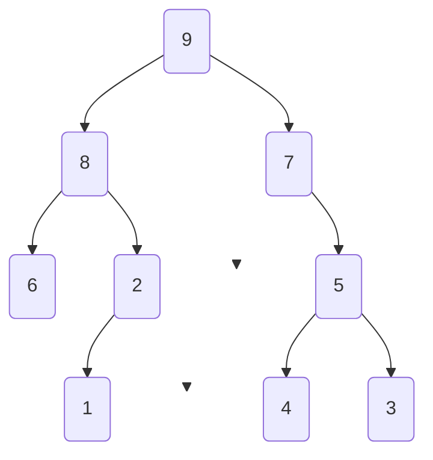

```mermaid
graph TD  
    A(9) --> B(8) 
    B --> C(6)
    B --> D(2)
    A --> E(7)
    D --> F(1)
    D --> G(" ")
    E --> H(" ")
    E --> I(5)
    I --> J(4)
    I --> K(3)
    linkStyle 5 stroke-width:0px;
    style G opacity:0;
    linkStyle 6 stroke-width:0px;
    style H opacity:0;
```

```mermaid
graph TD  
    A(9) --> B(8) 
    B --> C(6)
    B --> D(2)
    A --> E(7)
    D --> F(1)
    D --> G(" ")
    E --> H(" ")
    E --> I(5)
    I --> J(4)
    I --> K(3)
    linkStyle 5 stroke-width:0px;
    style G opacity:0;
    linkStyle 6 stroke-width:0px;
    style H opacity:0;
```