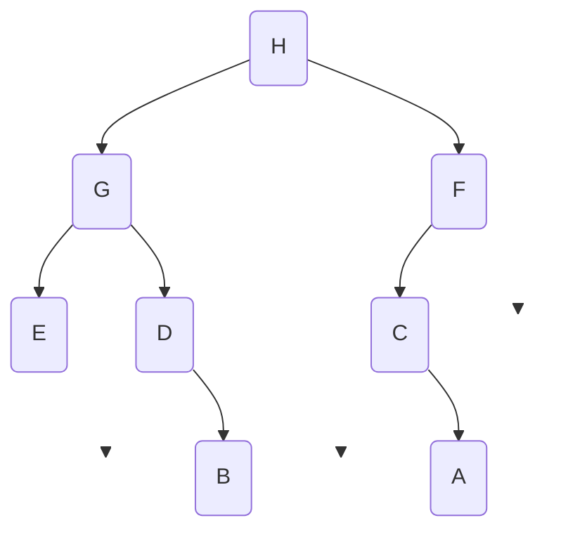

```mermaid
graph TD  
    H("H") --> G("G") 
    G --> E("E")
    G --> D("D")
    H --> F("F")
    F --> C("C")
    F --> F1(" ")
    D --> D1(" ")
    D --> B("B")
    C --> C1(" ")
    C --> A("A")
    linkStyle 5 stroke-width:0px;
    style F1 opacity:0;
    linkStyle 6 stroke-width:0px;
    style D1 opacity:0;
    linkStyle 8 stroke-width:0px;
    style C1 opacity:0;
```
