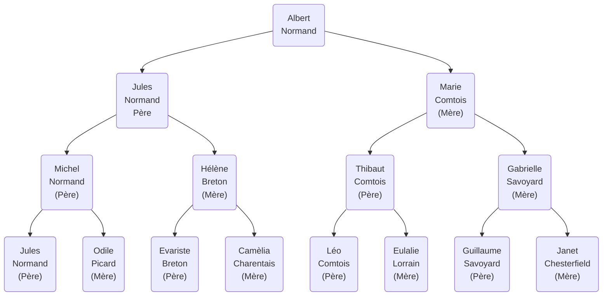

```mermaid
graph TD  
    A("Albert <br> Normand") --> B("Jules <br> Normand <br> Père") 
    B --> D("Michel <br> Normand <br> (Père)")
    B --> E("Hélène <br> Breton <br> (Mère)")
    A --> C("Marie <br> Comtois <br> (Mère)")
    C --> C1("Thibaut <br> Comtois <br> (Père)")
    C --> C2("Gabrielle <br> Savoyard <br> (Mère)")
    D --> D1("Jules <br> Normand <br> (Père)")
    D --> D2("Odile <br> Picard <br> (Mère)")
    E --> F("Evariste <br> Breton <br> (Père)")
    E --> E1("Camèlia <br> Charentais <br> (Mère)")
    C1 --> C3("Léo <br> Comtois <br> (Père)")
    C1 --> C4("Eulalie <br> Lorrain <br> (Mère)")
    C2 --> C5("Guillaume <br> Savoyard <br> (Père)")
    C2 --> C6("Janet <br> Chesterfield <br> (Mère)")
```

