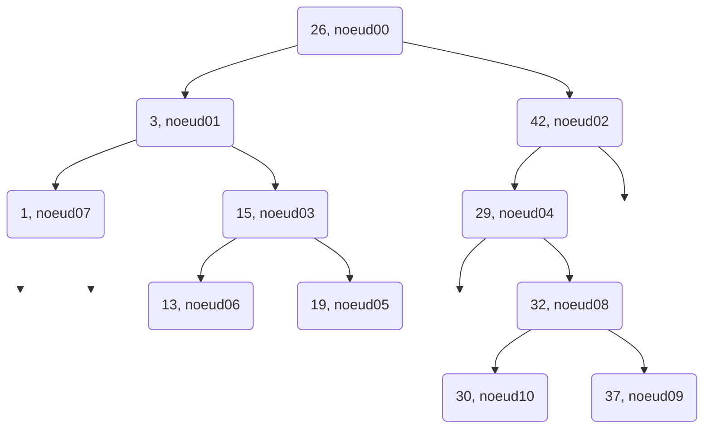

    linkStyle 2 stroke-width:0px;
    style E opacity:0;
    linkStyle 4 stroke-width:0px;
    style F opacity:0;
    linkStyle 2 stroke-width:0px;
    style E opacity:0;
    linkStyle 8 stroke-width:0px;
    style E1 opacity:0;
    linkStyle 9 stroke-width:0px;
    style E2 opacity:0;
    linkStyle 10 stroke-width:0px;
    style M opacity:0;
    linkStyle 11 stroke-width:0px;
    style F1 opacity:0;
    linkStyle 12 stroke-width:0px;
    style G1 opacity:0;
    linkStyle 13 stroke-width:0px;
    style G2 opacity:0;