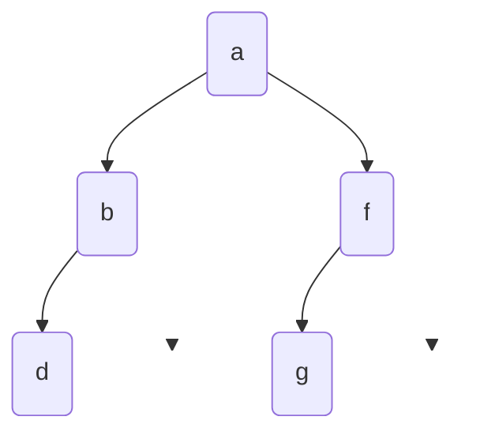
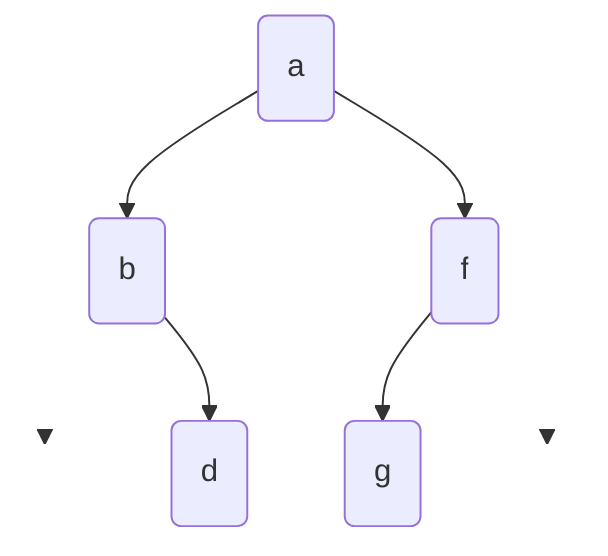
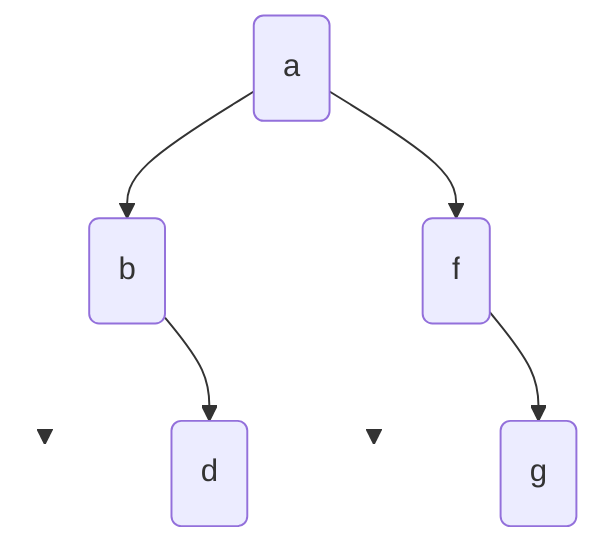

- arbre 1 :  

```mermaid
graph TD  
    A("a") --> B("b") 
    B --> d("d")
    B --> d1(" ")
    A --> F("f")
    F --> G("g")
    F --> G1(" ")
    linkStyle 2 stroke-width:0px;
    style d1 opacity:0;
    linkStyle 5 stroke-width:0px;
    style G1 opacity:0;
```

- arbre 2 :  

```mermaid
graph TD
    A("a") --> B("b") 
    B --> d(" ")
    B --> d1("d")
    A --> F("f")
    F --> G("g")
    F --> G1(" ")
    linkStyle 1 stroke-width:0px;
    style d opacity:0;
    linkStyle 5 stroke-width:0px;
    style G1 opacity:0;
```

- arbre 3 :    

```mermaid
graph TD
    A("a") --> B("b") 
    B --> d(" ")
    B --> d1("d")
    A --> F("f")
    F --> G(" ")
    F --> G1("g")
    linkStyle 1 stroke-width:0px;
    style d opacity:0;
    linkStyle 4 stroke-width:0px;
    style G opacity:0;
```