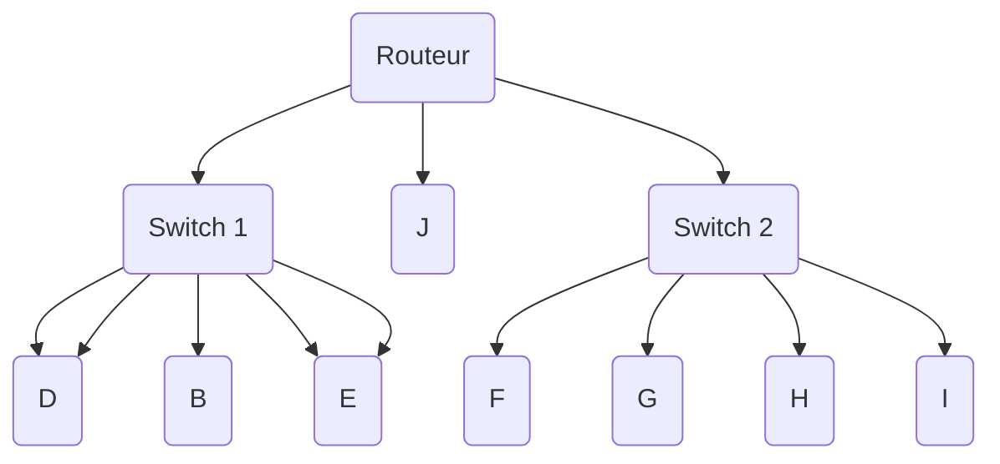
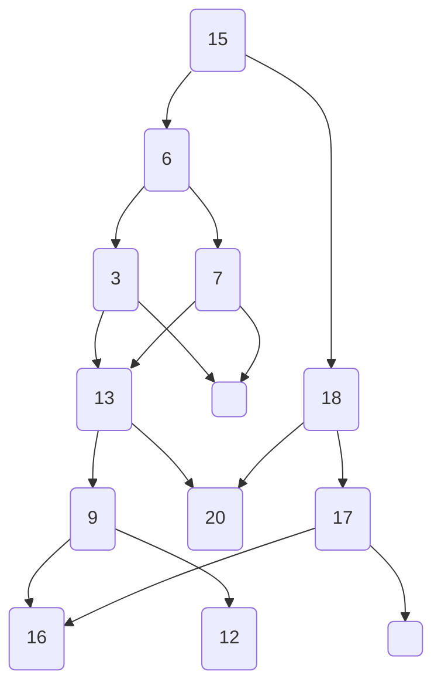

hide: - navigation  in docs.md



{{ corrige_sujetbac(repere_sujet) }}


{{ corrige_exobac(repere_sujet,1) }}

**Partie A**

1. Il est très difficile de répondre à cette question en restant dans le programme (le modèle OSI n’est pas au programme).  
   TCP correspond à la couche transport, il découpe les données en segments.  
   IP correspond à la couche réseau qui découpe les segments en paquets. C’est à ce niveau que s’effectue le routage. 
   
2.  a. 200.100.10.0 
   
    b. De 200.100.10.1 à 200.100.10.254.  
    Il y a donc 254 machines hôte identifiables sur ce réseau. 
    
**Partie B**

1. - A:172.16.0.0 
   - F:10.0.0.0  
  
2. Pour le réseau 1, toutes les machines appartiennent au même réseau car leurs adresse commencenttoutes par 172.16.x.x.  
   Pour le réseau 2, elles ne sont pas toutes sur le même réseau car une machine commence par 8.x.x.x et les autres par 10.x.x.x. 

3. Réponse (d)  $256^2 - 2$ (sur toutes les combinaisons, il faut enlever l’adresse du réseau et l’adresse de broadcast). 
   
4. 




{{ corrige_exobac(repere_sujet,2) }}

**Partie A** 

1. Réponse a) Vrai  
   
2. Réponse c) Logarithmique, $O(log(n))$ 
   
3. À chaque étape, si on ne trouve pas l’élément :   
   - Si `liste[m] > elem` alors   $fin_{k+1} = m - 1$  et $debut_{k+1} = debut_k$ or $m ≤ fin_k$ donc $fin_{k+1} < fin_k$ et ainsi $fin_{k+1} - debut_{k+1}  < fin_k - debut_k$
   - Si `liste[m] < elem` alors $fin_{k+1} = fin_k$ et $debut_{k+1} = m+1$ or $m ≥ debut_k$ donc $debut_{k+1} < fin_k$ et ainsi $fin_{k+1} - debut_{k+1} < fin_k - debut_k$
  
   On a donc toujours $fin_{k+1} - debut_{k+1} < fin_k - debut_k$, c’est bien un variant de boucle. Il existe donc un p tel que $fin_p < debut_p$ et l’algorithme se termine.


**Partie B**

1. Le programme s’adapte à la longueur de la liste. 
   
2. Si on cherche le quotient de a par b : 
   ```python
   c = a - b 
   q = 0 
   while c > 0: 
    q = q + 1 
    c = c- b
   ```
   
3.   
   
4. À la ligne 6 : `return True, m`
   À la ligne 12 : `return False,-1`
   
**Partie C**

1. Une fonction est récurssive si elle s’appelle elle-même. 
   
2. 
    ```python
    def dichoRecu(elem, liste, deb = None, fin = None): 
        if deb is None: 
            deb = 0 
        if fin is None: 
            fin = len(liste)- 1 
        if deb > fin: 
            return False 
        2m = (deb + fin) // 2 
        if liste[m] > elem: 
            return dichoRecu(elem, liste, deb, m-1) 
        else: 
            return dichoRecu(elem, liste, m+1, fin)

{{ corrige_exobac(repere_sujet,3) }}

**Partie A**

1. a. Avion 
   
   b. `numA` est un attribut de la table Avion. 
   
2. a. 1 
   b. 3
   
**Partie B**

1. BCN ne correspond à aucune valeur de l’attribut codeIAITA de la table Aeroport. Une contrainte d’intégrité référentielle n’est pas respectée 
   
2. La valeur `F-KI452` existe déjà pour la clé primaire numA. Une contrainte d’intégrité de clé n’est pas respectée. 
   
3. «environ 200» est une chaîne de caractères. Or le domaine de nbPlaces est un entier. Une contrainte d’intégrité de domaine n’est pas respectée. 
   
**Partie C**

1. Elle efface tous les vols dont la date est antérieure au 11/01/2021. Ainsi les vol 1044, 1233, 1248 et 1462 vont être effacés. 
   
2. ```sql INSERT INTO Type VALUES ("A310", 250, "Airbus");```
   
3. 
   ```sql
   SELECT Type 
   FROM Avion 
   JOIN Vol ON Avion.numA = Vol.numAvion 
   WHERE dateVol = "10/01/2021";
   ```

{{ corrige_exobac(repere_sujet,4) }}

**Partie A**

1. nom : string, non modifiable   
   occupation : tableau de booléens, modifiable dans reserver() 

2. `assert 0 < date and date < 366, "La date n'est pas valide"`
   
3. 
    ```python
    def AnnulerReserver(self, date : int): 
        self._occupation[date- 1] = False 
    ```
    
**Partie B** 

1. `GiteBN.ajouter_chambres('Ch1')`
   
2. 
   ```python
   def ajouter_chambres(self, nom-ch : str): 
    if nom_ch in self._chambres: 
        print("La chambre existe déjà") 
    else: 
        self._chambres.append(Chambre(nom_ch)) 
    ```
    
3. a. Tableau d’objets Chambre 
   
   b. 'Ch2' 
   
   c. `get_nchambres()` renvoie un tableau des noms des chambres alors que `get_chambres()` renvoie un tableau des objets chambre. 
   
4. a. ['Ch2', 'Ch4'] 
   
   b.  
   - En entrée : date : int  
   - En sortie : list  
   - Les attributs dont elle a besoin : `self._chambres`
   - Les méthodes dont elle a besoin : `Chambre.get_occupation()` et `Chambre.get_nom()`


{{ corrige_exobac(repere_sujet,5) }}

1. a. C’est un arbre binaire (chaque nœud a au maximum 2 fils) dont la valeur du fils gauche est inférieure à la valeur du père et la valeur du fils droit est supérieure à la valeur du père.
   
   b. 15 
   
   c. 4
   
2. 


3. 2, 3, 4, 6, 7, 9, 13, 15, 17, 18, 20. On obtient les valeurs en ordre croissant. 
   
4. 
```
Recherche(A, x): 
    Si EstVide(A) alors Faux 
    Si Racine(A) = x alors Vrai 
    Si x<Racine(A) alors Recherche(Sag(A), x) 
    Sinon Recherche(Sad(A), x)
```