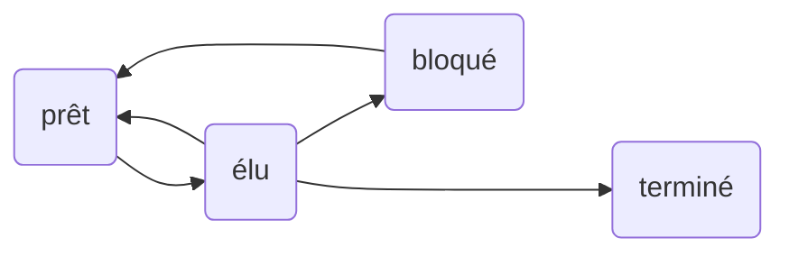
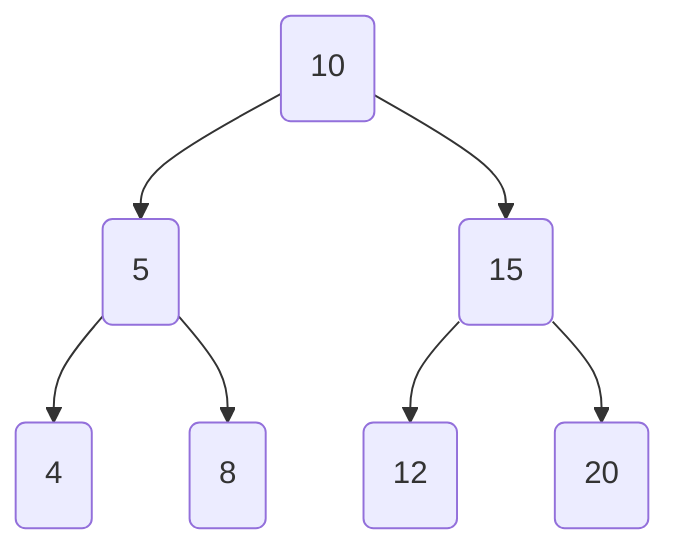
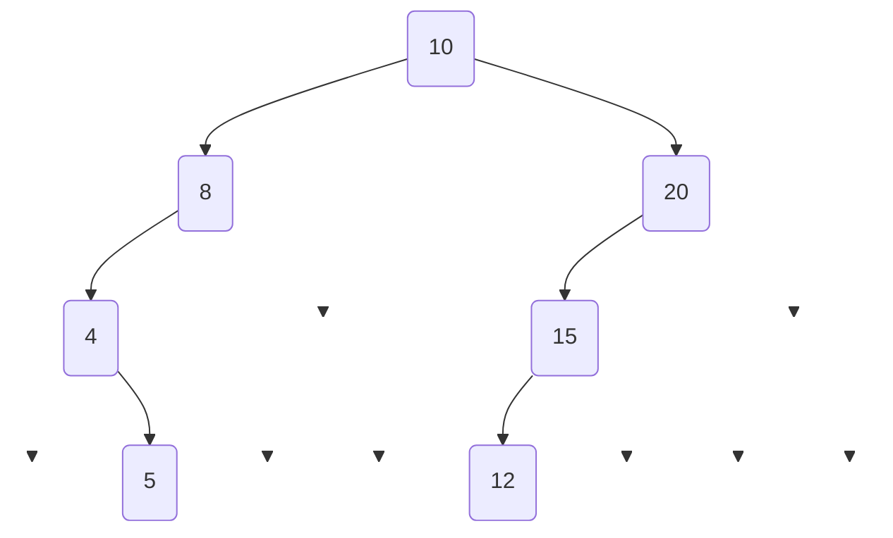

hide: - navigation  in docs.md



{{ corrige_sujetbac(repere_sujet) }}


{{ corrige_exobac(repere_sujet,1) }}


1. On insère deux entrées dans lesquelles l'attribut `idEleve` est égal à `128`. Or cet attribut est la clé primaire de la table, il ne peut pas exister en doublon.

2. Il s'agit de la clé étrangère `idEleve` qui doit respecter la contrainte d'intégrité référentielle.

3. 
```SQL
SELECT titre
FROM Livres
WHERE auteur = 'Molière'
```

4. On compte les élèves de la table `Eleves` dont la classe est la `'T2'`.

5.
```SQL
UPDATE Emprunts
SET dateRetour = '2020-09-30'
WHERE idEmprunt = 640
```

6. On récupère les noms et prénoms des élèves de la classe `'T2'` qui ont déjà emprunté un livre.

7. 
On propose (en utilisant l'ISBN cité dans la question 5):
   
```SQL
SELECT nom, prenom
FROM Eleves
JOIN Emprunts ON Eleves.idEleves = Emprunts.idEleves
WHERE Emprunts.isbn = 192
```
Sans l'ISBN :

```SQL
SELECT nom, prenom
FROM Eleves
JOIN Emprunts ON Eleves.idEleves = Emprunts.idEleves
JOIN Livres ON Livres.isbn = Emprunts.isbn
WHERE Livres.titre = 'Les Misérables'
```

{{ corrige_exobac(repere_sujet,2) }}

**1.a** Un processus *élu* est en cours d'exécution par le processeur actuellement.

**1.b.** 



**2.a** La file correspond au paradigme " *Premier entré, premier sorti* ".

**2.b.** 
    
    

**3.a.** Il s'agit d'un problème d'interblocage car les deux processus verrouillent simultanément les fichiers 1 et 2.

**3.b.** On échange simplement les deux premières lignes du programme 2 :

    | Programme 1             | Programme 2             |
    | :---------------------- | :---------------------- |
    | Verrouiller fichier_1   | Verrouiller fichier_1   |
    | Calculs sur fichier_1   | Verrouiller fichier_2   |
    | Verrouiller fichier_2   | Calculs sur fichier_1   |
    | Calculs sur fichier_1   | Calculs sur fichier_2   |
    | Calculs sur fichier_2   | Déverrouiller fichier_1 |
    | Calculs sur fichier_1   | Déverrouiller fichier_2 |
    | Déverrouiller fichier_2 |                         |
    | Déverrouiller fichier_1 |                         |


{{ corrige_exobac(repere_sujet,3) }}

**1.a.** La taille de l'arbre est 7.  

**1.b.** La hauteur de l'arbre est 4.  

**2**   


**3** 


**4.**
```python linenums='1'
def hauteur(self):
    return self.racine.hauteur()
```

**5.**
Méthode ```taille```    de la classe ```Noeud``` :  
```python linenums='1'
def taille(self):
    if self.gauche is None and self.droit is None:
        return 1
    elif self.gauche is None:
        return 1 + self.droit.taille()
    elif self.droit is None:
        return 1 + self.gauche.taille()
    else:
        return 1 + self.gauche.taille() + self.droit.taille()
```

Méthode ```taille```    de la classe ```Arbre``` : 

```python linenums='1'
def taille(self):
    return self.racine.taille()
```


**6.a.** La configuration minimale d'un arbre bien construit de hauteur $h$ peut être :

    {: .center}
    
    La taille minimale ```min``` est donc égale à $2^{h-1}$.

**6.b.** 
Intuitivement, un arbre est *mal construit* si sa hauteur est trop grande par rapport à sa taille (trop *étiré*).

Donc un arbre est *mal construit* si sa taille est trop petite par rapport à sa hauteur.

Donc un arbre de taille $t$ et de hauteur $h$ est *mal construit* si $t < 2^{h-1}$, puisqu'on a démontré que $2^{h-1}$ était la taille minimale.

Pour tester si un arbre est *bien construit*, on va donc juste vérifier que $t \geqslant 2^{h-1}$ :

```python linenums='1'
def bien_construit(self):
    h = self.taille()
    return self.taille() >= 2**(h-1)
```

{{ corrige_exobac(repere_sujet,4) }}


{{ corrige_exobac(repere_sujet,5) }}

1.  a Si les éléments du tableau sont tous positifs, il suffit d’additionner tous les éléments du tableau pour obtenir la somme maximale (la sous-séquence correspond à l’ensemble du tableau).

    b. Si les éléments du tableau sont tous négatifs, il suffit de prendre l’élément le plus grand du tableau (la sous-séquence est réduite à un seul élément)

2.  a 
    ```python 
    def somme_sous_sequence(lst, i, j):
        somme = 0
        for ind in range(i,j+1):
            somme = somme + lst[ind]
        return somme
    ```

    b.  Pour un tableau de 10 éléments, nous avons 55 comparaisons $(10+9+8+7+6+5+4+3+2+1=55)$.

    c. 
    ```python
    def pgsp(lst):
        n = len(lst)
        somme_max = lst[0]
        i_max = 0
        j_max = 0
        for i in range(n):
            for j in range(i,n):
                s = somme_sous_sequence(lst,i,j)
                if s > somme_max:
                    somme_max = s
                    i_max = i
                    j_max = j
        return (somme_max, i_max, j_max)
    ```

3.  a. 

    b.
    ```python
    def pgsp2(lst):
        somme_max = [lst[0]]
        for i in range (1,len(lst)):
            if somme_max[i-1] <= 0:
                somme_max.append(lst[i])
            else :
                somme_max.append(lst[i]+somme_max[i-1])
        return max(somme_max)
    ```

    c. Cette solution est plus avantageuse, car la complexité en temps de l’algorithme est en $O(n)$ alors que dans le cas précédent il était en $O(n^2)$.
