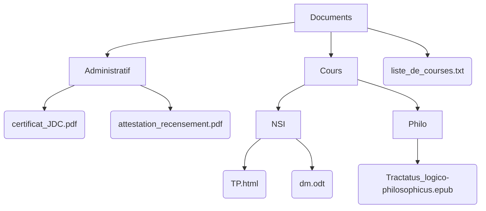

hide: - navigation  in docs.md



{{ corrige_sujetbac(repere_sujet) }}


{{ corrige_exobac(repere_sujet,1) }}

1.  a. Pour obtenir `"lundi"` on accède au second élément de la liste `jours` avec `jours[1]`

    !!! rappel
        La numérotation des éléments d'une liste commence à 0. Ici `"dimanche"` correspond donc à `jour[0]`.

    b. `18%7=4` car il reste 4 dans la division de 18 par 7, donc `jours[18%7]` renvoie `jours[4]` c'est à dire `"jeudi"`.

2.  !!! bug
        La syntaxe correct est `jours.index(element)` avec des parenthèses et non des crochets comme cela est indiqué dans l'énoncé
    
    ```python
        numero_jour = (jours.index(j)+n)%7
    ```

3.  a. `mois[3]` permet d'accéder au tuple `("mars",31)` reste à récupérer son second élément avec `mois[3][1]` pour accéder au nombre de jours.

    b. 
    ```python
        def mois_apres(numero_mois,x):
            nouveau_num = (numero_mois+x)%12
            if nouveau_num == 0:
                nouveau_num = 12
            return mois[nouveau_num][0]
    ```

    !!! note
        * On traite séparement la cas ou le nouveau numéro de mois est 0 qui correspond à décembre donc au mois de numéro 12.
        * On a préféré écrire une fonction, l'énoncé demandait *"d'écrire le code"*.

4.  a. `mois[date[2]][1]` correspond à `mois[10][1]` c'est à dire à 31 (nombre de jours du mois d'octobre)

    b. 
    ```python
    def jour_suivant(date):
        # On recupère les éléments de la date : (nom_jour,j,m,a)
        nom_jour, j, m, a = date[0], date[1], date[2], date[3]
        nom_jour_suivant =  jours[(jours.index(nom_jour) + 1)%7]
        # si c'est le dernier jour de l'année on change de mois et d'année !
        if m == 12 and j==31:
            j_suivant, m_suivant, a_suivant = 1, 1, a+1
        # si c'est le dernier jour d'un mois (pas décembre) on change de mois
        elif j == mois[m][1]:
            j_suivant, m_suivant, a_suivant = 1, m+1, a
        else :
        # sinon on change juste de jour
            j_suivant, m_suivant, a_suivant = j+1, m, a
        return (nom_jour_suivant, j_suivant, m_suivant, a_suivant)
    ```


{{ corrige_exobac(repere_sujet,2) }}


1. `panier1.enfiler((31002,"café noir",1.50,50525))`

2. 

    ```python
    def remplir(self,panier_temp):
        while note panier_temp.est_vide():
            article = panier_temp.defiler()
            self.enfiler(article)
    ```

3.  On sauvegarde les éléments du panier dans un panier temporaire de façon à les remettre ensuite dans le panier.
     
    ```python
    def prix_total(self):
        panier_temp = Panier()
        total = 0
        while not self.est_vide():
            article = self.defiler()
            total = total + article[2]
            panier_temp.enfiler(article)
        while not panier_temp.est_vide():
            self.enfiler(panier_temp.defiler())
    ```

4.  !!! note
        * On suppose ici que l'ordre des articles dans le panier ne correspond pas forcément à l'ordre dans lequel ils ont été scannés. On recherche donc les horaires de scan minimales et maximales en parcourant le panier.
        * Cette méthode renvoie la durée entre le premier scan d'article et le dernier. Si un seul article a été acheté c'est donc 0, cela ne correspond donc pas à la *durée des achats* indiquée dans l'énoncé

    ```python
    def duree_courses(self):
        if self.est_vide():
            return 0
        # initialisation avec l'horaire du scan du premier article
        debut, fin = self.defiler()[3], self.defiler()[3]
        while not self.est_vide():
            article = self.defiler()
            if article[3] < debut:
                debut = article[3]
            if article[3] > fin:
                fin = article[3]
        return fin-debut
    ```

{{ corrige_exobac(repere_sujet,3) }}

1. 


2.  a.
    ```python linenums="1" hl_lines="4"
    def Parcourir(racine,adr):
        dossier =  racine
        for nom_dossier in  adr:
            dossier = dossier[nom_dossier]
        return dossier
    ```

    b.
    L'instruction `Afficher(Documents, ["Cours", "NSI"],"TP.html")` affichera 60. En effet cela affiche la valeur associée à la clé `"TP.html"`.

3.  a.  L'erreur se situe à la ligne 3, pour la corriger on remplace par `dossier[nom_fichier] = taille` :

    ```python linenums="1" hl_lines="3"
    def ajoute_fichier(racine, adr, nom_fichier, taille):
        dossier = parcourt(racine, adr)
        dossier[nom_fichier] = taille
    ```

     b. Pour ajouter un dossier, on parcourt jusqu'à l'adresse demandée et on ajoute le dossier sous la forme d'un dictionnaire vide `{}`

    ```python
    def Ajouter_dossier(racine,adr,nom_dossier):
        dossier = Parcourir(racine,adr)
        dossier[nom_dossier] = {}
    ```

4.  

    ```python
        def taille(dossier):
            total_ko = 0
            for k in dossier:
                total_ko += dossier[k]
            return total_ko
    ```

{{ corrige_exobac(repere_sujet,4) }}

1.  a. `id_mesure` peut servir de clé primaire car c'est un numéro unique. Par contre, deux mesures peuvent être issues du même centre (et donc avoir le même `id_centre`) ou avoir les mêmes valeurs de pluviométrie, température ou pression. 

    b. Une jointure s'effectue avec une clé étrangère, ici `id_centre` de la table `Mesures` permet donc d'effectuer une jointure avec la table `Centres`

2.  a.Cette requête affiche les enregistrements de la table `Centres` dont l'altitude est supérieure à 500. Cela correspond donc à :

    | `id_centre` | `nom_ville`     | `latitude` | `longitude` | `altitude` |
    |:---------- | :-------------- | :--------- | :---------- | :--------- |
    |         138 | Grenoble        |     45.185 |       5.723 |        550 |
    |         185 | Tignes          |     45.469 |       6.909 |       2594 |
    |         126 | Le Puy-en-Velay |     45.042 |       3.888 |        744 |
    |         317 | Gérardmer       |     48.073 |       6.879 |        855 |

    b.
    ```sql
    SELECT nom_ville FROM Centres WHERE altitude >= 700 AND altitude <= 1200;
    ```

    c. 
    ```sql
    SELECT longitude, nom_ville
    FROM Centres
    WHERE longitude > 5
    ORDER BY nom_ville ASC;
    ```

3.  a. Cette requête affiche les enregistrements de la table `Mesures` pour la date du 30 octobre 2021.

    b. 
    ```sql
    INSERT INTO Mesures 
    VALUES (3650, 138, 2021-11-08, 11, 1013, 0);
    ```

4.  a. Cette requête l'enregistrement de la table `Centres` ayant la latitude minimale.

    b.
    ```sql
    SELECT DISTINCT nom_ville
    FROM Centres
    JOIN Mesures
    ON Centres.id_centre = Mesures.id_centre
    WHERE Mesures.temperature < 10.0
    AND Mesures.date_mesure >= 2021-10-01
    AND Mesures.date < 2021-11-01;
    ```

{{ corrige_exobac(repere_sujet,5) }}

!!! bug
    Le sujet comporte une faute d'orthographe on parle de *System on Chip* et pas de *System on a cheap*.

1.  a. Contrairement à un ordinateur classique où les divers        composants sont séparés, un *Soc* intègre sur la même puce la {{sc("cpu")}}, la {{sc("ram")}}, et d'autres périphériques (ex : Bluetooth, Wifi, ...). L'avantage est un gain de performance et une plus faible consommation d'énergie. Par contre, on ne peut réparer ni faire évoluer le *SoC*.

    b. En consultant le tableau comparatif des deux *SoC* on constate à la ligne **interface réseau** que seul le BCM71 en possède une et permet donc une connexion à un réseau filaire.

    c. On peut comparer le nombre de coeurs, la fréquence de base du processeur et aussi la mémoire cache pour constater que le BCM271 est plus puissant. Ce dernier *SoC* possède aussi un processeur graphique {{sc("gpu")}}.

2.  a. Une adresse {{sc("mac")}} identifie de façon unique une carte réseau, elle y est stockée et ne peut pas être modifiée.

    b. `10.0.2.15` est une adresse {{sc("ip")}} permettant d'identifier une machine sur le réseau (cette adresse peut changer)

    c. L'adresse `10.0.2.2` correspond à une passerelle reliée au routeur qui achemine les données aux machines extérieures.

3.  a. On examine les tables de routages pour constater que R1 est relié à R2, R3 et R5 de même R2 est relié à R3 et R4, etc ... Ce qui permet de construire le tracé suivant :
    {.imgcentre width=400px}

    b. Puisqu'on utilise le protocole {{sc("rip")}}, on doit minimiser le nombre de sauts pour se rendre de R4 à R5, la route sera R4 - R2 - R1 - R5.

    c. D'après la formule de l'énoncé les débits de  100 Mbits/s correspondent à un coût de 1 et les débits de 10 Mbits/s à un coût de 10. C'est à dire :

    {.imgcentre width=400px}

    Cette fois c'est donc le chemin R4 - R2 - R3 - R1 - R5 qui sera emprunté pour un coût total de 22.
