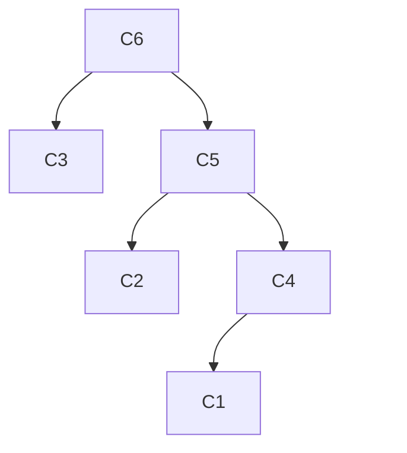

hide: - navigation  in docs.md



{{ corrige_sujetbac(repere_sujet) }}


{{ corrige_exobac(repere_sujet,1) }}

1.  a.  
    ```python
    class Concurrent: 
        def __init__(self, pseudo, temps, penalite): 
            self.nom = pseudo 
            self.temps = temps 
            self.penalite = penalite 
            self.temps_tot = temps + penalite 
    ```

    b. Pour c1, `temps_tot` est égal à 99,67 (87,67 + 12)

    c `c1.temps_tot`

2.  a 
    ```python
    L1 = resultats.queue() 
    L2 = L1.queue() 
    c1 = L2.tete()
    ```

    ou bien directement :  

    ```python
    c1 = resultats.queue().queue().tete()
    ```

    b 
    ```python
    temps_total = resultats.tete().temps_tot
    ```

3. 
```python
def meilleur_conccurent(L): 
    conc_mini = L.tete() 
    mini = conc_mini.temps_tot 
    Q = L.queue() 
    while not(Q.est_vide()): 
        elt = Q.tete() 
        if elt.temps_tot < mini : 
            conc_mini = elt 
            mini = elt.temps_tot 
        Q = Q.queue() 
    return conc_mini
```

4. 


{{ corrige_exobac(repere_sujet,2) }}

1.  a. Proposition 2  
    b. cd lycee  
    c. mkdir algorithmique  
    d. rm image1.jpg  
2.  a. PID du parent du processus démarré par la commande vi : 927  
    b. PID d’un processus enfant du processus démarré par la commande xfce4-terminal : 1058  
    c. PID de deux processus qui ont le même parent : 1153 et 1154 (parent PID 927)  
    d. PID des deux processus qui ont consommé le plus de temps processeur : 923 et 1036  
3.  a. P1 -  P2 - P3 - P1 - P3 - P1 - P3 - P3  
    b. P2 -  P1 - P1 - P1 - P3 - P3 - P3 - P3    
4.  a. Un processus peut être dans un état : ÉLU, PRÊT ou BLOQUÉ  
    Voici une situation qui peut provoquer un interblocage :  
    
    - P1 est à l’état ÉLU, il demande R1, il l’obtient (car R1 est libre) puis passe à l’état PRÊT  
    - P2 passe à l’état ÉLU, il demande R2, il l’obtient (car R2 est libre) puis passe à l’état PRÊT  
    - P3 passe à l’état ÉLU, il demande R3, il l’obtient (car R3 est libre) puis passe à l’état PRÊT  
    - P1 passe à l’état ÉLU, il demande R2, il ne l’obtient pas (car R2 est déjà utilisé par P2). P1 passe à l’état BLOQUÉ   
    - P2 passe à l’état ÉLU, il demande R3, il ne l’obtient pas (car R3 est déjà utilisé par P3). P2 passe à l’état BLOQUÉ  
    - P3 passe à l’état ÉLU, il demande R1, il ne l’obtient pas (car R1 est déjà utilisé par P1). P3 passe à l’état BLOQUÉ.  
    Les 3 processus se retrouvent à l’état BLOQUÉ, nous avons ici un phénomène d’interblocage. 

    b. Pour éviter le phénomène d’interblocage, il suffit d’inverser les 2 lignes Demande R3 et Demande R2 pour le processus P3. On obtient alors :  

    - P1 est à l’état ÉLU, il demande R1, il l’obtient (car R1 est libre) puis passe à l’état PRÊT  
    - P2 passe à l’état ÉLU, il demande R2, il l’obtient (car R2 est libre) puis passe à l’état PRÊT  
    - P3 passe à l’état ÉLU, il demande R1, il ne l’obtient pas (car R1 est déjà utilisé par P1). P3 passe à l’état BLOQUÉ  
    - P1 passe à l’état ÉLU, il demande R2, il ne l’obtient pas (car R2 est déjà utilisé par P2). P1 passe à l’état BLOQUÉ  
    - P2 passe à l’état ÉLU, il demande R3, il l’obtient (car R3 est libre) puis passe à l’état PRÊT  
    - P2 libère R2   
    - P2 libère R3  
    - P1 passe à l’état ÉLU, il demande R2, il l’obtient (car R2 est libre) puis passe à l’état PRÊT  
    - P1 Libère R1  
    - P1 libère R2  
    - P3 passe à l’état ÉLU, il demande R1, il l’obtient (car R1 est libre) puis passe à l’état PRÊT  
    - P3 passe à l’état ÉLU, il demande R3, il l’obtient (car R3 est libre) puis passe à l’état PRÊT  
    - P3 Libère R3  
    - P3 libère R1  


{{ corrige_exobac(repere_sujet,3) }}

1.  a. Une clé primaire d’une relation est un attribut (ou plusieurs attributs) dont la valeur permet d'identifier de manière unique un p-uplet de la relation.  
    b. Une clé étrangère est un attribut qui permet d’établir un lien entre 2 relations  
    c. Un abonné ne peut pas réserver plusieurs fois la même séance, car le couple idAbonné et idSéance est une clé primaire pour la relation Réservation. Il est donc impossible d’avoir 2 fois la même séance pour le même abonné.  
    d. 
    |idAbonné |idSéance| nbPlaces_plein |nbPlaces_réduit |
    |:---:|:----:|:---:|:---:|
    |13 | 737|3|2|
    
2.  a.
    ```sql
    SELECT titre, réalisateur 
    FROM Film 
    WHERE durée < 120 ;
    ```  

    b. Cette requête permet de déterminer le nombre de séances proposées les 22 et 23 octobre 2021.  
3.  a.
    ```sql
    SELECT nom, prénom 
    FROM Abonné
    ```

    b. 
    ```sql
    SELECT titre, durée 
    FROM Film JOIN Séance ON Film.idFilm = Séance.idFilm 
    WHERE date = 2021-10-12 AND heure = 21:00
    ```

4.  a. 
    ```sql
    UPDATE Film 
    SET durée = 127 
    WHERE titre = "Jungle Cruise"
    ```

    b. idSéance est une clé étrangère pour la relation Réservation. La suppression d’une séance risque donc de provoquer des problèmes dans la relation Réservation (avec un Réservation.idSéance ne correspondant à aucun Séance.idRéservation).  
    c. 
    ```sql
    DELETE FROM Séance 
    WHERE idSéance = 135
    ```

{{ corrige_exobac(repere_sujet,4) }}

1. a. La racine de l’arbre B est Milka  
    b. feuilles de l’arbre B : Nemo, Moka, Maya, Museau et Noisette  
    c. Nuage est une femelle puisque c’est la mère de Nougat  
    d. père : Ulk ; mère : Maya   
2.  a.
    ```python
    def present(arb, nom): 
        if est_vide(arb): 
            return False 
        elif racine(arb) == nom: 
            return True 
        else : 
            return present(droit(arb), nom) or present(gauche(arb), nom) 
    ```

    b. 
    ```python
    def parents(arb): 
        if est_vide(gauche(arb)): 
            pere="" 
        else : 
            pere = racine(gauche(arb)) 
        if est_vide(droit(arb)): 
            mere="" 
        else : 
            mere = racine(droit(arb)) 
        return (pere, mere)
    ```

3.  a. Mango et Cacao ont le même père (Domino). Milka et Cacao ont la même mère (Nougat)  
    b. 
    ```python
    def frere_soeur(arbre1, arbre2): 
        parents1 = parents(arbre1) 
        parents2 = parents(arbre2) 
        return parents1[0]==parents2[0] or parents1[1]==parents2[1]
    ```
    
4. 
```python
def nombre_chiens(arb, n): 
    if est_vide(arb): 
        return 0 
    elif n == 0: 
        return 1 
    else: 
        return nombre_chiens(gauche(arb), n-1) + nombre_chiens(droit(arb), n-1)
```


{{ corrige_exobac(repere_sujet,5) }}

Partie A  

1.  a  
    b. ligne = 3 ; colonne = 0  
    c. pixel situé en haut et à gauche : ligne = li - 1 ; colonne = co - 1  
    pixel situé en haut et à droite : ligne = li - 1 ; colonne = co + 1   
2.  a. si image[li - 1][co - 1] est égal à image[li - 1][co + 1] alors image[li][co] est égal à 1.  
    b. 
    ```python
    def remplir_ligne(image, li): 
        image[li][0] = 0 
        image[li][7] = 0 
        for co in range(1,7): 
            if image[li-1][co-1] != image[li-1][co+1]: 
                image[li][co] = 1
    ```  
    
    c. 
    ```python
    def remplir(image): 
        for li in range(1,5): 
            remplir_ligne(image, li)
    ```
    
PARTIE B  

1.  a. Représentation en base 10 de l’entier correspondant : 44  
    b. 
    ```python
    def conversion2_10(tab): 
        nb_bit = len(tab) 
        s = 0 
        for i in range(nb_bit): 
            s = s + tab[i]*2**(nb_bit-1-i) 
        return s
    ```
    
    c. tableau associé à 78 : `[0,1,0,0,1,1,1,0]`  
2.  a. préconditions : Le bit de poids fort est à zéro :  l’entier ne doit pas dépasser 127. Le bit de poids faible est à zéro : l’entier doit être pair. On peut donc utiliser tous les nombres paires entre 0 et 126. 
    b. 
    ```python
    def generer(n,k): 
        tab = [None for i in range(k)] 
        image = [[0 for j in range(8)]  for i in range(k+1)] 
        t = conversion10_2(n) 
        for i in range(8): 
            image[0][i] = t[i] 
        tab[0]=n 
        for li in range(1,k): 
            remplir_ligne(image, li) 
            tab[li] = conversion2_10(image[li]) 
        return tab
    ```