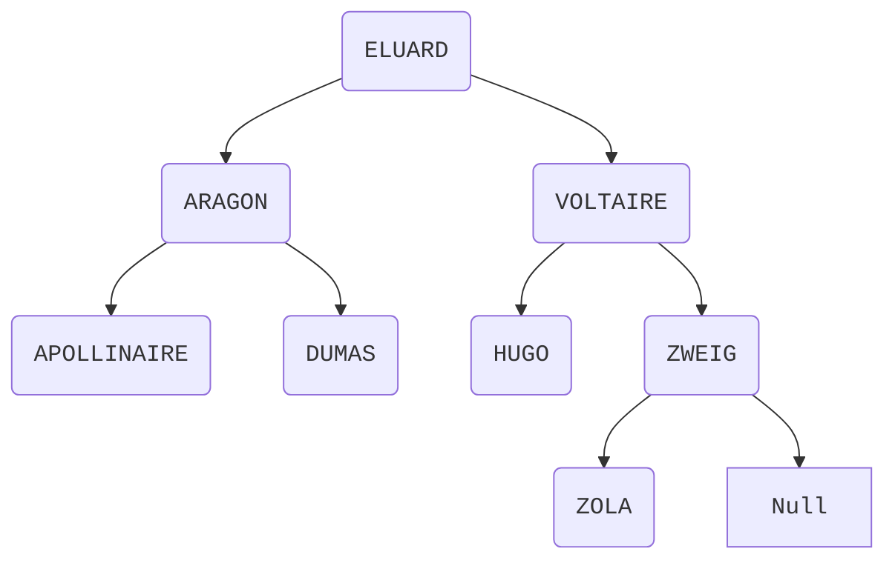
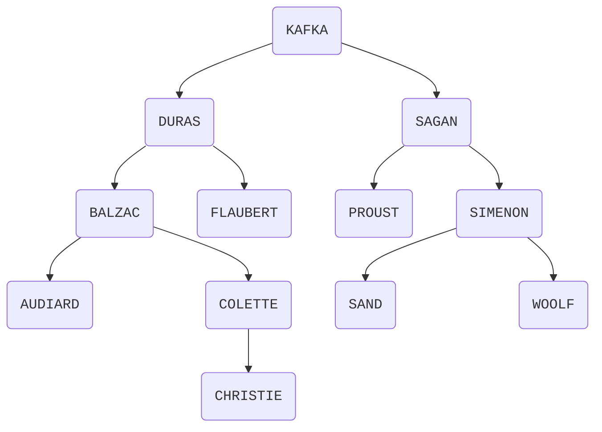

hide: - navigation  in docs.md



{{ corrige_sujetbac(repere_sujet) }}


{{ corrige_exobac(repere_sujet,1) }}

1.  a. La première ligne du terminale `gestion@capNSI-ordinateur_central` affiche le nom de l'utilisateur et le nom du terminal séparés par le caractère `@`. Ici, le nom d'utilisateur est donc `gestion` et le nom d'ordinateur `capNSI-ordinateur_central`

    b. On utilise la commande `ls` en donnant le répertoire concerné ` ls Contrats`


2.  a. `mkdir Contrats/TURING_Alan`
    b. `chmod ug=rwx, o=r Contrats/TURING_Alan` 


3. 
```python
    def formatage(tab):
        liste_noms = []
        for (nom,prenom) in tab:
            liste_noms.append(nom + "_" + prenom)
        return liste_noms
```

4.  
```python
    def creation_dossiers(tab):
        for nom in tab:
            rep = "Contrats/" + nom
            os.mkdir(repertoire)
            os.chmod(rep,774)
```
            

{{ corrige_exobac(repere_sujet,2) }}


1.a



1.b

- Taille : 8
- Hauteur : 4

1.c

Si l'arbre est de hauteur $h$ alors il y a $2^h - 1$ auteurs au maximun. 

**Preuve**

On montre d'abord que le nombre d'auteurs max au niveau $n$ est $2^{n-1}$. Immédiat par récurrence : au niveau 1, il n'y a qu'un auteur. La propriété est donc vraie. Si au niveau $n$ on a $2^{n-1}$ auteurs, alors, au niveau $n+1$ on peut ajouter 2 auteurs pour chacun d'eux soit au total $2\times 2^{n-1}$.

Un arbre complet de hauteur $h$ a tous ses niveaux pleins et donc au total :
    
\[1 + 2 + ... + 2^{h-1}\] 
    
Et cette somme vaut $2^h - 1$

2.



3.

```python
def recherche_auteur(abr, nom):
    if est_vide(abr):
        return False
    elif valeur(abr) == nom:
        return True
    else:
        return recherche_auteur(fils_gauche(abr), nom) or\
                recherche_auteur(fils_droit(abr), nom)
```

L'appel renvoie `True`. En effet, au premier appel, l'arbre n'est pas vide et la valeur de l'arbre ('KAFKA') n'est pas égale à la valeur recherchée. Il y a donc le premier appel récursif sur le sous-arbre gauche et la valeur 'SIMENON'. Cet appel va finir par renvoyer `False` (puisque 'SIMENON' n'est pas dans ce sous-arbre). Puisqu'on est sur l'évaluation d'un OU, le deuxième appel récursif est lancé, et finira par renvoyer `True`.

4.

```python
def hauteur(abr):
    if est_vide(abr):
        return 0
    else:
        return 1 + max(hauteur(fils_gauche(abr)), hauteur(fils_droit(abr)))
```


{{ corrige_exobac(repere_sujet,3) }}

1.a. 
Le choix 2 est le plus adapté car dans le choix 1 c’est la même ligne qui est ajoutée à jeu.  
Ainsi lorsqu’on modifiera une ligne, toutes les lignes seront modifiées.  

1.b.  
```python
jeu[5][2] = 1
```  

2.a.  
```python  
import random 
def remplissage(n, jeu):
    for i in range(n): 
        x = random.randrange(8) 
        y = random.randrange(8) # On cherche une cellule qui n'est pas déjà vivante
        while jeu[x][y] == 1: 
            x = random.randrange(8) 
            y = random.randrange(8) 
        jeu[x][y] = 1
```

2.b. 
On doit avoir 0 <= n <= 64  

3.  
```python
def nombre_de_vivants(i, j, jeu): 
    nb = 0 
    voisins = [(i-1,j-1), (i-1,j), (i-1,j+1), (i,j+1), (i+1,j+1), (i+1,j), (i+1,j-1), (i,j-1)] 
    for e in voisins : 
        if 0 <= e[0] < 8 and 0 <= e[1] < 8 : 
            nb = nb + jeu[e[0]][e[1]] 
    return nb 
```

4.  
```python
def transfo_cellule(i, j, jeu): 
    nb_vivants = nombre_de_vivants(i, j, jeu) # règle 1 
    if jeu[i][j] == 0: 
        if nb_vivants == 3: 
            return 1 
        else: 
            return 0 # règle 2 
    if jeu[i][j] == 1: 
        if nb_vivants == 2 or nb_vivants == 3: 
            return 1 
        else: 
            return 0
```

{{ corrige_exobac(repere_sujet,4) }}

1.a.  
`id_match` est la clé primaire de la relation match.  

1.b.  
Oui elle en a quatre : id_creneau, id_terrain, id_joueur1, id_joueur2  

2.a.  
C’est le premier août 2020 entre 10h et 11h.  

2.b. Ce sont Dupont Alice et Durand Belina.  

3.a.  
```sql
SELECT prenom_joueur 
FROM joueurs 
WHERE nom_joueur = 'Dupont';
```

3.b.  
```sql
UPDATE joueurs 
SET mdp = 1976 
WHERE id_joueur = 4;
``` 

4.  
```sql
INSERT INTO joueurs (id_joueur, nom_joueur, prenom_joueur, login, mdp) 
VALUES (5, 'MAGID', 'Zora', 'zora', 2021);
``` 

On peut également ne pas nommer les champs :  
```sql
INSERT INTO joueurs 
VALUES (5, 'MAGID', 'Zora', 'zora', 2021);
```   
5.  
```sql
SELECT date 
FROM matchs JOIN joueurs ON matchs.id_joueur1 = joueurs.id_joueur OR matchs.id_joueur2 = joueurs.id_joueur 
WHERE prenom_joueur = 'Alice';
```

{{ corrige_exobac(repere_sujet,5) }}

1.  Les valeurs successives prises par la variable `i` seront `0,1, ...,n-1`. La première valeur provoque donc une erreur de division par 0. La dernière valeur n'est pas non plus correcte puisqu'on doit calculer la somme des inverses jusqu'à `n`. On peut corriger des deux façons suivantes :
    * A la ligne 3 : `for i range(1,n+1)` afin de démarrer à 1 et d'aller jusqu'à n
    * ou alors à la ligne 4 : `total = total + 1\(i+1)` 

2.  a. La variable `indice` atteint la valeur `len(L)` or les indices  des éléments d'une liste vont jusqu'à `len(L)-1`. Pour corriger ce problème on remplace la ligne 3 par `while indice <len(L)`

    b. L'appel `maxi([-2,-7,-3])` renvoie `0` puisque le maximum est initialisé à 0 et aucun élément plus grand que 0 n'est trouvé lorsqu'on parcourt la liste. Pour corriger ce problème, on peut initialiser le maximum avec le premier élément de la liste et donc écrire à la ligne 3 : `maximum = L[0]`

3.  On peut pas ajouter une variable de type `str` avec une variable de type `int`. La ligne 4 provoque donc une erreur car `Joueur ` est du type `str` et `i` est du type `int`. Pour corriger ce problème, il faut convertir `i` en `str` et donc écrire ligne 4 : `L.append('Joueur ' + str(i))`

4.  a. Pour calculer `suite(6)`, on fait les appels successifs à `suite(4)` puis `suite(2)` puis `suite(0)`. La condition d'arrêt renvoie `0` comme valeur de `suite(0)` on remonte alors et on calcule :
    * `suite(2) = 3+2*suite(0) = 3`
    * `suite(4) = 3+2*suite(2) = 9`
    * `suite(6) = 3+2*suite(4) = 21`

L'appel de `suite(6)` renvoie donc 21.

    b. On obtient une erreur de profondeur de récursion, en effet la condition d'arrêt n'est jamais atteinte puisque les appels successifs se feront avec les valeurs suivants de `n` : `7, 5, 3, 1, -1, -3, -5, ....`.

5. La variable `x` est de type `int` donc *non mutable* alors que `L` est de type liste donc *mutable*. Par conséquent, `L` est modifiée lorsque passé en paramètre à une fonction mais pas `x`. Le premier print affichera donc `(5, [10])` et le second `4 [10]`. En effet le premier print affiche le tuple renvoyé par la fonction `modif` et le second print la valeur non modifiée de `x` suivie de celle de `L`.


