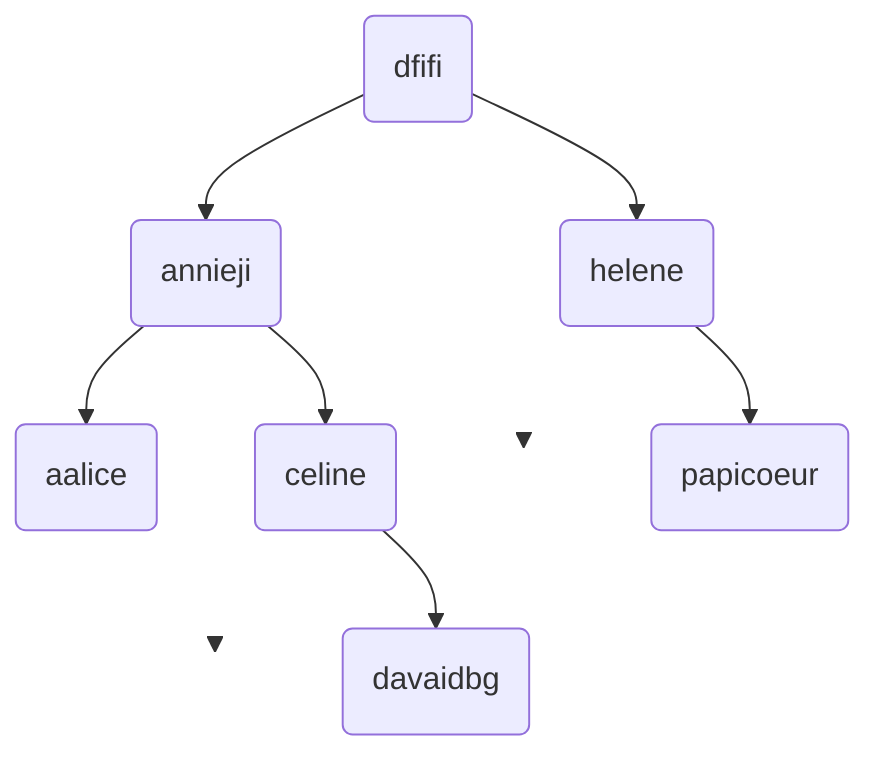

hide: - navigation  in docs.md



{{ corrige_sujetbac(repere_sujet) }}


{{ corrige_exobac(repere_sujet,1) }}

1. 

table Noeud B

|Destination | Cout |
|:---:|:---:|
|A|1|
|C|3|
|D|2|
|E|2|
|F|2|
|G|1|
|H|2|

table Noeud B

|Destination | Cout |
|:---:|:---:|
|A|1|
|C|3|
|D|2|
|E|2|
|F|2|
|G|1|
|H|2|

2.  

- F - E - G - H  
- F - A - G - H   

3. 


4. B - G - E - F - A - D - C - H  coût = 34   
il s’agit du chemin au coût le plus faible .


{{ corrige_exobac(repere_sujet,2) }}
 
1.  a. Une clé primaire est un attribut dont la valeur permet d'identifier de manière unique un enregistrement d’une relation.

    b. La requête insert into tente d’ajouter un enregistrement à la table Astronaute. Hors la clé primaire 3 est déjà utilisée. Il est donc impossible d’ajouter un élément avec la clé primaire 3. 

    c. {{relation ("Fusee", "id_fusee: INT", "modele : TEXT", "constructeur : TEXT", "nb_places : INT")}}
 
 2. a. La requete compte le nombre de fusee ayant pour constructeur ‘SpaceX’. La requête renvoie donc la valeur 2.

    b. 
    ```sql
    SELECT modele, constructeur
    FROM Fusee
    WHERE nb_places >= 4;
    ```

    c.  
    ```sql
    SELECT nom, prenom
    FROM Astronaute
    ORDER BY nom ASC;
    ```
 
3.  a.  
    ```sql
    INSERT INTO Vol VALUES(5,3,’12/04/2023’);
    INSERT INTO Equipe VALUES(5,1);
    INSERT INTO Equipe VALUES(5,4);
    ```

    b. 
    ```sql
    SELECT DISTINCT nom, prenom
    FROM Astronaute
    JOIN Equipe ON Astronaute.id_astronaute = Equipe.id_astronaute
    JOIN Vol ON Equipe.id_vol = Vol.id_vol
    WHERE Vol.Date = ‘25/10/2022’
    ```
  


{{ corrige_exobac(repere_sujet,3) }}

**Partie 1**  
 
1.  taille = 5 hauteur = 3 
 
2. 



3. C - Parcours en profondeur dans l’ordre infixe
 
4. 
```python 
def present(self, identifiant):
  if self.est_vide():
     return False
  elif self.racine() == identifiant:
     return True
  elif self.racine() < identifiant:
     return self.sd().present(identifiant)
  else:
     return self.sg().present(identifiant)
```

**Partie 2 :**  

5.  a. `est_vide(f1)` renvoie `False`

    b. `bac` - `nsi` `2023` 

    c. `poule` - `python` - `castor`

6. 
```python 
def longueur(f):
  resultat = 0
  g = creer_file()
  while not est_vide(f):
     elt = defiler(f)
     resultat = resultat + 1
     enfiler(g , elt)
  while not(est_vide(g)):
     enfiler(f, defiler(g))
  return resultat
```

7. C - '2!@59fgds'
 
8. 
```python
def ajouter_mot(f,mdp) : 
  if longueur(f) == 3 : 
     defiler(f)
  enfiler(f,mdp)
```
 
9. 
```python
def mot_file(f, mdp):
  g = creer_file()
  present = False
  while not(est_vide(f)):
     elt = defiler(f)
     enfiler(g, elt)
     if elt == mdp:
        present = True
  while not(est_vide(g)):
     enfiler(f, defiler(g))
  return present
```

10. 
```python
def modification (f, nv_mdp) : 
    if est_valide(nv_mdp) and not mot_file(f,nv_mdp) : 
        ajouter_mot(f,nv_mdp)
        return True
    return False
```


