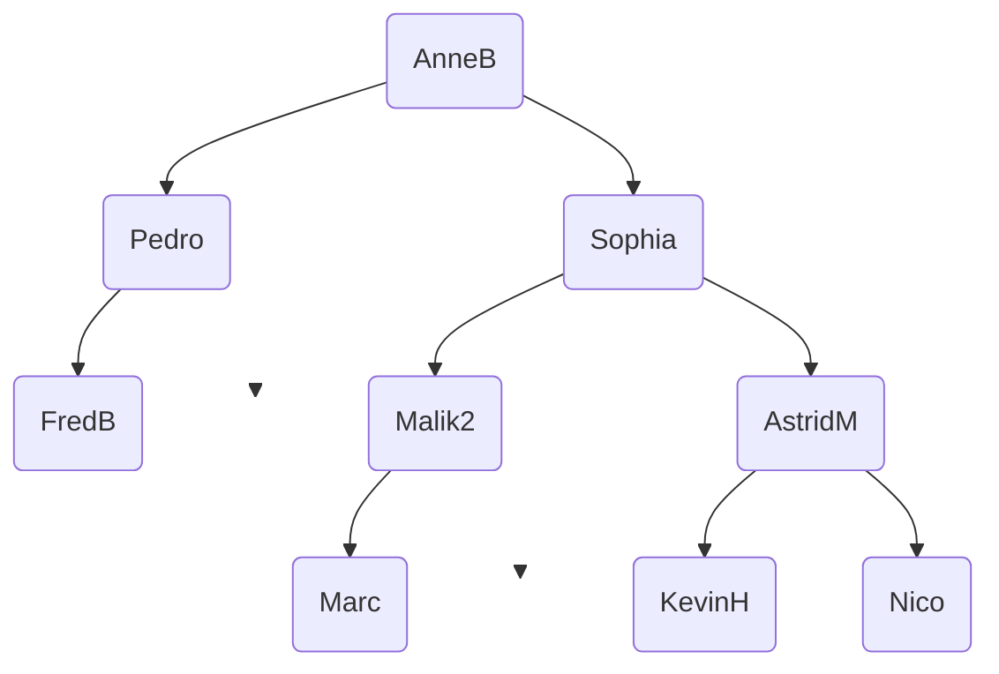
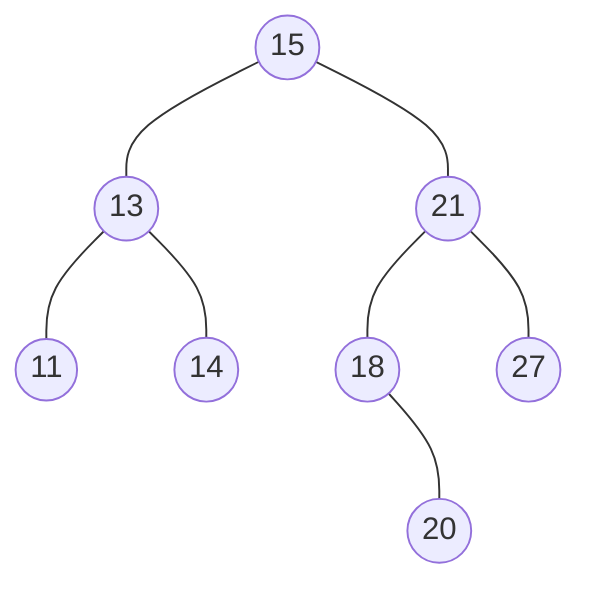







{{ titre_chapitre(num,titre,theme,niveau)}}

{{ initexo(0) }}


## Question de cours

!!! exo 

!!! question "Question de cours"
    On note h la hauteur d'un arbre binaire et n sa taille.  
    En utilisant vos connaissances de cours, prouver que $h \leqslant n \leqslant 2^h -1$.

??? success "Réponse"
    On étudie les deux cas de figure "extrème" :

    - **Cas minimaliste** : arbre filiforme
    ```mermaid
    graph TD
        A(" ") --> B(" ") 
        B --> C(" ")
        B --> D(" ")
        C --> E(" ")
        C --> C1(" ")
        E --> E1(" ")
        E --> E2(" ")
        C1 --> C2(" ")
        C1 --> C3(" ")
        A --> F(" ")
        F --> J(" ")
        F --> K(" ")
        J --> L(" ")
        J --> N(" ")
        K --> M(" ")
        style F opacity:0;
        style D opacity:0;
        style C1 opacity:0;
        style C2 opacity:0;
        style C3 opacity:0;
        style E2 opacity:0;
        style J opacity:0;
        style K opacity:0;
        style L opacity:0;
        style N opacity:0;
        style M opacity:0;
        linkStyle 2 stroke-width:0px;
        linkStyle 4 stroke-width:0px;
        linkStyle 6 stroke-width:0px;
        linkStyle 7 stroke-width:0px;
        linkStyle 8 stroke-width:0px;
        linkStyle 9 stroke-width:0px;
        linkStyle 10 stroke-width:0px;
        linkStyle 11 stroke-width:0px;
        linkStyle 12 stroke-width:0px;
        linkStyle 13 stroke-width:0px;
        linkStyle 14 stroke-width:0px;
    ```
    On a alors  $h = n$, on en déduit l'inégalité :  $h \leqslant n$

    - **Cas maximaliste** : arbre complet  
    ```mermaid
    graph TD
        A(" ") --> B(" ") 
        B --> C(" ")
        B --> D(" ")
        C --> E(" ")
        C --> C1(" ")
        E --> E1(" ")
        E --> E2(" ")
        C1 --> C2(" ")
        C1 --> C3(" ")
        A --> F(" ")
        F --> J(" ")
        F --> K(" ")
        J --> L(" ")
        J --> N(" ")
        D --> D1(" ")
        D --> D2(" ")
        D1 --> D3(" ")
        D1 --> D4(" ")
        D2 --> D5(" ")
        D2 --> D6(" ")
        L --> L3(" ")
        L --> L4(" ")
        N --> N1(" ")
        N --> N2(" ")
        K --> K1(" ")
        K --> K2(" ")
        K1 --> K3(" ")
        K1 --> K4(" ")
        K2 --> K5(" ")
        K2 --> K6(" ") 
    ```
    Chaque niveau a $2^{h-1}$ noeuds donc le nombre total de noeuds est donnée par $1 + 2 + 2^2 + 2^3 + ... + 2^{h-1} = 1 \times \dfrac{1-2^h}{1-2}=2^h - 1$.

    - On obtient alors les inégalités demandées : $h \leqslant n \leqslant 2^h -1$

## D'aprés exercice BAC

!!! exo
_Cet exercice porte sur le thème "Algorithmique", les arbes bianires de recherche et leurs parcours_  

**Rappel :** Un arbre binaire de recherche (ABR) est un arbre binaire étiqueté avec des clés tel que :  

- Les clés du sous-arbre gauche sont inférieures ou égales à celle de la racine;
- Les clés du sous-arbre droit sont strictement supérieures à celle de la racine;
- Les deux sous-arbres sont eux-mêmes des arbres binaires de recherche.


### Partie A : Préambule

!!! fabquestion "Question A.1"
    Recopier sur votre copie le ou les numéro(s) correspondant aux arbres binaires de recherche parmi les arbres suivants : 

    !!! note "Arbre 1"
        ```mermaid
        graph TD
            A(3) --> B(2) 
            B --> D(1)
            B --> E(3)
            A --> C(4)
            C --> F(4)
            C --> G(5)
        ```

    !!! note "Arbre 2"
        ```mermaid
        graph TD
            A(4) --> B(2) 
            B --> D(1)
            B --> E(3)
            A --> C(4)
            C --> F(4)
            C --> G(5)
        ```

    !!! note "Arbre 3"
        ```mermaid
        graph TD
            A(3) --> B(2) 
            B --> D(1)
            B --> E(1)
            A --> C(4)
            C --> F(3)
            C --> G(5)
        ```

??? success "Réponse" 
    Seul l'arbre 1 est un arbre binaire de recherche. En effet, dans l'arbre 2 la clé 4 apparaît dans le sous arbre droit de la racine de clé 4, or les clé du sous arbre droit doivent être *strictement* supérieurs à la racine. Pour la même raison, l'arbre 3 n'est pas non plus un arbre binaire de recherche, la valeur 1 figure dans le sous arbre droit du noeud d'étiquette 2.

### Partie B : Analyse  

On considère la structure de données abstraites ABR (Arbre Binaire de Recherche) que l'on munit des opérations suivantes : 

!!! abstract "Strucutres de données ABR"
    Utilise : Booleen, Element  
    Opérations :  
        - `creer_arbre()` : renvoie un arbre vide  
        - `est_vide(a)` : renvoie `True` si l'arbre a est vide et `False` sinon  
        - `racine(a)` : renvoie la clé de la racine de l'arbre non vide a.  
        - `sous_arbre_gauche(a)` : renvoie le sous-arbre gauche de l'arbre non vide a.  
        - `sous_arbre_droit(a)` : renvoie le sous-arbre droit de l'arbre non vie a.  
        - `ìnserer(a,e)` insère la clé e dans l'arbre a.  


!!! fabquestion "Question B.2.a"   
    Dans un ABR, où se trouve le plus petit élément ? Justifier

??? success "Réponse"

    Le plus petit élément se trouve sur la feuille la plus à gauche de l'arbre. En effet en descendant récursivement à gauche, on trouve à chaque étape une valeur inférieure à toutes celles se trouvant à droite.

    !!! attention
        La question demande **le** plus petit élément, or les valeurs présentes dans un arbre binaire de recherche ne sont pas forcément uniques. A titre d'exemple, dans l'arbre binaire de recherche suivant, la plus petite valeur apparaît 2 fois :
        ```mermaid
        graph TD
        S5(5) --> S6(5)
        S5 --> S8(8)
        ```

Pour rechercher une clé dans un ABR, il faut comparer la clé donnée avec la clé située à la racine. Si cette clé est ç la racine, la fonction renvoie vrai sinon il faut procéder récursivement sur les sous-arbres à gauche ou à droite.   


!!! fabquestion "Question B.2.b"  
    En utilisant les fonctions ci-dessus, écrire une fonction récursive `RechercheValeur` prenant en arguments la clé recherchée et l'arbre ABR considèré. Cette fonction retourne un booléen (vrai ou faux) indiquant si la clé est présente dans l'arbre ou non..

??? success "Réponse"
    Si l'arbre est vide alors il ne contient pas la cle cherchée. Sinon trois cas se présente : la clé cherchée est la racine et on renvoie `True`, la clé cherchée est inférieure à la racine et on relance la recherche dans le sous arbre gauche (là ou se trouve les valeurs inférieures à la racine), la clé cherchée est supérieure à la racine et on relance la recherche dans le sous arbre droit.  

    ```python
    def RechercheValeur(cle,abr):
        if est_vide(abr):
            return False
        if racine(abr)==cle:
            return True
        elif racine(abr)>cle:
            return RechercheValeur(cle,sous_arbre_gauche(a))
        else:
            return RechercheValeur(cle,sous_arbre_droit(a))
    ```


!!! fabquestion "Question B.3"
    On considère l'arbre ABR suivant : 

    ```mermaid
    graph TD
        A(7) --> B(2) 
        B --> D(1)
        D --> D1(" ")
        D --> D2(" ")
        B --> E(5)
        E --> H(3)
        E --> I(6)
        A --> C(10)
        C --> F(8)
        C --> G(" ")
        F --> F1(" ")
        F --> F2(9)
        G --> G1(" ")
        G --> G2(" ")
        linkStyle 2 stroke-width:0px;
        style D1 opacity:0;
        linkStyle 3 stroke-width:0px;
        style D2 opacity:0;
        linkStyle 9 stroke-width:0px;
        style G opacity:0;
        linkStyle 10 stroke-width:0px;
        style F1 opacity:0;
        linkStyle 12 stroke-width:0px;
        style G1 opacity:0;
        linkStyle 13 stroke-width:0px;
        style G2 opacity:0;
    ```
    a. Donner le parcours infixe de cette arbre.  
    b. Donner le parcours suffixe de cette arbre.  
    c. Donner le parcours préfixe de cette arbre.  
    d. Donner le parcours en largeur d'abord de cette arbre.

??? success "Réponse"
    a. En parcours en profondeur infixe, on liste de façon récursive les clé du sous arbre gauche, puis la racine, puis les clé du sous arbre droit. On obtient donc : $1 - 2 - 3 - 5 - 6 - 7 - 8 - 9 - 10$

    b. En parcours suffixe, on liste récursivement les noeuds du sous arbre gauche, ceux du sous arbre droit et enfin la racine. Ici, on obtient : $1 - 3 - 6 - 5 - 2 - 9 - 8 - 10 - 7$.

    c. En parcours préfixe, on liste récursivement la racine puis les noeuds du sous arbre gauche puis ceux du sous arbre droit. On obtient donc : $7 - 2 - 1 - 5 - 3 - 6 - 10 - 8 - 9$.  

    d. Le parcours en largeur corresponda à l'ordre de la lecture (de gauche à droite et de haut en bas). Ici on obtient : $7 - 2 - 10 - 1 - 5 - 8 - 3 - 6 - 9$.


## D'aprés BAC 

!!! exo  "Club d'Informatique"

> D'après 2022, Nouvelle-Calédonie, J1, Ex. 4

Un club de passionné⋅e⋅s d'informatique fonctionne de la façon suivante : pour être membre du club, à l'exception du fondateur ou de la fondatrice, il faut être parrainé⋅e. De plus, chaque membre peut parrainer au maximum deux personnes.

Dans ce club, on distingue trois profils de membres :

- membre or : le membre a parrainé deux personnes ;
- membre argent : le membre a parrainé une seule personne ;
- membre bronze : le membre n'a parrainé personne.

On peut modéliser ce fonctionnement de parrainage à l'aide d'un arbre binaire dont les étiquettes sont les pseudonymes des membres du club. Lorsque deux personnes ont été parrainées, celle qui a été parrainée en premier apparait comme racine du sous-arbre à gauche tandis que l'autre est racine du sous-arbre à droite.

On donne ci-dessous l'arbre $P$ représentant les membres du club issus des parrainages de AnneB, fondatrice du club. Par exemple, Sophia a parrainé Malik2 avant AstridM.



On munit la structure de données `ArbreBinaire` des opérations suivantes :

!!! note "Interface de la structure `ArbreBinaire`"

    ```python
    def est_vide(arbre: ArbreBinaire) -> bool:
        """renvoie True si arbre est vide, False sinon"""
    
    def racine(arbre: ArbreBinaire) -> str:
        """renvoie l'étiquette du nœud racine de arbre"""

    def gauche(arbre: ArbreBinaire) -> ArbreBinaire:
        """renvoie le sous-arbre à gauche de arbre"""

    def droite(arbre: ArbreBinaire) -> ArbreBinaire:
        """renvoie le sous-arbre à droite de arbre"""
    ```

!!! question "Question 1"
    On appelle feuille, un nœud qui ne possède pas de successeurs ou dit autrement dont l'arbre dont il est la racine possède deux sous-arbres vides. On définit la hauteur d'un arbre binaire non vide comme la longueur (en nombre de nœuds) du plus long chemin allant de la racine à une feuille. Un arbre vide a une hauteur égale à $0$. 

    a) **Indiquer** la hauteur de l'arbre $P$  
    b) **Recopier** et **compléter** la définition de la fonction récursive `hauteur` qui prend un `arbre` binaire en paramètre et renvoie la hauteur de cet `arbre`. On pourra utiliser la fonction `max` renvoyant la valeur maximale entre deux valeurs.

    ```python title="hauteur" linenums="1"
    def hauteur(arbre):
        if ...... :
            return 0
        else:
            hauteur_a_gauche = hauteur(gauche(arbre))
            hauteur_a_droite = ......
            return 1 + ......
    ```  
    c) **Indiquer** le type de la valeur renvoyée par la fonction `hauteur`


??? success "Réponse a"

    L'arbre binaire $P$ a une hauteur de $4$ (par exemple en considérant le chemin qui va de la racine `'AnneB'` jusqu'à la feuille `'Marc'`, on dénombre bien $4$ nœuds, aucun autre chemin en dénombre plus).


??? success "Réponse b"

    ```python title="hauteur" linenums="1"
    def hauteur(arbre):
        if est_vide(arbre) :
            return 0
        else:
            hauteur_a_gauche = hauteur(gauche(arbre))
            hauteur_a_droite = hauteur(droite(arbre))
            return 1 + max(hauteur_a_gauche, hauteur_a_droite)
    ```

??? success "Réponse c"

    Il s'agit d'un entier (type `int`)


!!! question "Question 2"
    La fonction `membres` ci-dessous prend un `arbre` binaire et une `liste_membres` en paramètres et ajoute, dans un certain ordre, les étiquettes de l'`arbre` à la `liste_membres`.

    ```python title="membres" linenums="1"
    def membres(arbre, liste_membres):
        if not est_vide(arbre):
            liste_membres.append(racine(arbre))
            membres(gauche(arbre), liste_membres)
            membres(droite(arbre), liste_membres)
    ```

    a) En supposant la liste `membres_p` initialement vide, **écrire** la valeur de cette liste après l'appel `membres(arbre_p, membres_p)` où `arbre_p` référence l'arbre $P$.

    b) **Indiquer** le nom du type de parcours d'arbre binaire réalisé par la fonction `membres`.


??? success "Réponse a"

    ```pycon
    >>> membres_p
    ['AnneB', 'Pedro', 'FredB', 'Sophia', 'Malik2', 'Marc', 'AstridM', 'KevinH', 'Nico']
    ```

??? success "Réponse b"

    Il s'agit d'un parcours **préfixe** (on traite la racine **avant** de traiter les sous-arbres à gauche et à droite).

!!! question "Question 3"
    Dans cette question, on s'intéresse aux profils des membres (or, argent ou bronze).

    a) **Indiquer** les étiquettes des feuilles de l'arbre $P$.  
    b) À partir des propositions suivantes, **indiquer** le profil des membres dont les pseudonymes sont les étiquettes des feuilles.

    - Réponse A : membre or
    - Réponse B : membre argent
    - Réponse C : membre bronze
    - Réponse D : on ne peut pas savoir

    c) **Écrire** la fonction `profil` qui prend un `arbre` binaire non vide en paramètre et renvoie le profil du membre dont le pseudonyme est l'étiquette de la racine de l'`arbre` sous la forme d'une chaine de caractères : `'or'`, `'argent'` ou `'bronze'`. Par exemple, l'appel `profil(arbre_p)` doit renvoyer `'or'`qui correspond au profil du membre `'AnneB'`, racine de $P$.


??? success "Réponse a"

    Les feuilles sont : `'FredB'`, `'Marc'`, `'KevinH'` et `'Nico'`

??? success "Réponse b"

    Puisqu'il s'agit des feuilles, cela signifie que ces nœuds n'ont pas de successeurs et donc que les membres associés n'ont parrainé personne. La bonne réponse est donc la C : membre bronze.

??? success "Réponse c"

    ```python title="profil" linenums="1"
    def profil(arbre):
        if est_vide(gauche(arbre)) and est_vide(droite(arbre)):
            return 'bronze'
        elif est_vide(gauche(arbre)) or est_vide(droite(arbre)):
            return 'argent'
        else:
            return 'or'
    ```


!!! question "Question 4"
    Afin d'obtenir un tableau dont chaque élément est un _tuple_ contenant le pseudonyme d'un membre et son profil, on propose la fonction `membres_profils` définie ci-dessous :

    ```python title="membres_profils" linenums="1"
    def membres_profils(arbre, liste_membres_profils):
        if not est_vide(arbre):
            liste_membres_profils.append((racine(arbre), profil(arbre))
            membres_profils(gauche(arbre), liste_membres_profils)
            membres_profils(droite(arbre), liste_membres_profils)
    ```

    On appelle cette fonction sur un arbre `arbre_2` et on obtient ceci :

    ```pycon
    >>> liste_2 = []
    >>> membres_profils(arbre_2, liste_2)
    >>> liste_2
    [('LeaC', 'or'), ('Ali', 'bronze'), ('Tom45', 'argent'), ('Vero', 'bronze')]
    ```

    **Dessiner** un arbre possible pouvant correspondre à l'`arbre_2`.


??? success "Réponse"

    Comme pour la question 2b, on a à faire à un parcours préfixe donc `'LeaC'` est la racine de l'`arbre_2`. Ensuite à gauche on a `'Ali'` qui est une feuille (membre bronze). À droite on tombe sur `'Tom45'` qui a parrainé un seul membre : `'Vero'`.

    
    ```mermaid
    graph TD
        A("LeaC") --> B("Ali") 
        B --> D(" ")
        B --> E(" ")
        A --> H("Tom45")
        H --> I("Vero")
        H --> J(" ")
        linkStyle 2 stroke-width:0px;
        style E opacity:0;
        linkStyle 1 stroke-width:0px;
        style D opacity:0;
        linkStyle 5 stroke-width:0px;
        style J opacity:0;
    ```

!!! question "Question 5"
    Chaque année, les membres versent une cotisation en fonction de leur profil.

    - membre or : cotisation de 20€
    - membre argent : cotisation de 30€
    - membre bronze : cotisation de 40€

    **Écrire** une fonction `cotisation` qui prend un `arbre` binaire et renvoie le total des cotisations reçues par le club dont `arbre` modélise les relations de parrainage. On pourra utiliser la fonction `membres_profils` de la question précédente.


??? success "Réponse"

    On commence par définir un dictionnaire des tarifs de cotisation :

    ```python
    tarifs = {'or': 20, 'argent': 30, 'bronze': 40}
    ```

    ```python title="cotisation" linenums="1"
    def cotisation(arbre):
        if est_vide(arbre):
            return 0
        else:
            arbre_gauche = cotisations(gauche(arbre))
            arbre_droit = cotisations(droite(arbre))
            return tarifs[profil(arbre)] + arbre_gauche + arbre_droit
    ```

    ou  


    ```python title="cotisation" linenums="1"
    def cotisations2(arbre):
        a=[]
        membres_profils(arbre,a)
        print(a)
        prixtotal=0
        for i in range(len(a)):
            if a[i][1]=='or':
                prixtotal+=20
            elif a[i][1]=='argent':
                prixtotal+=30
            else:
                prixtotal+=40
        return prixtotal
    ```


## D'aprés BAC

!!! exo "Insertion et valeurs supérieures dans un ABR"

> D'après 2022, Métropole, J2, Ex. 1

Dans cet exercice, la taille d'un arbre est le nombre de nœuds qu'il contient. Sa hauteur est le nombre de nœuds du plus long chemin qui joint le nœud racine à l'une des feuilles (nœuds sans sous-arbres). On convient que la hauteur d'un arbre ne contenant qu'un nœud vaut 1 et la hauteur de l'arbre vide vaut 0.


On considère l'arbre binaire représenté ci-dessous :



!!! question "Question 1"
    1.a. Donner la taille de cet arbre.  
    1.b. Donner la hauteur de cet arbre.  
    1.c. Représenter sur la copie le sous-arbre à droite du nœud de valeur 15.  
    1.d. Justifier que l'arbre de la figure 1 est un arbre binaire de recherche.  
    1.e. On insère la valeur 17 dans l'arbre de la figure 1 de telle sorte que 17 soit une nouvelle feuille de l'arbre et que le nouvel arbre obtenu soit encore un arbre binaire de recherche. Représenter sur la copie ce nouvel arbre.

??? success "Réponse 1.a"
    La taille vaut 8.

??? success "Réponse 1.b"
    La hauteur vaut 4.

??? success "Réponse 1.c"

    ```mermaid
    graph
    N2((21)) --- N5((18))
    N2 --- N6((27))
    N5 --- N7(( ))
    linkStyle 2 stroke-width:0px;
    style N7 opacity:0;
    N5 --- N8((20))
    ```

??? success "Réponse 1.d"

    Un arbre binaire de recherche est un arbre tel que, pour tout nœud $n$, les valeurs associées à tous les nœuds du sous-arbre à gauche sont inférieures à la valeur de $n$, et les valeurs associées à tous les nœuds du sous-arbre à droite sont supérieures à la valeur associée à $n$.

    On vérifie donc :
    
    * 15 > 13
    * 13 > 11
    * 13 < 14
    * 15 < 21
    * 21 > 18
    * 18 < 20
    * 21 < 27

    Cette propriété étant récursive, on doit aussi vérifier que l'on a :

    * 15 > 14
    * 15 < 18
    * 15 < 17
    * 21 > 20

    *Remarque :* Il est inutile de vérifier que l'on a 15 > 11 car on a vérifié 15 > 13 et 13 > 11. De la même façon, la vérification 15 < 27 est inutile.


??? success "Réponse 1.e"

    ```mermaid
    graph
    N0((15)) --- N1((13))
    N0 --- N2((21))
    N1 --- N3((11))
    N1 --- N4((14))
    N2 --- N5((18))
    N2 --- N6((27))
    N5 --- N7((17))
    N5 --- N8((20))
    ```    


On considère l'arbre la classe `Noeud` définie de la façon suivante en Python :

```python linenums="1"
class Noeud:
    def __init__(self, gauche, valeur, droite):
        self.gauche = gauche
        self.valeur = valeur
        self.droite = droite
```

!!! question "Question 2"
    **2.a.** Parmi les trois instructions **(A)**, **(B)** et **(C)** suivantes, écrire sur la copie la lettre correspondant à celle qui construit et stocke dans la variable `abr` l'arbre représenté ci-dessous.

    ```mermaid
    graph
    N0((15)) --- N1((13))
    N0 --- N2((21))
    ```

    * **(A)** `abr = Noeud(Noeud(Noeud(None, 13, None), 15, None), 21, None)`  
    * **(B)** `abr = Noeud(None, 13, Noeud(Noeud(None, 15, None), 21, None))`  
    * **(C)** `abr = Noeud(Noeud(None, 13, None), 15, Noeud(None, 21, None))`  

    **2.b.** Recopier et compléter la ligne 7 du code de la fonction `inserer` ci-dessous qui prend en paramètres une valeur `v` et un arbre binaire de recherche `abr` et qui renvoie l'arbre obtenu suite à l'insertion de la valeur v dans l'arbre `abr`. Les lignes 8 et 9 permettent de ne pas insérer la valeur `v` si celle-ci est déjà présente dans `abr`.

    ```python linenums="1"
    def inserer(v, abr):
        if abr is None:
            return Noeud(None, v, None)
        if v > abr.valeur:
            return Noeud(abr.gauche, abr.valeur, inserer(v, abr.droite))
        elif v < abr.valeur:
            return ...
        else:
            return abr
    ```

??? success "Réponse 2.a"

    On utilise l'instruction **(C)** :

    ```python
    abr = Noeud(
            Noeud(None, 13, None),
            15,
            Noeud(None, 21, None)
    )
    ```

??? success "Réponse 2.b"

    On propose :

    ```python linenums="1"
    def inserer(v, abr):
        if abr is None:
            return Noeud(None, v, None)
        if v > abr.valeur:
            return Noeud(abr.gauche, abr.valeur, inserer(v, abr.droite))
        elif v < abr.valeur:
            return Noeud(inserer(v, abr.gauche), abr.valeur, abr.droite)
        else:
            return abr
    ```

**3.** La fonction `nb_sup` prend en paramètres une valeur `v` et un arbre binaire de recherche `abr` et renvoie le nombre de valeurs supérieures ou égales à la valeur `v` dans l'arbre `abr`. 

Le code de cette fonction `nb_sup` est donné ci-dessous :
       
```python linenums="1"
def nb_sup(v, abr):
    if abr is None:
        return 0
    elif abr.valeur >= v:
        return 1+nb_sup(v, abr.gauche)+nb_sup(v, abr.droite)
    else:
        return nb_sup(v, abr.gauche)+nb_sup(v, abr.droite)
```

!!! question "Question 3"
    **3.a.** On exécute l'instruction `nb_sup(16, abr)` dans laquelle `abr` est l'arbre initial de la question **1.**. Déterminer le nombre d'appels à la fonction `nb_sup`.  
    **3.b.** L'arbre passé en paramètre étant un arbre binaire de recherche, on peut améliorer la fonction `nb_sup` précédente afin de réduire ce nombre d'appels.  
    Écrire sur la copie le code modifié de cette fonction.

??? success "Réponse 3.a"

    La fonction va faire autant d'appel que l'arbre compte de sous-arbres **y compris les sous-arbres vides**. En comptant l'appel initial cela fait donc 17 appels.


??? success "Réponse 3.b"

    Dans la mesure où l'on souhaite compter les valeurs supérieures, il est inutile d'explorer le sous-arbre à gauche si la valeur d'un nœud est inférieure à la valeur passée en argument.

    On peut donc faire :

    ```python
    def nb_sup(v, abr):
        if abr is None:
            return 0
        elif abr.valeur >= v:
            return nb_sup(v, abr.gauche) + 1 + nb_sup(v, abr.droite)
        else:
            return nb_sup(v, abr.droite)
    ```