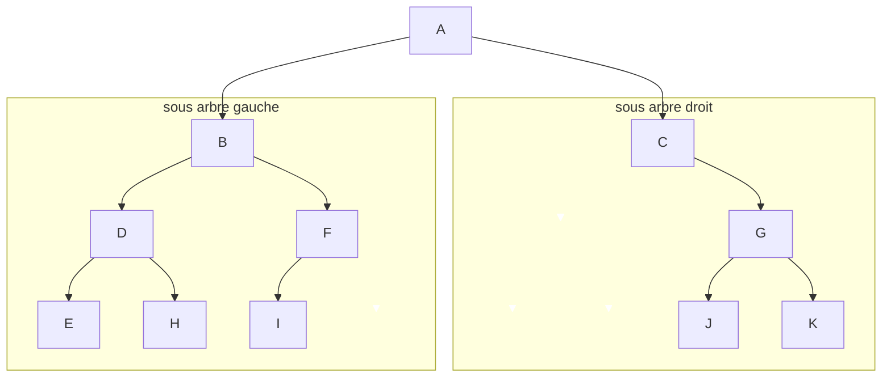
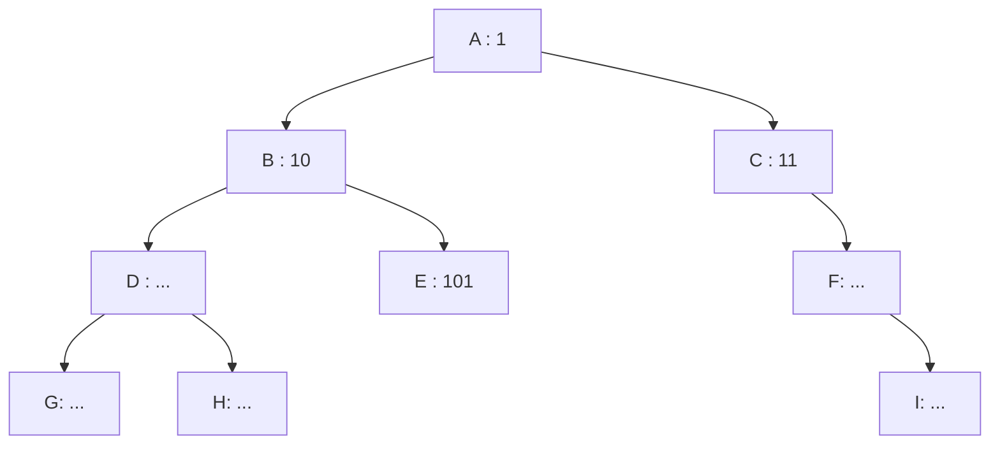
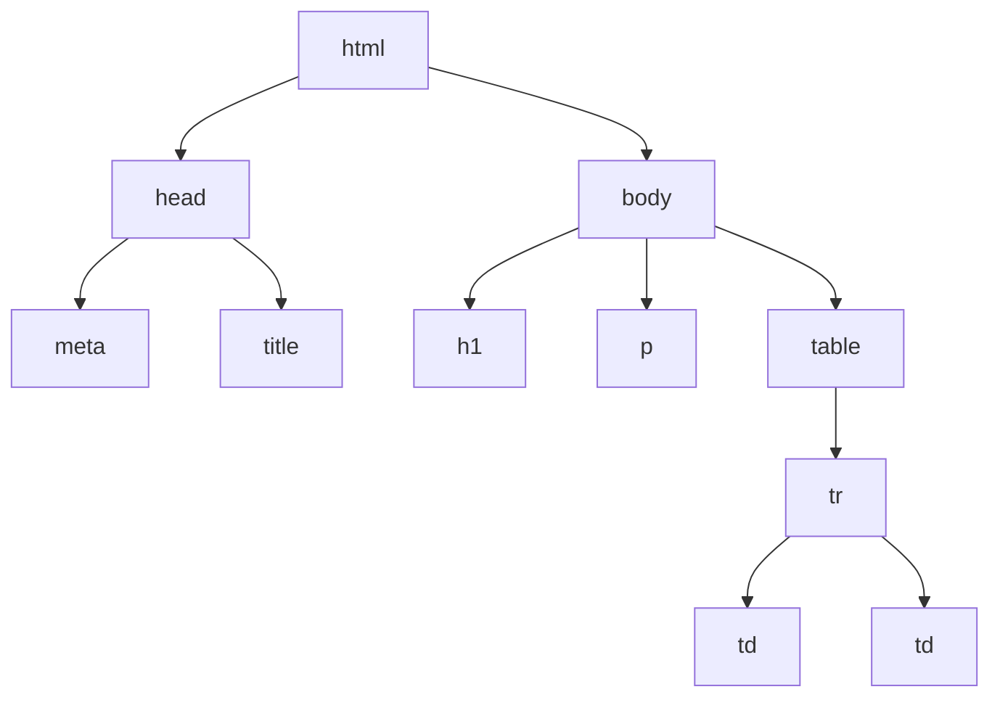
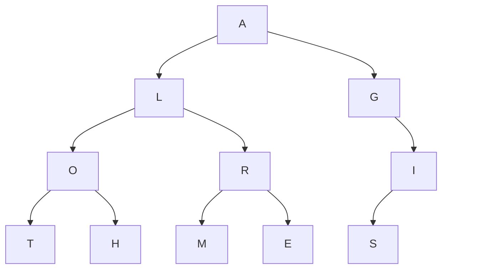




 


{{ titre_chapitre(num,titre,theme,niveau)}}


## Activités 

{{ titre_activite("Vocabulaire",[],0) }}

1. Après execution d'une commande dans un terminal Linux on a obtenu l'affichage ci-dessous :

    {:.center}

    1. De quelle commande s'agissait-il ? (Rechercher la commande sur internet) Quelle est sa traduction en français ?
    2. Que sont `Maths` et `NSI` pour le système d'exploitation ?
    3. Un point (**.**) figure en haut du schéma, quelle en est la signification ?
    4. Que signifie le lien entre `NSI` et `Projet` ?

2. Le schéma ci-dessus est un exemple d'**arbre** (on parle d'ailleurs de l'arborescence des dossiers dans un système d'exploitation). Un arbre est constitué de **noeuds** et un lien entre deux noeuds s'appelle une **arête**.

    1. Citer trois noeuds de l'arbre ci-dessus et donner un exemple d'arête.
    2. Quel noeud est le répertoire parent de `Systèmes`  ? On dira dans le vocabulaire des arbres que le noeud `Systèmes` est un **fils** de ce noeud.
    3. Citer tous les fils du noeud `NSI`.
    4. Dans un arbre, un seul et unique noeud n'est le fils de personne, on l'appelle la **racine** de l'arbre. De qui s'agit-il ici ?
    5. Nommer les noeuds n'ayant aucun fils (on les appelle **feuilles** de l'arbre).
    6. Une **branche** est une suite (finie) de noeuds depuis la racine vers une feuille. Donner une branche de cette arbre constituée de trois noeuds.
    7. Donner la **taille** de cet arbre (c'est à dire son nombre de noeuds).
    8. Donner l'**arité** de cet arbre, c'est à dire le nombre maximal de fils qu'un noeud peut avoir.
    9. Donner la **hauteur** de cet arbre c'est à dire le nombre maximal de noeuds dans une branche.

        !!! Attention
                La hauteur d'un arbre est parfois définie comme le plus grand nombre d'arêtes dans une branche. Dans les sujets de {{sc("bac")}} faire attention à la définition utilisée qui est normalement donnée dans l'énoncé.


{{ titre_activite("Arbre binaire",[]) }}

!!! jeretiens "Arbre binaire"
    Un **arbre binaire** est un arbre dont tous les noeuds ont au plus deux fils.





1. Quelle est la taille de cet arbre ?  
2. Listez les noeuds internes puis les feuilles.  
3. Quelle est la hauteur de cet arbre ?  
4. Quels sont les fils du noeud B ?  
5. Quel est le sous-abre gauche du noeud B ?  
6. Quel est le sous-abre gauche du noeud C ?  

{{ titre_activite("Relation entre la hauteur et la taille d'un arbre binaire",[])}}

1. On note $h$ la hauteur d'un arbre binaire et $n$ sa taille, on suppose dans la suite que $n \geq 2$. En rappelant les définitions de la hauteur et de la taille d'un arbre, justifier que $n \geq h$.
2. On numérote les noeuds d'un arbre binaire de la suivante :  

    * la racine porte le numéro 1,
    * le fils gauche d'un noeud porte le numéro de son père suivi d'un 0,
    * le fils droit d'un noeud porte le numéro de son père suivi d'un 1.

On a entamé la numérotation de l'arbre binaire ci-dessous, recopier cet arbre et compléter cette numérotation.




3. Justifier que sur un niveau donné de l'arbre tous les numéros de noeud ont le même nombre de caractères.
4. En déduire en fonction de $h$, le nombre de caractères formant le numéro des feuilles
5. En utilisant vos connaissances sur la numérotation binaire d'un entier positif, prouver que $n \leq 2^h - 1$.


{{ titre_activite("Parcours en largeur (*BFS : Breadth First Search*) d'abord d'un arbre binaire",[]) }}


!!! methode "Parcours en largeur d'abord  (BFS)"
    Le parcours en largeur d'abord est un parcours étage par étage (de haut en bas) et de gauche à droite.


{:.center}

L'ordre des lettres parcourues est donc T-Y-O-P-H-N.

> Un parcours en largeur d'abord n'est pas récursif.

1. Indiquez dans quel ordre les noeuds sont explorés dans le cas d'un parcours en largeur de l'arbre `A1` suivant.

    ```mermaid
        graph TD
        A["2"] --> B["8"]
        A --> C["9"]
        B --> D["4"]
        B --> E["5"]
        C --> V1[" "]
        C --> F["3"]
        V1 --> V2[" "]
        V1 --> V3[" "]
        style V1 opacity:0;
        linkStyle 4 stroke:#FFFFFF,stroke-width:0px
        style V2 opacity:0;
        linkStyle 6 stroke:#FFFFFF,stroke-width:0px
        style V3 opacity:0;
        linkStyle 7 stroke:#FFFFFF,stroke-width:0px
        style V2 opacity:0;
    ```


2. Indiquez dans quel ordre les noeuds sont explorés dans le cas d'un parcours en largeur de l'arbre `A2` suivant.

    ```mermaid
        graph TD
        A["1"] --> B["2"]
        A --> C["5"]
        B --> D["3"]
        B --> E["4"]
        C --> V1["6"]
        C --> F[" "]
        V1 --> V2["7"]
        V1 --> V3["8"]
        D --> G[" "]
        D --> H[" "]
        F --> I[" "]
        F --> V6[" "]
        E --> V4[" "]
        E --> V5[" "]
        style F opacity:0;
        linkStyle 5 stroke:#FFFFFF,stroke-width:0px
        style G opacity:0;
        linkStyle 8 stroke:#FFFFFF,stroke-width:0px
        style H opacity:0;
        linkStyle 9 stroke:#FFFFFF,stroke-width:0px
        style I opacity:0;
        linkStyle 10 stroke:#FFFFFF,stroke-width:0px
        style V6 opacity:0;
        linkStyle 11 stroke:#FFFFFF,stroke-width:0px
        style V4 opacity:0;
        linkStyle 12 stroke:#FFFFFF,stroke-width:0px
        style V5 opacity:0;
        linkStyle 13 stroke:#FFFFFF,stroke-width:0px
    ```
    

{{ titre_activite("Parcours en profondeur d'un arbre binaire",[]) }}

!!! note 
    Dans le cas où on explore complètement l'un des deux sous-arbres avant le second on parle d'un **parcours en profondeur**. On utilise le terme _profondeur_ car dans ce cas on tente toujours de visiter le noeud le plus éloigné de la racine à condition qu'il soit le fils d'un noeud déjà visité.  
    On distingue trois ordres particuliers pour explorer en profondeur les sous-arbres gauche, droit et la racine du noeud courant : 
    
    - **ordre préfixe** : le noeud courant est traité, puis son sous-arbre gauche et son sous-arbre droit.  
    - **ordre infixe** : le noeud courant est traité entre son sous-arbre gauche et son sous-arbre droit.  
    - **ordre suffixe** : le noeud courant est traité après son sous-arbre gauche et son sous-arbre droit. 


#### Parcours préfixe

Le parcours **préfixe** est un parcours **en profondeur d'abord**. 

!!! methode "Méthode du parcours préfixe :"
    (parfois aussi appelé *préordre*)  

    - Chaque nœud est visité avant que ses fils le soient.
    - On part de la racine, puis on visite son fils gauche (et éventuellement le fils gauche de celui-ci, etc.) avant de remonter et de redescendre vers le fils droit.


{:.center}


L'ordre des lettres parcourues est donc T-Y-P-O-H-N.

??? video "Vidéo explicative d'un parcours préfixe"
    <iframe width="1193" height="671" src="https://www.youtube.com/embed/XH0vkaWPu-k" title="parcours préfixe d'un arbre binaire" frameborder="0" allow="accelerometer; autoplay; clipboard-write; encrypted-media; gyroscope; picture-in-picture" allowfullscreen></iframe>


#### Parcours infixe

!!! methode "Parcours infixe"
    Le parcours **infixe** est aussi un parcours en profondeur d'abord.

    **Méthode du parcours infixe :** (parfois aussi appelé *en ordre*)  

    - Chaque nœud est visité **après son fils gauche mais avant son fils droit**.
    - On part donc de la feuille la plus à gauche et on remonte par vagues sucessives. Un nœud ne peut pas être visité si son fils gauche ne l'a pas été.

{:.center}

L'ordre des lettres parcourues est donc P-Y-T-H-O-N.

??? video "Vidéo explicative d'un parcours infixe"
    <iframe width="1193" height="671" src="https://www.youtube.com/embed/oB2saWLbESU" title="parcours infixe d'un arbre binaire" frameborder="0" allow="accelerometer; autoplay; clipboard-write; encrypted-media; gyroscope; picture-in-picture" allowfullscreen></iframe>


#### Parcours suffixe

!!! methode "Parcours suffixe"
    Le parcours **suffixe** est aussi un parcours en profondeur d'abord.

    **Méthode du parcours suffixe :** (parfois aussi appelé *post ordre*)  

    - Chaque nœud est visité **après ses fils le soient**.
    - On part donc de la feuille la plus à gauche, et on ne remonte à un nœud père que si ses fils ont tous été visités. 

{:.center}

L'ordre des lettres parcourues est donc P-Y-H-N-O-T.


#### Comment ne pas se mélanger entre le pré / in / post fixe ?

- *pré* veut dire *avant*  
- *in* veut dire *au milieu*  
- *post* veut dire *après*  

Ces trois mots-clés parlent de la place du **père** par rapport à ses fils.   
Ensuite, il faut toujours se souvenir qu'on traite le fils gauche avant le fils droit.  

- préfixe : le père doit être le premier par rapport à ses fils.  
- infixe : le père doit être entre son fils gauche (traité en premier) et son fils droit.  
- postfixe : le père ne doit être traité que quand ses deux fils (gauche d'abord, droite ensuite) l'ont été.  

Un parcours préfixe commencera toujours par la racine, alors qu'un parcours postfixe finira toujours par la racine. Dans un parcours infixe, la racine sera «au milieu» (pas nécessairement parfaitement).

#### Exercices d'application 


!!! exo "Exercice"
    === "Énoncé" 
        ```mermaid
        graph TD  
            A(1) --> B(2) 
            B --> C(4)
            B --> D(5)
            A --> E(3)
            D --> F(7)
            D --> G(8)
            E --> H(" ")
            E --> I(6)
            I --> J(9)
            I --> K(" ")
            linkStyle 6 stroke-width:0px;
            style H opacity:0;
            linkStyle 9 stroke-width:0px;
            style K opacity:0;
        ```

        Donner le rendu de chaque parcours :

        1. Parcours en largeur 
        2. Parcours préfixe
        3. Parcours infixe
        4. Parcours postfixe
    
    === "Corr. largeur"
        {{ correction(True,
        "
        largeur : 1 2 3 4 5 6 7 8 9
        "
        ) }}
    === "Corr. préfixe"
        {{ correction(True,
        "
        préfixe : 1 2 4 5 7 8 3 6 9
        "
        ) }}
    === "Corr. infixe"
        {{ correction(True,
        "
        infixe : 4 2 7 5 8 1 3 9 6
        "
        ) }}
    === "Corr. postfixe"
        {{ correction(True,
        "
        postfixe : 4 7 8 5 2 9 6 3 1
        "
        ) }}


!!! exo "Exercice"
    === "Énoncé"
        ```mermaid
        graph TD  
            A(9) --> B(8) 
            B --> C(6)
            B --> D(2)
            A --> E(7)
            D --> F(1)
            D --> G(" ")
            E --> H(" ")
            E --> I(5)
            I --> J(4)
            I --> K(3)
            linkStyle 5 stroke-width:0px;
            style G opacity:0;
            linkStyle 6 stroke-width:0px;
            style H opacity:0;
        ```

        Donner le rendu de chaque parcours :

        1. Parcours en largeur 
        2. Parcours préfixe
        3. Parcours infixe
        4. Parcours postfixe
    === "Corr. largeur"
        {{ correction(True,
        "
        largeur : 9 8 7 6 2 5 1 4 3
        "
        )}}
    === "Corr. préfixe"
        {{ correction(True,
        "
        préfixe : 9 8 6 2 1 7 5 4 3
        "
        )}}
    === "Corr. infixe"
        {{ correction(True,
        "
        infixe : 6 8 1 2 9 7 4 5 3
        "
        )}}
    === "Corr. postfixe"
        {{ correction(True,
        "
        postfixe : 6 1 2 8 4 3 5 7 9
        "
        )}}


    


## Cours

{{ aff_cours(num) }}


## Exercices

{{ exo("DOM",[],0) }}
On considère le code  {{sc("html")}} suivant :
```html
<html lang="fr">
<head>
    <meta charset="UTF-8">
    <title>Exemple</title>
</head>
<body>
    <h1> Un titre </h1>
    <p> Bonjour ! </p>
    <table>
        <tr>
            <td> Case 1</td>
            <td> Case 2</td>
        </tr>
    </table>
</body>
</html>
```
Ce document peut se représenter par un arbre :


1. Que représentent les noeuds de cet arbre ?
2. Que signifie du point de vue du {{sc("html")}} une arête de cet arbre ?
3. Quelle est la racine de cet arbre ?
4. Donner les feuilles de cet arbre.
5. Donner une branche de cet arbre.
6. Donner l'arité de cet arbre.
7. Donner la hauteur de cet arbre.

{{ exo("Vocabulaire sur les arbres",[]) }}

On considère l'arbre ci-dessous :




1. Justifier qu'il s'agit d'un arbre binaire. Quelle est sa taille ?
2. Quelle est sa racine ? Nommer les feuilles.
3. Donner une branche de cet arbre.
4. Donner la hauteur de cet arbre.
5. Donner une branche de longueur 3 dans cet arbre  
6. On considère le sous arbre gauche de la racine, quel est l'arité de chaque noeud ? Que peut-on dire du sous arbre gauche ?
7. Même question pour le sous arbre droit de la racine.

{{ exo("Représenter un arbre binaire",[]) }}

1. Dessiner tous les arbres binaires à 3 noeuds. Attention à bien distinguer le fils droit du fils gauche.
2. Dessiner un arbre binaire de taille 4 et de profondeur 4.
3. Dessiner un arbre binaire de taille 4 et de profondeur 3.
4. Quelle est la taille maximale d'un arbre binaire de hauteur 10 ? Justifier 

    !!!aide 
        On pourra utiliser sans justification, la formule vue en cours qui permet d'encadrer la taille d'un arbre en fonction de sa hauteur.

{{ exo("Représenter un arbre binaire par un triplet",[]) }}

On rappelle qu'on peut définir un arbre binaire de façon récursive, en effet, un arbre binaire est soit vide (noté $\Delta$), soit un triplet $(etiquette,sag,sad)$ où $sag$ (pour sous arbre gauche) et $sad$ (pour sous arbre droit) sont eux-mêmes des arbres binaires. 

On considère les arbres suivants :

* $A = (7,\Delta,\Delta)$
* $B = (2,(3,\Delta,(9,\Delta,\Delta)),(10,\Delta,\Delta))$
* $C = (4,(1,(8,\Delta,\Delta),(7,\Delta,\Delta)),(3,(6,\Delta,\Delta),(5,\Delta,\Delta)))$

Pour chacun de ces arbres :

1. Faire un schéma pour le représenter.
2. Donner sa taille, sa hauteur, son nombre de feuilles.

