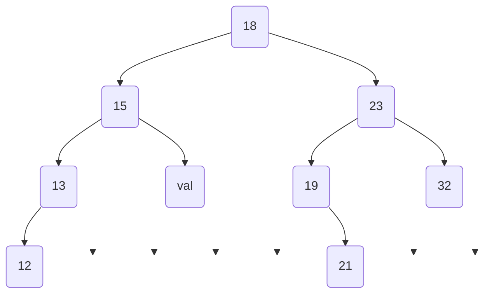
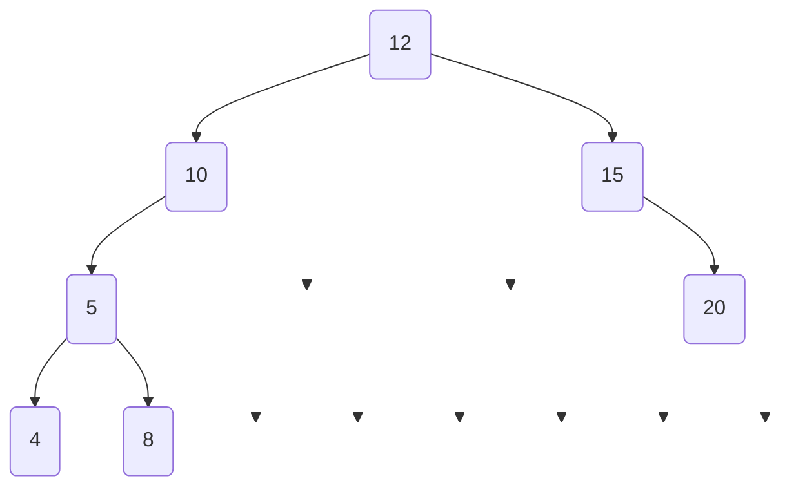
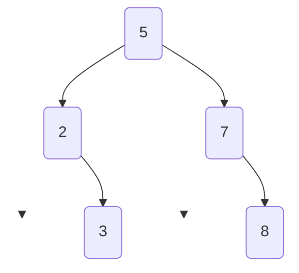
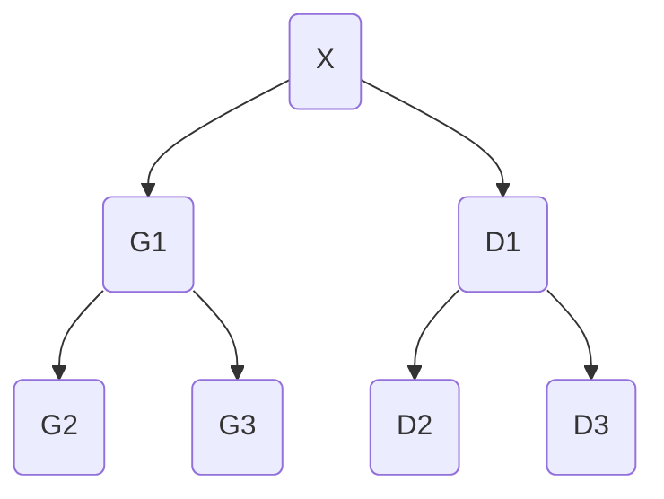
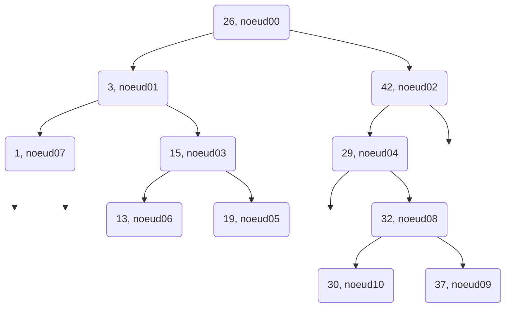







{{ titre_chapitre(num,titre,theme,niveau)}}

{{ initexo(0) }}


## 2020, sujet 0

!!! exo "2020, sujet 0"

!!! question "Question  1"

    Déterminer la taille et la hauteur de l’arbre binaire suivant :
    ```mermaid
    graph TD  
        A("A") --> B("B") 
        B --> C("C")
        B --> D("D")
        A --> E("E")
        C --> C1(" ")
        C --> C2(" ")
        D --> G("G")
        D --> D2(" ")
        E --> F("F")
        E --> E2(" ")
        F --> H("H")
        F --> I("I")
        E2 --> E3(" ")
        E2 --> E4(" ")
        linkStyle 4 stroke-width:0px;
        style C1 opacity:0;
        linkStyle 5 stroke-width:0px;
        style C2 opacity:0;
        linkStyle 7 stroke-width:0px;
        style D2 opacity:0;
        linkStyle 9 stroke-width:0px;
        style E2 opacity:0;
        linkStyle 12 stroke-width:0px;
        style E3 opacity:0;
        linkStyle 13 stroke-width:0px;
        style E4 opacity:0;
    ```

??? success "corrigé"
    La taille est 9, la hauteur est 4.  


!!! question "Question  2"

    On décide de numéroter en binaire les nœuds d’un arbre binaire de la façon suivante :  

    - la racine correspond à 1 ;
    - la numérotation pour un fils gauche s’obtient en ajoutant le chiffre 0 à droite au numéro de son
    père ;
    - la numérotation pour un fils droit s’obtient en ajoutant le chiffre 1 à droite au numéro de son
    père ;  


    Par exemple, dans l’arbre ci-dessous, on a utilisé ce procédé pour numéroter les nœuds A, B, C, E et
    F .

    ```mermaid
    graph TD  
        A("A : 1") --> B("B : 10") 
        B --> C("C : 100")
        B --> D("D : ?")
        A --> E("E : 11")
        C --> C1(" ")
        C --> C2(" ")
        D --> G("G: ?")
        D --> D2(" ")
        E --> F("F : 110")
        E --> E2(" ")
        F --> H("H : ?")
        F --> I("I : ?")
        E2 --> E3(" ")
        E2 --> E4(" ")
        linkStyle 4 stroke-width:0px;
        style C1 opacity:0;
        linkStyle 5 stroke-width:0px;
        style C2 opacity:0;
        linkStyle 7 stroke-width:0px;
        style D2 opacity:0;
        linkStyle 9 stroke-width:0px;
        style E2 opacity:0;
        linkStyle 12 stroke-width:0px;
        style E3 opacity:0;
        linkStyle 13 stroke-width:0px;
        style E4 opacity:0;
    ```

    1. Dans l’exemple précédent, quel est le numéro en binaire associé au nœud G ?  
    2. Quel est le nœud dont le numéro en binaire vaut 13 en décimal ?  
    3. En notant $h$ la hauteur de l’arbre, sur combien de bits seront numérotés les nœuds les plus en bas ?  
    4. Justifier que pour tout arbre de hauteur $h$ et de taille $n \geqslant 2$, on a : $h \leqslant n \leqslant 2^h-1$  

??? success "corrigé"
    1. G est associé à 1010.   
    2. 13 s'écrit 1101 en binaire, c'est donc le nœud I.    
    3. Les nœuds les plus en bas sont notés sur $h$ bits.  
    4. L'arbre de hauteur $h$ de taille minimale est l'arbre filiforme, qui est de taille $h$.  
    L'arbre de hauteur $h$ de taille maximale est l'arbre complet, qui est de taille $2^h-1$. Si $n$ est la taille d'un arbre quelconque de taille $h$, on a donc bien $$ h \leqslant n \leqslant 2^h-1 $$.

  
!!! question "Question  3"
    Un arbre binaire est dit complet si tous les niveaux de l’arbre sont remplis.
    ```mermaid
    graph TD
        A("A") --> B("B") 
        B --> D("D")
        B --> E("E")
        A --> C("C")
        C --> F("F")
        C --> G("G")
        D --> H("H")
        D --> I("I")
        E --> J("J")
        E --> K("K")
        F --> L("L")
        F --> M("M")
        G --> N("N")
        G --> O("O")
    ```


    On décide de représenter un arbre binaire complet par un tableau de taille n + 1, où n est la taille de
    l’arbre, de la façon suivante :  

    - La racine a pour indice 1 ;  
    - Le fils gauche du nœud d’indice i a pour indice $2 \times i$ ;  
    - Le fils droit du nœud d’indice i a pour indice $2 \times i + 1$ ;  
    - On place la taille $n$ de l’arbre dans la case d’indice 0.  

    Répondre aux questions suivantes :  

    1. Déterminer le tableau qui représente l’arbre binaire complet de l’exemple précédent.  
    2. On considère le père du nœud d’indice $i$ avec $i \geqslant 2$. Quel est son indice dans le tableau ?

??? success "corrigé"
    1. Tableau : ```[15, A, B, C, D, E, F, G, H, I, J, K, L, M, N, O]``` .  
    2. Le père du nœud d'indice ```i``` a pour indice ```i//2```.   


!!! question "Question  4"

    On se place dans le cas particulier d’un arbre binaire de recherche complet où les nœuds
    contiennent des entiers et pour lequel la valeur de chaque noeud est supérieure à celles des
    noeuds de son fils gauche, et inférieure à celles des noeuds de son fils droit.


    Écrire une fonction `recherche` ayant pour paramètres un arbre `arbre` et un élément `element`. Cette
    fonction renvoie `True` si `element` est dans l’arbre et `False` sinon. L’arbre sera représenté par un tableau
    comme dans la question précédente.


??? success "corrigé"
  
    ```python
    def recherche(arbre, element):
        i = 1
        while i < len(arbre):
            if arbre[i] == element:
                return True
            if element < arbre[i]:
                i = 2*i # on se place sur le fils gauche
            else:
                i = 2*i +  1 # on se place sur le fils droit
        return False
    ```

## 2021, Métropole sujet 1

!!! exo "2021, Métropole sujet 1"

Dans cet exercice, les arbres binaires de recherche ne peuvent pas comporter plusieurs fois la
même clé. De plus, un arbre binaire de recherche limité à un nœud a une hauteur de 1.
On considère l’arbre binaire de recherche représenté ci-dessous (figure 1), où `val` représente un entier :



!!! question "Question  1"
    **a** Donner le nombre de feuilles de cet arbre et préciser leur valeur (étiquette).  
    **b** Donner le sous arbre-gauche du nœud 23.  
    **c** Donner la hauteur et la taille de l’arbre.  
    **d** Donner les valeurs entières possibles de `val` pour cet arbre binaire de recherche.


??? tip "corrigé"
    **1.a.** Il y a 4 feuilles, d'étiquette 12, `val`, 21 et 32.  
    **1.b.** Le sous-arbre gauche du nœud 23 est 19-21.  
    **1.c.** La hauteur de l'arbre est 4. Sa taille est 9.  
    **1.d.** Les valeurs possibles de ```val``` sont 16 et 17.  


On suppose, pour la suite de cet exercice, que `val` est égal à 16.

!!! question "Question  2"
    On rappelle qu’un parcours infixe depuis un nœud consiste, dans l’ordre, à faire un parcours infixe sur le sous arbre-gauche, afficher le nœud puis faire un parcours infixe sur le sous-arbre droit.    
    Dans le cas d’un parcours suffixe, on fait un parcours suffixe sur le sous-arbre gauche puis un parcours suffixe sur le sous-arbre droit, avant d’afficher le nœud.

    **a.** Donner les valeurs d’affichage des nœuds dans le cas du parcours infixe de l’arbre.   
    **b**. Donner les valeurs d’affichage des nœuds dans le cas du parcours suffixe de l’arbre.


??? tip "corrigé"
    **2.a.** Parcours infixe : 12-13-15-16-18-19-21-23-32  
    **2.b.** Parcours suffixe : 12-13-16-15-21-19-32-23-18  


!!! question "Question  3"
    On considère la classe `Noeud` définie de la façon suivante en Python :

    ```python
    class Noeud():
        def __init__(self, v):
            self.ag = None
            self.ad = None
            self.v = v
            
        def insere(self, v):
            n = self
            est_insere = False
            while not est_insere :
                if v == n.v:
                    est_insere = True             | Bloc 1
                elif v < n.v:                  
                    if n.ag != None:           ---
                        n = n.ag                  |
                    else:                         |  Bloc 2
                        n.ag = Noeud(v)           |  
                        est_insere = True      ---   
                else:
                    if n.ad != None:           ---
                        n = n.ad                  |
                    else:                         | Bloc 3
                        n.ad = Noeud(v)           |
                        est_insere = True      --- 
                        
        def insere_tout(self, vals):
            for v in vals:
                self.insere(v) 
    ```
    **a.** Représenter l’arbre construit suite à l’exécution de l’instruction suivante :  

    ```python 
    racine = Noeud(18)
    racine.insere_tout([12, 13, 15, 16, 19, 21, 32, 23])
    ```
    **b.** Écrire les deux instructions permettant de construire l’arbre de la figure 1. On rappelle que le nombre `val` est égal à 16.

    **c.** On considère l’arbre tel qu’il est présenté sur la figure 1. Déterminer l’ordre d’exécution des blocs (repérés de 1 à 3) suite à l’application de la méthode `insere(19)` au nœud racine de cet arbre.


??? tip "corrigé"
    **a.**  

    ```mermaid
    graph TD
        A(18) --> B(12) 
        B --> D(" ")
        B --> E(13)
        A --> C(19)
        C --> F(" ")
        C --> G(21)
        D --> H(" ")
        D --> D1(" " )
        E --> E1(" ")
        E --> E2(15)
        F --> F1(" ")
        F --> M(" ")
        M --> G1(" ")
        M --> G2(" ")
        E2 --> I(" ")
        E2 --> J(16)
        G --> K(" ")
        G --> L(32)
        L --> N(23)
        L --> O(" ")
        linkStyle 1 stroke-width:0px;
        style D opacity:0;    
        linkStyle 4 stroke-width:0px;
        style F opacity:0;
        linkStyle 6 stroke-width:0px;
        style H opacity:0;
        linkStyle 7 stroke-width:0px;
        style D1 opacity:0;
        linkStyle 8 stroke-width:0px;
        style E1 opacity:0;
        linkStyle 10 stroke-width:0px;
        style F1 opacity:0;
        linkStyle 11 stroke-width:0px;
        style M opacity:0;
        linkStyle 12 stroke-width:0px;
        style G1 opacity:0;
        linkStyle 13 stroke-width:0px;
        style G2 opacity:0;
        linkStyle 14 stroke-width:0px;
        style I opacity:0;
        linkStyle 16 stroke-width:0px;
        style K opacity:0;
        linkStyle 19 stroke-width:0px;
        style O opacity:0;
    ```
    **b.**   
    ```python
    racine = Noeud(18)
    racine.insere([15, 13, 12, 16, 23, 32, 19, 21])
    ```
    (d'autres solutions sont possibles)

    **3.c.** Bloc 3 - Bloc 2 - Bloc 1  


!!! question "Question  4"
    Écrire une méthode `recherche(self, v)` qui prend en argument un entier `v` et renvoie la valeur `True` si cet entier est une étiquette de l’arbre, `False` sinon.


??? tip "corrigé"  

    ```python linenums='1'
    class Noeud():
        def __init__(self, v):
            self.ag = None
            self.ad = None
            self.v = v

        def insere(self, v):
            n = self
            est_insere = False
            while not est_insere:
                if v == n.v:
                    est_insere = True
                elif v < n.v:
                    if n.ag != None:
                        n = n.ag
                    else:
                        n.ag = Noeud(v)
                        est_insere = True
                else:
                    if n.ad != None:
                        n = n.ad
                    else:
                        n.ad = Noeud(v)
                        est_insere = True

        def insere_tout(self, vals):
            for v in vals:
                self.insere(v)

        def recherche(self, v):
            arbre = self
            while not arbre is None:
                if arbre.v == v:
                    return True
                if v < arbre.v:
                    arbre = arbre.ag
                else:
                    arbre = arbre.ad
            return False


        # version récursive (non demandée)

        def recherche_rec(self, v):
            if self is None:
                return False
            if self.v == v:
                return True
            if v < self.v:
                if self.ag is not None:
                    return self.ag.recherche_rec(v)
                else:
                    return False
            else:
                if self.ad is not None:
                    return self.ad.recherche_rec(v)
                else:
                    return False


    racine = Noeud(18)
    racine.insere_tout([12, 13, 15, 14, 19, 21, 32, 23])
    print(racine.recherche(149))
    print(racine.recherche(12))


    ```


## 2021, Métropole Candidats Libres 2

!!! exo "2021, Métropole Candidats Libres 2"

On rappelle qu’un arbre binaire est composé de nœuds, chacun des nœuds possédant éventuellement un sous-arbre gauche et éventuellement un sous-arbre droit. Un nœud sans sous-arbre est appelé feuille. La taille d’un arbre est le nombre de nœuds qu’il contient ; sa hauteur est le nombre de nœuds du plus long chemin qui joint le nœud racine à l’une des feuilles. Ainsi la hauteur d’un arbre réduit à un nœud, c’est-à-dire la racine, est 1.


Dans un arbre binaire de recherche, chaque nœud contient une clé, ici un nombre entier, qui est :

- strictement supérieure à toutes les clés des nœuds du sous-arbre gauche ;  
- strictement inférieure à toutes les clés des nœuds du sous-arbre droit.


Un arbre binaire de recherche est dit « bien construit » s’il n’existe pas d’arbre de hauteur inférieure qui pourrait contenir tous ses nœuds.


On considère l’arbre binaire de recherche ci-dessous.



!!! question "Question  1"

    **a.** Quelle est la taille de l’arbre ci-dessus ?  

    **b.** Quelle est la hauteur de l’arbre ci-dessus ?

??? tip "corrigé"
    **1.a.** La taille de l'arbre est 7.  
    **1.b.** La hauteur de l'arbre est 4.  

!!! question "Question  2"
    Cet arbre binaire de recherche n’est pas « bien construit ». Proposer un arbre binaire de recherche contenant les mêmes clés et dont la hauteur est plus petite que celle de l’arbre initial.

??? tip "corrigé"

    ```mermaid
    graph TD
        A(10) --> B(5) 
        B --> D(4)
        B --> E(8)
        A --> C(15)
        C --> F(12)
        C --> G(20)
    ```

!!! question "Question  3"
    Les classes Noeud et Arbre ci-dessous permettent de mettre en œuvre en Python la structure d’arbre binaire de recherche. La méthode `insere` permet d’insérer récursivement une nouvelle clé.

    ```python linenums='1'
    class Noeud :
        
        def __init__(self, cle):
            self.cle = cle
            self.gauche = None
            self.droit = None
            
        def insere(self, cle):
            if cle < self.cle :
                if self.gauche == None :
                    self.gauche = Noeud(cle)
                else :
                    self.gauche.insere(cle)
            elif cle > self.cle :
                if self.droit == None :
                    self.droit = Noeud(cle)
                else :
                    self.droit.insere(cle)
                    
    class Arbre :
        
        def __init__(self, cle):
            self.racine = Noeud(cle)

        def insere(self, cle):
            self.racine.insere(cle)

    ```

    Donner la représentation de l’arbre codé par les instructions ci-dessous.

    ```python
    a = Arbre(10)
    a.insere(20)
    a.insere(15)
    a.insere(12)
    a.insere(8)
    a.insere(4)
    a.insere(5)
    ```

??? tip "corrigé"
    ```mermaid
    graph TD
        A(10) --> B(8) 
        B --> D(4)
        D --> D1(" ")
        D --> D2(5)
        B --> E(" " )
        E --> E1(" ")
        E --> E2(" ")
        A --> C(20)
        C --> F(15)
        C --> G(" ")
        F --> H(12)
        F --> J(" ")
        G --> G1(" ")
        G --> G2(" ")
        linkStyle 2 stroke-width:0px;
        style D1 opacity:0;
        linkStyle 4 stroke-width:0px;
        style E opacity:0;
        linkStyle 5 stroke-width:0px;
        style E opacity:0;
        linkStyle 6 stroke-width:0px;
        style E1 opacity:0;
        style E2 opacity:0;
        linkStyle 9 stroke-width:0px;
        style G opacity:0;
        linkStyle 11 stroke-width:0px;
        style J opacity:0;
        linkStyle 12 stroke-width:0px;
        style G1 opacity:0;
        linkStyle 13 stroke-width:0px;
        style G2 opacity:0;
    ```

!!! question "Question  4"
    Pour calculer la hauteur d’un arbre non vide, on a écrit la méthode ci-dessous dans
    la classe Noeud.

    ```python
    def hauteur(self):
        if self.gauche == None and self.droit == None:
            return 1
        if self.gauche == None:
            return 1 + self.droit.hauteur()
        elif self.droit == None:
            return 1 + self.gauche.hauteur()
        else:
            hg = self.gauche.hauteur()
            hd = self.droit.hauteur()
            if hg > hd:
                return hg + 1
            else:
                return hd + 1

    ```
    Écrire la méthode `hauteur` de la classe `Arbre` qui renvoie la hauteur de
    l’arbre.

??? tip "corrigé"
    **4.**
    ```python linenums='1'
    def hauteur(self):
        return self.racine.hauteur()
    ```


!!! question "Question  5"
    Écrire les méthodes `taille` des classes `Noeud` et `Arbre` permettant de calculer
    la taille d’un arbre.

??? tip "corrigé"
    **5.**
    Méthode ```taille```    de la classe ```Noeud``` :  
    ```python linenums='1'
    def taille(self):
        if self.gauche is None and self.droit is None:
            return 1
        elif self.gauche is None:
            return 1 + self.droit.taille()
        elif self.droit is None:
            return 1 + self.gauche.taille()
        else:
            return 1 + self.gauche.taille() + self.droit.taille()
    ```
    Méthode ```taille```    de la classe ```Arbre``` : 
    ```python linenums='1'
    def taille(self):
        return self.racine.taille()
    ```

!!! question "Question  6"
    On souhaite écrire une méthode `bien_construit` de la classe `Arbre` qui
    renvoie la valeur `True` si l’arbre est « bien construit » et `False` sinon.

    On rappelle que la taille maximale d’un arbre binaire de recherche de hauteur $ℎ$
    est $2^h - 1$.

    **a.** Quelle est la taille minimale, notée `min` d’un arbre binaire de recherche
    « bien construit » de hauteur $ℎ$ ?  
    **b.** Écrire la méthode ```bien_construit``` demandée.


??? tip "corrigé"
    **6.a.** La configuration minimale d'un arbre bien construit de hauteur $h$ peut être :

    {: .center}
    
    La taille minimale ```min``` est donc égale à $2^{h-1}$.

    **6.b.** Intuitivement, un arbre est *mal construit* si sa hauteur est trop grande par rapport à sa taille (trop *étiré*).

    Donc un arbre est *mal construit* si sa taille est trop petite par rapport à sa hauteur.

    Donc un arbre de taille $t$ et de hauteur $h$ est *mal construit* si $t < 2^{h-1}$, puisqu'on a démontré que $2^{h-1}$ était la taille minimale.

    Pour tester si un arbre est *bien construit*, on va donc juste vérifier que $t \geqslant 2^{h-1}$ :

    ```python linenums='1'
    def bien_construit(self):
        h = self.taille()
        return self.taille() >= 2**(h-1)
    ```


## 2021, Polynésie

!!! exo "2021, Polynésie"

Cet exercice traite principalement du thème « algorithmique, langages et programmation » et en particulier les arbres binaires de recherche. La première partie aborde les arbres en mode débranché via l'application d'un algorithme sur un exemple.  
La suivante porte sur la programmation orientée objet. La dernière partie fait le lien avec les algorithmes de tri.

**Partie A : Étude d'un exemple**

Considérons l'arbre binaire de recherche ci-dessous :



!!! question "Question  A.1"
    Indiquer quelle valeur a le nœud racine et quels sont les fils de ce nœud.

??? success "Réponse"
    - Racine : 5  
    - Fils gauche : 2  
    - Fils droit : 7  

!!! question "Question  A.2"
    Indiquer quels sont les nœuds de la branche qui se termine par la feuille qui a pour valeur 3.

??? success "Réponse"
    5, 2 et 3

!!! question "Question  A.3"
    Dessiner l’arbre obtenu après l’ajout de la valeur 6.

??? success "Réponse"
    ```mermaid
    graph TD
        A(5) --> B(2) 
        B --> D(" ")
        B --> E(3)
        A --> C(7)
        C --> F(6)
        C --> G(8)
        linkStyle 1 stroke-width:0px;
        style D opacity:0;
    ```

**Partie B : Implémentation en Python**

Voici un extrait d’une implémentation en Python d'une classe modélisant un arbre binaire
de recherche.

```python linenums='1'
class ABR:
    """Implémentation d’un arbre binaire de recherche (ABR)"""
    def __init__(self, valeur=None):
        self.valeur = valeur
        self.fg = None
        self.fd = None

    def estVide(self):
        return self.valeur == None

    def insererElement(self, e):
        if self.estVide():
            self.valeur = e
        else:
            if e < self.valeur:
                if self.fg:
                    self.fg.insererElement(e)
                else:
                    self.fg = ABR(e)
            if e > self.valeur:
                if self.fd:
                    self.fd.insererElement(e)
                else:
                    self.fd = ABR(e)
```

!!! question "Question  B.1"
     Expliquer le rôle de la fonction `__init__`.

??? success "Réponse"
    C’est un constructeur qui permet d’initialiser les attributs de l’instance.

!!! question "Question  B.2"
    Dans cette implémentation, expliquer ce qui se passe si on ajoute un élément déjà présent dans l’arbre.

??? success "Réponse"
    Il ne se passe rien.

!!! question "Question  B.3"
    Recopier et compléter les pointillés ci-dessous permettant de créer l’arbre de la partie A.  
    ```python
    arbre = ABR(.......... )
    arbre.insererElement(2)
    arbre.insererElement(.......... )
    arbre.insererElement(7)
    arbre.insererElement(.......... )
    ```

??? success "Réponse"
    ```python
    arbre = ABR(5) 
    arbre.insereElement(2) 
    arbre.insereElement(3) 
    arbre.insereElement(7) 
    arbre.insereElement(8)
    ```


**Partie C : Tri par arbre binaire de recherche**

On souhaite trier un ensemble de valeurs entières distinctes grâce à un arbre binaire de
recherche. Pour cela, on ajoute un à un les éléments de l’ensemble dans un arbre
initialement vide. Il ne reste plus qu’à parcourir l’arbre afin de lire et de stocker dans un tableau résultat les valeurs dans l’ordre croissant.

!!! question "Question  C.1"
    Donner le nom du parcours qui permet de visiter les valeurs d’un arbre binaire de recherche dans l’ordre croissant.

??? success "Réponse"
    Parcours infixe.

!!! question "Question  C.2"
    Comparer la complexité de cette méthode de tri avec celle du tri par insertion ou du tri par sélection.

??? success "Réponse"
    Elle est en $O(nlog(n))$ alors que les autres sont en $O(n^2)$. Elle est plus efficace.


## 2021, Centres Étrangers, sujet 1


!!! exo "2021, Centres Etrangers, sujet 1"

Un arbre binaire est soit vide, soit un nœud qui a une valeur et au plus deux fils (le
sous-arbre gauche et le sous-arbre droit).




- X est un nœud, sa valeur est X.valeur
- G1 est le fils gauche de X, noté X.fils_gauche
- D1 est le fils droit de X, noté X.fils_droit

Un arbre binaire de recherche est ordonné de la manière suivante :

Pour chaque nœud X,

- les valeurs de tous les nœuds du sous-arbre gauche sont **strictement
inférieures** à la valeur du nœud X
- les valeurs de tous les nœuds du sous-arbre droit sont **supérieures ou égales** à
la valeur du nœud X.

Ainsi, par exemple, toutes les valeurs des nœuds G1, G2 et G3 sont strictement
inférieures à la valeur du nœud X et toutes les valeurs des nœuds D1, D2 et D3 sont
supérieures ou égales à la valeur du nœud X.

Voici un exemple d'arbre binaire de recherche dans lequel on a stocké dans cet ordre
les valeurs : ```[26, 3, 42, 15, 29, 19, 13, 1, 32, 37, 30]``` 

L'étiquette d'un nœud indique la valeur du nœud suivie du nom du nœud.
Les nœuds ont été nommés dans l'ordre de leur insertion dans l'arbre ci-dessous.

`'29, noeud04'` signifie que le nœud nommé `noeud04` possède la valeur 29.




!!! question "Question  1"
    On insère la valeur 25 dans l'arbre, dans un nouveau nœud nommé nœud11.

    Recopier l'arbre binaire de recherche étudié et placer la valeur 25 sur cet arbre en coloriant en rouge le chemin parcouru.

    Préciser sous quel nœud la valeur 25 sera insérée et si elle est insérée en fils gauche ou en fils droit, et expliquer toutes les étapes de la décision.


??? success "Réponse"
    ```mermaid
    graph TD
        A("26, noeud00") --> B("3, noeud01") 
        B --> D("1, noeud07")
        B --> E("15, noeud03")
        A --> C("42, noeud02")
        C --> F("29, noeud04")
        C --> G(" ")
        D --> H(" ")
        D --> D1(" " )
        E --> E1("13, noeud06")
        E --> E2("19, noeud05")
        F --> F1(" ")
        F --> M("32, noeud08")
        M --> G1("30, noeud10")
        M --> G2("37, noeud09")
        E2 --> O(" ")
        E2 --> P("25, noeud11")
        style G opacity:0;
        linkStyle 6 stroke-width:0px;
        style H opacity:0;
        linkStyle 7 stroke-width:0px;
        style D1 opacity:0;
        style F1 opacity:0;
        linkStyle 14 stroke-width:0px;
        style O opacity:0;
        linkStyle 0 stroke:red;
        linkStyle 2 stroke:red;
        linkStyle 9 stroke:red;
        linkStyle 15 stroke:red;
    ```
    On désire insérer le noeud11 (valeur 25). On part de la racine (noeud00 de valeur 26), 25 est plus petit que 26, on considère donc le sous-arbre gauche et on se retrouve au niveau du noeud01 (valeur 3).  25 est plus grand que 3, on considère donc le sous-arbre droit au noeud01 et on se retrouve au niveau du noeud03 (valeur 15). 25 est plus grand que 15, on considère donc le sous-arbre droit au noeud03 et on se retrouve au niveau du noeud05 (valeur 19). 25 est plus grand que 19, on considère donc le sous-arbre droit du noeud05, ce sous-arbre droit est vide et on insère donc le noeud11 à cet emplacement. Le noeud11 est donc inséré sous le noeud5 en fils droit


!!! question "Question  2"
    Préciser toutes les valeurs entières que l’on peut stocker dans le nœud fils gauche du nœud04 (vide pour l'instant), en respectant les règles sur les arbres binaires de recherche ? 

??? success "Réponse"

!!! question "Question  3"
    Voici un algorithme récursif permettant de parcourir et d'afficher les valeurs de l'arbre :

    ```python
    Parcours(A)  # A est un arbre binaire de recherche
        Afficher(A.valeur)
        Parcours(A.fils_gauche)
        Parcours(A.fils_droit)
    ```

??? success "Réponse"
    Il est possible de stocker toutes les valeurs comprises entre 26 et 29, c’est à dire : 26, 27 et 28 (on peut prendre 26 car il est précisé dans l’énoncé que “les valeurs de tous les nœuds du sous-arbre droit sont supérieures ou égales à la valeur du nœud X”

!!! question "Question  3"  
    **a.** Écrire la liste de toutes les valeurs dans l'ordre où elles seront affichées.  
    **b.** Choisir le type de parcours d'arbres binaires de recherche réalisé parmi les propositions suivantes : Préfixe, Suffixe ou Infixe.  

??? success "Réponse"
    **a.** 26 - 3 - 1 - 15 - 13 - 19 - 25 - 42 - 29 - 32  - 30 - 37  
    **b.** C’est un parcours  préfixe

!!! question "Question  4"
    En vous inspirant de l’algorithme précédent, écrire un algorithme Parcours2 permettant de parcourir et d'afficher les valeurs de l'arbre A dans l'ordre croissant.

??? success "Réponse"
    ```python
    Parcours2(A) 
        Parcours2(A.fils_gauche) 
        Afficher(A.valeur) 
        Parcours2(A.fils_droit)
    ```