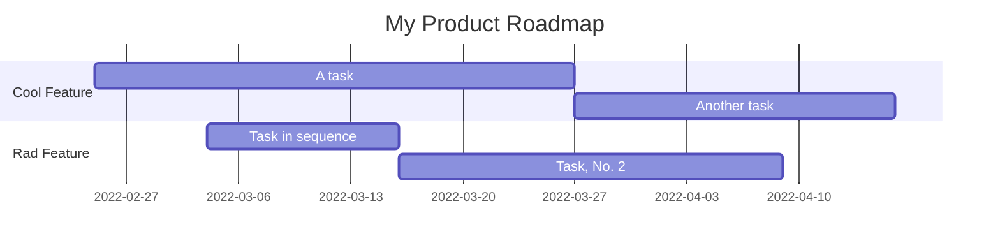
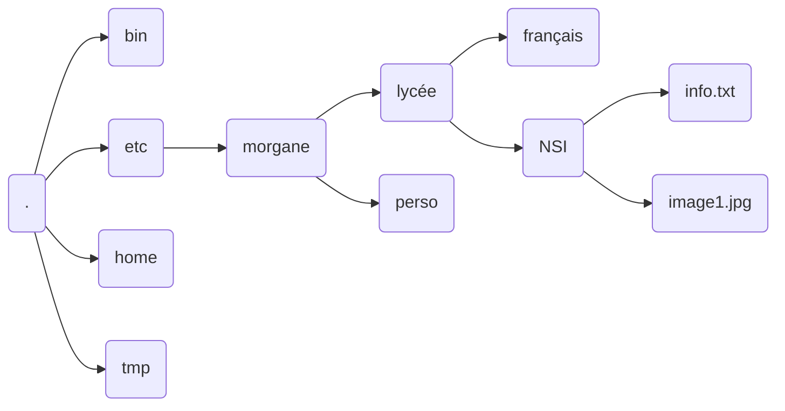
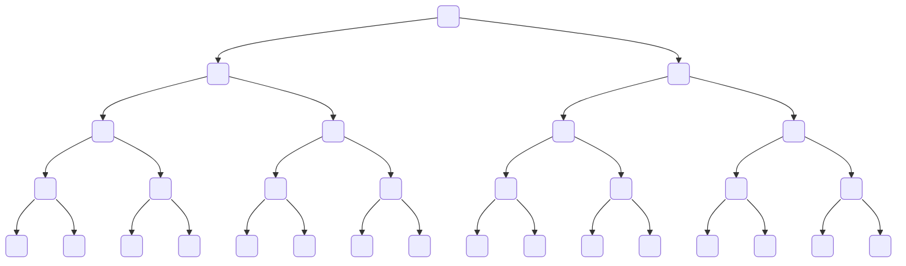
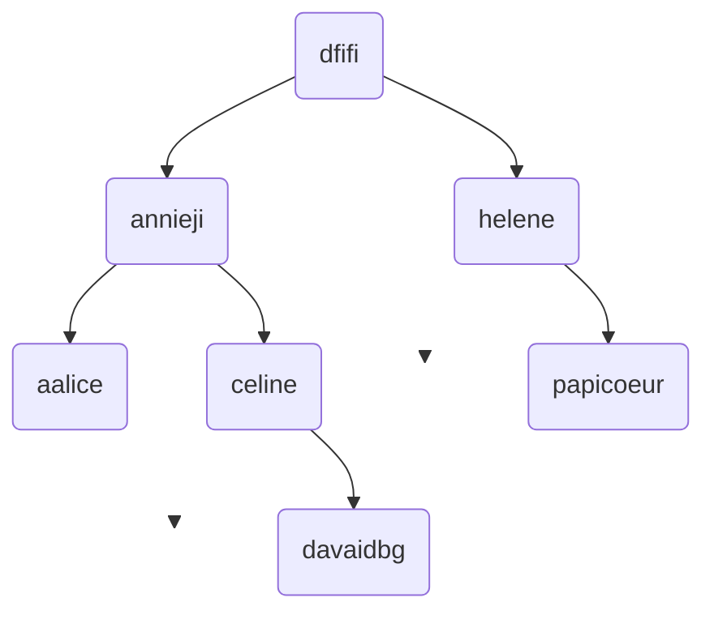
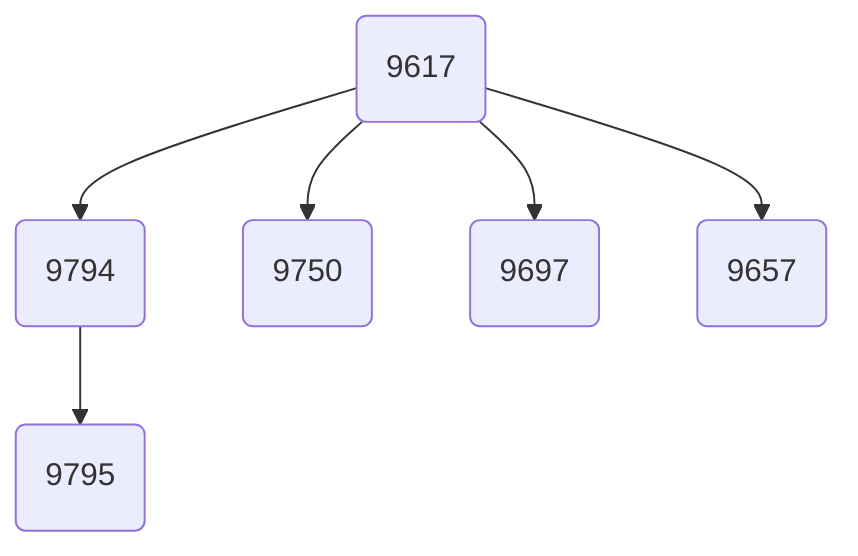
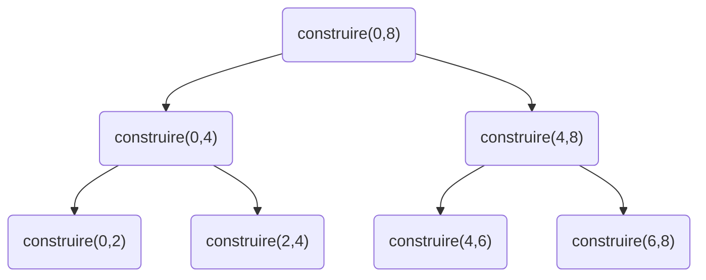
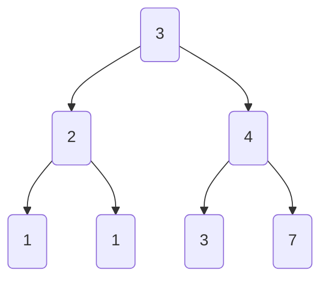
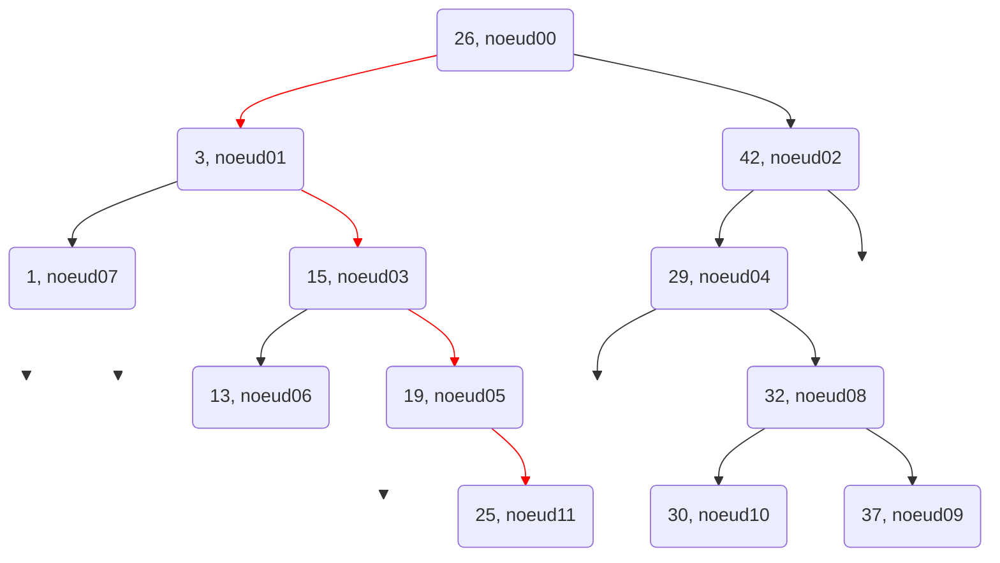

```mermaid
gantt
    title My Product Roadmap
    dateFormat  YYYY-MM-DD
    section Cool Feature
    A task           :a1, 2022-02-25, 30d
    Another task     :after a1, 20d
    section Rad Feature
    Task in sequence :2022-03-04, 12d
    Task, No. 2      :24d
```

```mermaid
graph LR
    A(".") --> B("bin")
    A --> C("etc")
    A --> D("home")
    A --> E("tmp")
    C --> F("morgane")
    F --> G("lycée")
    G --> H("français")
    G --> I("NSI")
    I --> J("info.txt")
    I --> K("image1.jpg")
    F --> L("perso")
```

```mermaid
graph TD
    A(" ") --> B(" ") 
    B --> C(" ")
    B --> D(" ")
    C --> E(" ")
    C --> C1(" ")
    E --> E1(" ")
    E --> E2(" ")
    C1 --> C2(" ")
    C1 --> C3(" ")
    A --> F(" ")
    F --> J(" ")
    F --> K(" ")
    J --> L(" ")
    J --> N(" ")
    D --> D1(" ")
    D --> D2(" ")
    D1 --> D3(" ")
    D1 --> D4(" ")
    D2 --> D5(" ")
    D2 --> D6(" ")
    L --> L3(" ")
    L --> L4(" ")
    N --> N1(" ")
    N --> N2(" ")
    K --> K1(" ")
    K --> K2(" ")
    K1 --> K3(" ")
    K1 --> K4(" ")
    K2 --> K5(" ")
    K2 --> K6(" ") 
```

```mermaid
graph TD
    A("dfifi") --> B("annieji") 
    B --> D("aalice")
    B --> E("celine")
    A --> H("helene")
    E --> F(" ")
    E -->G("davaidbg")
    H --> I(" ")
    H --> J("papicoeur")
    linkStyle 4 stroke-width:0px;
    style F opacity:0;
    linkStyle 6 stroke-width:0px;
    style I opacity:0;
```

```mermaid
graph TD
    A("9617") --> B("9794") 
    A --> D("9750")
    A --> E("9697")
    A --> H("9657")
    B --> I("9795")
```

```mermaid
graph TD
    A("construire(0,8)") --> B("construire(0,4)") 
    B --> D("construire(0,2)")
    B --> E("construire(2,4)")
    A --> H("construire(4,8)")
    H --> I("construire(4,6)")
    H --> J("construire(6,8)")
```

```mermaid
graph TD
    A(3) --> B(2) 
    B --> D(1)
    B --> E(1)
    A --> C(4)
    C --> F(3)
    C --> G(7)
```

```mermaid
graph TD
    A("26, noeud00") --> B("3, noeud01") 
    B --> D("1, noeud07")
    B --> E("15, noeud03")
    A --> C("42, noeud02")
    C --> F("29, noeud04")
    C --> G(" ")
    D --> H(" ")
    D --> D1(" " )
    E --> E1("13, noeud06")
    E --> E2("19, noeud05")
    F --> F1(" ")
    F --> M("32, noeud08")
    M --> G1("30, noeud10")
    M --> G2("37, noeud09")
    E2 --> O(" ")
    E2 --> P("25, noeud11")
    style G opacity:0;
    linkStyle 6 stroke-width:0px;
    style H opacity:0;
    linkStyle 7 stroke-width:0px;
    style D1 opacity:0;
    style F1 opacity:0;
    linkStyle 14 stroke-width:0px;
    style O opacity:0;
    linkStyle 0 stroke:red;
    linkStyle 2 stroke:red;
    linkStyle 9 stroke:red;
    linkStyle 15 stroke:red;
```

